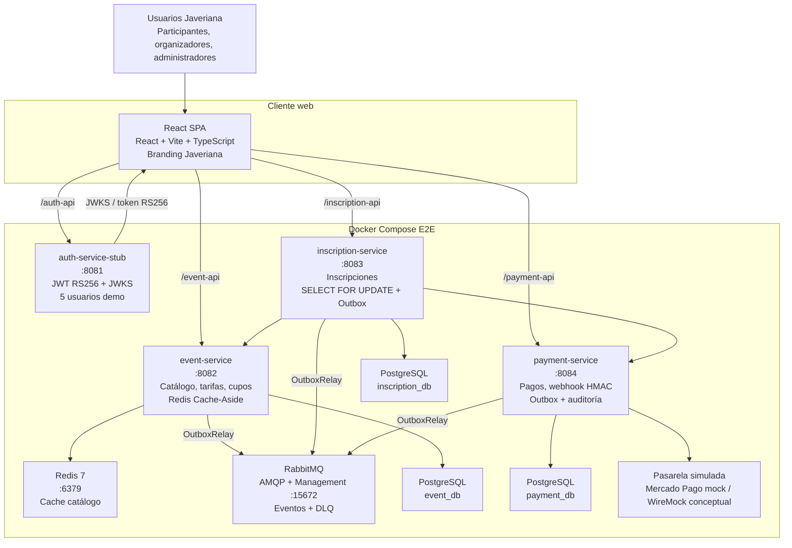

# Plataforma de Gestión de Eventos Académicos

**Pontificia Universidad Javeriana**  
Maestría en Ingeniería de Software · Arquitectura de Software · Entrega 3

[](frontend/coverage/index.html)
[](docs/evidencia-accesibilidad-frontend.md)
[](docs/evidencia-autenticacion-completa.md)
[](docs/evidencia-frontend.md)
[](docs/vista-fisica-deployment.md)
[](TECH_DEBT.md)

## Resumen

La Plataforma de Gestión de Eventos Académicos implementa el flujo crítico de un participante Javeriana: login institucional demo, consulta de catálogo, inscripción con control de cupos, pago simulado, confirmación y evidencia operativa. El sistema está construido con microservicios Spring Boot, frontend React + Vite + TypeScript, JWT RS256, Outbox Pattern, RabbitMQ, Redis, PostgreSQL, Circuit Breaker, pruebas automatizadas y documentación arquitectónica trazable.

Entrega 3 no presenta un sistema productivo en AWS ni una integración real con Azure AD o Mercado Pago. Esos límites están declarados en [TECH_DEBT.md](TECH_DEBT.md). Lo que sí queda demostrado es la arquitectura ejecutable, el flujo E2E real, la concurrencia sobre cupos, la resiliencia con degradación controlada y la calidad del frontend.

## Arquitectura C2

El diagrama C2 principal se mantiene en [docs/vista-fisica-deployment.md](docs/vista-fisica-deployment.md). Esta versión embebida refleja la composición real de Entrega 3: `auth-service-stub` en `8081`, tres microservicios core, SPA TypeScript, PostgreSQL, Redis, RabbitMQ y pasarela simulada.



## Stack Implementado

| Capa | Tecnología | Evidencia |
|---|---|---|
| Frontend | React, Vite, TypeScript strict, Playwright, Vitest | [frontend/README.md](frontend/README.md), [docs/evidencia-frontend.md](docs/evidencia-frontend.md) |
| Auth demo | `auth-service-stub`, JWT RS256, JWKS, 5 usuarios demo | [auth-service-stub/](auth-service-stub/), [docs/evidencia-autenticacion-completa.md](docs/evidencia-autenticacion-completa.md) |
| Backend core | Java 17, Spring Boot 3, arquitectura hexagonal | [event-service/](event-service/), [inscription-service/](inscription-service/), [payment-service/](payment-service/) |
| Persistencia | PostgreSQL por servicio | [docker-compose.e2e.yml](docker-compose.e2e.yml) |
| Mensajería | RabbitMQ, Outbox Pattern, DLQ, idempotencia | [docs/asyncapi/](docs/asyncapi/), [docs/adrs/ADR-019-dead-letter-strategy.md](docs/adrs/ADR-019-dead-letter-strategy.md) |
| Cache | Redis Cache-Aside para catálogo | [docs/evidencia-carga.md](docs/evidencia-carga.md) |
| Resiliencia | Circuit Breaker, `Retry-After`, UX degradada | [docs/evidencia-carga.md](docs/evidencia-carga.md), [docs/evidencia-frontend.md](docs/evidencia-frontend.md) |
| Honestidad técnica | 19 deudas clasificadas + H-001 cerrado | [TECH_DEBT.md](TECH_DEBT.md) |

## Quick Start Reproducible

Prerrequisitos: Docker, Docker Compose, Java 17, Maven 3.9+, Node.js compatible con Vite.

```bash
# 1. Compilar backend core
mvn package -DskipTests -pl shared,event-service,inscription-service,payment-service

# 2. Compilar auth-service-stub
mvn -f auth-service-stub/pom.xml package -DskipTests

# 3. Levantar stack E2E completo
docker compose -f docker-compose.e2e.yml up -d --build

# 4. Levantar SPA en otra terminal
cd frontend
npm install
npm run dev -- --host 127.0.0.1

# 5. Validar flujo real login -> catálogo -> inscripción -> pago
npm run smoke:e2e
```

Resultado esperado del smoke:

```json
{
  "login": "diego.participante@javeriana.edu.co",
  "pago": {
    "resultado": "CONFIRMADO"
  }
}
```

URLs locales:

| Componente | URL |
|---|---|
| SPA | `http://127.0.0.1:3000` |
| auth-service-stub | `http://localhost:8081/actuator/health` |
| event-service | `http://localhost:8082/actuator/health` |
| inscription-service | `http://localhost:8083/actuator/health` |
| payment-service | `http://localhost:8084/actuator/health` |
| RabbitMQ Management | `http://localhost:15672` (`guest` / `guest`) |

## Calidad Demostrada

| Métrica | Threshold | Resultado real | Evidencia |
|---|---:|---:|---|
| Cobertura frontend statements | >=70% | 87.82% | [frontend/coverage/index.html](frontend/coverage/index.html), [docs/evidencia-autenticacion-completa.md](docs/evidencia-autenticacion-completa.md) |
| Cobertura frontend branches | >=70% | 80.52% | [frontend/coverage/index.html](frontend/coverage/index.html) |
| Tests unitarios frontend | Verde | 52/52 | [docs/evidencia-autenticacion-completa.md](docs/evidencia-autenticacion-completa.md) |
| Tests E2E Playwright | Verde | 28/28 | [frontend/playwright-report/index.html](frontend/playwright-report/index.html) |
| Smoke E2E real | Pago confirmado | `CONFIRMADO` | [frontend/scripts/smoke-e2e.mjs](frontend/scripts/smoke-e2e.mjs), [docs/evidencia-frontend.md](docs/evidencia-frontend.md) |
| WCAG 2.1 AA | 0 críticas | 0 violaciones axe en páginas auditadas | [docs/evidencia-accesibilidad-frontend.md](docs/evidencia-accesibilidad-frontend.md) |
| Sobrecupo bajo concurrencia | 0% | 10 confirmadas / 40 rechazadas | [load-tests/reports/04-cupos-concurrencia.html](load-tests/reports/04-cupos-concurrencia.html), [docs/evidencia-carga.md](docs/evidencia-carga.md) |
| Circuit Breaker abierto | p95 < 50 ms | 37.26 ms | [load-tests/reports/05-circuit-breaker.html](load-tests/reports/05-circuit-breaker.html) |
| Carga sostenida local | p95 < 800 ms | 52.81 ms | [load-tests/reports/02-load-test.html](load-tests/reports/02-load-test.html) |
| Cache Redis | Medible | 99.50% hit rate | [load-tests/reports/06-cache-effectiveness.html](load-tests/reports/06-cache-effectiveness.html) |

## Comandos de Verificación

```bash
# Frontend
cd frontend
npm run lint
npm run build
npm run test
npm run test:coverage
npm run test:e2e
npm run smoke:e2e

# Carga K6 defendible
cd ../load-tests
make smoke
make cupos
make circuit-breaker
make cache
```

Los reportes HTML quedan en [frontend/coverage/index.html](frontend/coverage/index.html), [frontend/playwright-report/index.html](frontend/playwright-report/index.html) y [load-tests/reports/](load-tests/reports/).

## Mapa de Documentación

| Documento | Función |
|---|---|
| [TECH_DEBT.md](TECH_DEBT.md) | Documento maestro de honestidad técnica: 19 deudas, roadmap Fase 2 y H-001 cerrado. |
| [docs/evidencia-frontend.md](docs/evidencia-frontend.md) | Evidencia del flujo crítico SPA contra backend real. |
| [docs/evidencia-autenticacion-completa.md](docs/evidencia-autenticacion-completa.md) | Login con 5 usuarios demo, RBAC frontend, JWT, JWKS, logout y refresh. |
| [docs/evidencia-testing-frontend.md](docs/evidencia-testing-frontend.md) | Suite Vitest, React Testing Library, MSW y Playwright. |
| [docs/evidencia-accesibilidad-frontend.md](docs/evidencia-accesibilidad-frontend.md) | Auditoría WCAG 2.1 AA con axe-core y checklist. |
| [docs/evidencia-carga.md](docs/evidencia-carga.md) | Resultados K6: RNF-16, RNF-14, carga sostenida y cache Redis. |
| [docs/evidencia-diseno-completo-frontend.md](docs/evidencia-diseno-completo-frontend.md) | Capturas visuales completas del SPA por ruta, estado y viewport. |
| [docs/alcance-y-decisiones-de-mocks.md](docs/alcance-y-decisiones-de-mocks.md) | Declaración de mocks intencionales: auth-stub, usuarios demo y pasarela simulada. |
| [docs/validacion-diagramas-c4.md](docs/validacion-diagramas-c4.md) | Validación liviana C4 contra sistema real de Entrega 3. |
| [docs/vista-fisica-deployment.md](docs/vista-fisica-deployment.md) | Vista física/C2 con Mermaid y PlantUML. |
| [docs/c4-nivel3-componentes.md](docs/c4-nivel3-componentes.md) | Vistas C3 por microservicio. |
| [docs/diagramas/](docs/diagramas/) | Fuentes PlantUML y PNG de diagramas arquitectónicos. |
| [docs/adrs/README.md](docs/adrs/README.md) | Índice de ADRs arquitectónicos. |
| [docs/adr/ADR-013-frontend-spa-revision-typescript.md](docs/adr/ADR-013-frontend-spa-revision-typescript.md) | Revisión formal de ADR-013: migración a TypeScript strict. |
| [docs/limites-carga-reconocidos.md](docs/limites-carga-reconocidos.md) | Límites honestos de pruebas de carga locales y RNF-04. |

## Alcance y Límites

Implementado y validado:

- Flujo crítico E2E: login, catálogo, inscripción, pago y confirmación.
- JWT RS256 emitido por `auth-service-stub` y validado por servicios.
- Protección frontend con `sessionStorage`, logout, refresh y validación de JWT hidratado.
- Control de cupos con concurrencia y evidencia K6 de sobrecupo cero.
- Outbox Pattern en servicios core, RabbitMQ, DLQ e idempotencia.
- UX de Circuit Breaker con `503 + Retry-After`.
- Evidencia visual, accesibilidad, testing y carga reproducibles.

Declarado para Fase 2:

- Despliegue productivo AWS.
- Azure AD / IdP OIDC institucional con Authorization Code + PKCE.
- Integración real con Mercado Pago.
- `notification-service` y `certificate-service` productivos.
- Certificación RNF-04 de 500 usuarios concurrentes sobre infraestructura horizontal.

El detalle de impacto, mitigación y plan de cierre está en [TECH_DEBT.md](TECH_DEBT.md).
