```mermaid
classDiagram
    %% === infrastructure.rest ===
    class EventoRestController {
        <<RestController>>
        ⚠️ DEUDA HEXAGONAL
        +crearEvento(req) EventoDto
        +publicarEvento(id) void
        +cancelarEvento(id) void
        +obtenerEvento(id) EventoDto
        +listarPublicados(filtros) List
    }

    %% === application.service ===
    class CrearEventoService {
        <<ApplicationSvc>>
        +ejecutar(cmd) EventoDto
    }
    class PublicarEventoService {
        <<ApplicationSvc>>
        +ejecutar(eventoId) void
    }
    class CancelarEventoService {
        <<ApplicationSvc>>
        +ejecutar(eventoId, motivo) void
    }
    class ConsultarCatalogoService {
        <<ApplicationSvc>>
        ADR-008 Cache-Aside TTL=60s
        +buscarEvento(id) EventoDto
        +listarPublicados(filtros) List
    }

    %% === domain.model ===
    class Evento {
        <<AggregateRoot>>
        -cuposTotales int
        -cuposDisponibles int
        -estado EstadoEvento
        +publicar() void
        +cancelar() void
        +decrementarCupo() void
        +incrementarCupo() void
    }
    class PoliticaPublicacion {
        <<DomainService>>
        +puedePublicar(evento) boolean
    }
    class EstadoEvento {
        <<Enumeration>>
        BORRADOR PUBLICADO AGOTADO FINALIZADO CANCELADO
    }

    %% === domain.port ===
    class EventoRepository {
        <<Port>>
        +guardar(evento) Evento
        +buscarPorId(id) Optional
        +buscarPublicados(filtros) List
    }
    class CacheEventoPort {
        <<Port>>
        +obtener(id) Optional
        +guardar(id, dto, ttl) void
        +invalidar(id) void
    }
    class EventPublisher {
        <<Port>>
        +publicarEventoCreado(evento) void
        +publicarEventoCancelado(evento) void
    }

    %% === infrastructure ===
    class EventoJpaAdapter {
        <<JpaAdapter>>
        +guardar(evento) Evento
        +buscarPorId(id) Optional
    }
    class RedisEventoCacheAdapter {
        <<CacheAdapter>>
        TTL=60s ADR-008
        +obtener(id) Optional
        +guardar(id, dto, ttl) void
    }
    class EventoRabbitPublisherAdapter {
        <<RabbitPublisher>>
        exchange: evento.events
        +publicarEventoCreado(evento) void
    }

    EventoRestController --> CrearEventoService
    EventoRestController --> PublicarEventoService
    EventoRestController --> CancelarEventoService
    EventoRestController --> ConsultarCatalogoService
    CrearEventoService --> EventoRepository
    CrearEventoService --> EventPublisher
    PublicarEventoService --> EventoRepository
    PublicarEventoService --> PoliticaPublicacion
    PublicarEventoService --> EventPublisher
    CancelarEventoService --> EventoRepository
    CancelarEventoService --> EventPublisher
    ConsultarCatalogoService --> EventoRepository
    ConsultarCatalogoService --> CacheEventoPort
    Evento --> EstadoEvento
    EventoJpaAdapter ..|> EventoRepository
    RedisEventoCacheAdapter ..|> CacheEventoPort
    EventoRabbitPublisherAdapter ..|> EventPublisher
```

```mermaid
classDiagram
    %% === infrastructure.rest ===
    class InscripcionRestController {
        <<RestController>>
        +crearInscripcion(req) InscripcionDto
        +cancelarInscripcion(id) void
        +obtenerInscripcion(id) InscripcionDto
    }

    %% === infrastructure.messaging driving ===
    class PagoEventConsumerListener {
        <<RabbitListener>>
        queues: pago.confirmado / pago.expirado
        +onPagoConfirmado(event) void
        +onPagoExpirado(event) void
    }

    %% === application.service ===
    class CrearInscripcionService {
        <<ApplicationSvc>>
        ADR-003 SELECT FOR UPDATE
        ADR-011 INSERT outbox
        +ejecutar(cmd) InscripcionDto
    }
    class CancelarInscripcionService {
        <<ApplicationSvc>>
        Strategy: PoliticaCancelacion
        +ejecutar(id, motivo) void
    }
    class ConfirmarInscripcionService {
        <<ApplicationSvc>>
        +ejecutar(id, referenciaPago) void
    }
    class ExpirarInscripcionesPendientesService {
        <<ApplicationSvc>>
        ADR-018 ShedLock 60s
        SKIP LOCKED
        +ejecutar() void
    }
    class OutboxRelayService {
        <<ApplicationSvc>>
        ADR-011 SKIP LOCKED 2s
        +procesarEventosPendientes() void
    }

    %% === domain.model ===
    class Inscripcion {
        <<AggregateRoot>>
        -estado EstadoInscripcion
        -expiraEn LocalDateTime
        +confirmar() void
        +cancelar(motivo) void
        +expirar() void
        +haExpirado() boolean
    }
    class OutboxEvent {
        <<Entity>>
        -eventType String
        -payload String
        +marcarProcesado() void
    }
    class PoliticaCancelacion {
        <<DomainService>>
        +puedeCancelarse(insc, evt) boolean
        +aplicaReembolso(insc, evt) boolean
    }

    %% === domain.port ===
    class InscripcionRepository {
        <<Port>>
        +guardar(i) Inscripcion
        +buscarPendientesExpiradas(antes) List
    }
    class EventoRepository {
        <<Port>>
        ⚡ SELECT FOR UPDATE ADR-003
        +buscarPorIdConBloqueoPesimista(id) Optional
    }
    class OutboxRepository {
        <<Port>>
        +guardar(e) OutboxEvent
        +buscarPendientes(n) List
    }
    class EventPublisher {
        <<Port>>
        +publicar(evento) void
    }

    %% === infrastructure ===
    class InscripcionJpaAdapter { <<JpaAdapter>> }
    class EventoJpaAdapter {
        <<JpaAdapter>>
        @Lock PESSIMISTIC_WRITE
    }
    class OutboxJpaAdapter { <<JpaAdapter>> }
    class RabbitMqEventPublisher { <<RabbitPublisher>> }

    InscripcionRestController --> CrearInscripcionService
    InscripcionRestController --> CancelarInscripcionService
    PagoEventConsumerListener --> ConfirmarInscripcionService
    PagoEventConsumerListener --> CancelarInscripcionService
    CrearInscripcionService --> InscripcionRepository
    CrearInscripcionService --> EventoRepository
    CrearInscripcionService --> OutboxRepository
    CancelarInscripcionService --> InscripcionRepository
    CancelarInscripcionService --> EventoRepository
    CancelarInscripcionService --> OutboxRepository
    CancelarInscripcionService --> PoliticaCancelacion
    ConfirmarInscripcionService --> InscripcionRepository
    ConfirmarInscripcionService --> OutboxRepository
    ExpirarInscripcionesPendientesService --> InscripcionRepository
    ExpirarInscripcionesPendientesService --> CancelarInscripcionService
    OutboxRelayService --> OutboxRepository
    OutboxRelayService --> EventPublisher
    InscripcionJpaAdapter ..|> InscripcionRepository
    EventoJpaAdapter ..|> EventoRepository
    OutboxJpaAdapter ..|> OutboxRepository
    RabbitMqEventPublisher ..|> EventPublisher
```

```mermaid
classDiagram
    %% === infrastructure.rest ===
    class PagoRestController {
        <<RestController>>
        +iniciarPago(req) PagoDto
        +consultarPago(id) PagoDto
        +webhookPasarela(payload) void
    }

    %% === infrastructure.messaging driving ===
    class InscripcionEventConsumerListener {
        <<RabbitListener>>
        queue: payment.inscripcion.created
        +onInscripcionCreada(event) void
    }

    %% === application.service ===
    class IniciarPagoService {
        <<ApplicationSvc>>
        +ejecutar(cmd) PagoDto
    }
    class ProcesarWebhookService {
        <<ApplicationSvc>>
        idempotency-key check
        +procesarCallbackPasarela(payload) void
    }
    class ConfirmarPagoService {
        <<ApplicationSvc>>
        +ejecutar(pagoId, txnId) void
    }
    class OutboxRelayService {
        <<ApplicationSvc>>
        ⚠️ PENDIENTE feat/payment-outbox-e2e
        +procesarEventosPendientes() void
    }

    %% === domain.model ===
    class Pago {
        <<AggregateRoot>>
        -inscripcionId UUID
        -monto BigDecimal
        -estado EstadoPago
        +confirmar(txnId) void
        +fallar(motivo) void
    }
    class EstadoPago {
        <<Enumeration>>
        PENDIENTE CONFIRMADO FALLIDO EXPIRADO
    }

    %% === domain.port ===
    class PagoRepository { <<Port>> }
    class PasarelaPagoPort {
        <<Port>>
        WireMock stub
        +procesarCobro(monto, token) ResultadoCobro
    }
    class OutboxRepository { <<Port>> }
    class EventPublisher {
        <<Port>>
        ⚠️ PENDIENTE
    }

    %% === infrastructure ===
    class PagoJpaAdapter { <<JpaAdapter>> }
    class OutboxJpaAdapter { <<JpaAdapter>> }
    class WireMockPasarelaAdapter {
        <<GatewayAdapter>>
        POST /mock/gateway/charge
    }
    class RabbitMqPaymentPublisher {
        <<RabbitPublisher>>
        ⚠️ PENDIENTE
    }

    PagoRestController --> IniciarPagoService
    PagoRestController --> ProcesarWebhookService
    InscripcionEventConsumerListener --> IniciarPagoService
    IniciarPagoService --> PagoRepository
    IniciarPagoService --> PasarelaPagoPort
    IniciarPagoService --> OutboxRepository
    ProcesarWebhookService --> PagoRepository
    ProcesarWebhookService --> OutboxRepository
    ConfirmarPagoService --> PagoRepository
    ConfirmarPagoService --> OutboxRepository
    OutboxRelayService --> OutboxRepository
    OutboxRelayService --> EventPublisher
    Pago --> EstadoPago
    PagoJpaAdapter ..|> PagoRepository
    OutboxJpaAdapter ..|> OutboxRepository
    WireMockPasarelaAdapter ..|> PasarelaPagoPort
    RabbitMqPaymentPublisher ..|> EventPublisher
```

```mermaid
classDiagram
    %% === infrastructure.messaging driving ===
    class NotificationEventListener {
        <<RabbitListener>>
        Idempotencia: messageId check
        +onInscripcionCreada(event, msgId) void
        +onPagoConfirmado(event, msgId) void
        +onPagoFallido(event, msgId) void
        +onInscripcionExpirada(event, msgId) void
    }

    %% === application.service ===
    class NotificarInscripcionCreadaService {
        <<ApplicationSvc>>
        Template Method
        +ejecutar(event, messageId) void
    }
    class NotificarPagoConfirmadoService {
        <<ApplicationSvc>>
        +ejecutar(event, messageId) void
    }
    class NotificarPagoFallidoService {
        <<ApplicationSvc>>
        +ejecutar(event, messageId) void
    }
    class NotificarInscripcionExpiradaService {
        <<ApplicationSvc>>
        +ejecutar(event, messageId) void
    }

    %% === domain.model ===
    class Notificacion {
        <<Entity>>
        -canal CanalNotificacion
        -tipo TipoNotificacion
        +enviar() void
        +marcarFallida(motivo) void
    }
    class NotificationStrategySelector {
        <<DomainService>>
        Factory Method
        +seleccionar(canal) NotificationStrategy
    }
    class NotificationStrategy {
        <<Strategy>>
        +enviar(destinatario, asunto, cuerpo) void
    }
    class EmailNotificationStrategy {
        <<Strategy>>
        WireMock SMTP
        +enviar(destinatario, asunto, cuerpo) void
    }
    class SmsNotificationStrategy {
        <<Strategy>>
        mock log only
        +enviar(destinatario, asunto, cuerpo) void
    }
    class PushNotificationStrategy {
        <<Strategy>>
        mock log only
        +enviar(destinatario, asunto, cuerpo) void
    }

    %% === domain.port ===
    class NotificacionRepository { <<Port>> }
    class ProcessedMessageRepository {
        <<Port>>
        +existePorMessageId(id) boolean
        +registrar(messageId) void
    }
    class NotificationSenderPort {
        <<Port>>
        +enviar(notificacion) void
    }

    %% === infrastructure ===
    class NotificacionJpaAdapter { <<JpaAdapter>> }
    class ProcessedMessageJpaAdapter {
        <<JpaAdapter>>
        ON CONFLICT DO NOTHING
    }
    class WireMockEmailSenderAdapter {
        <<SenderAdapter>>
        POST /mock/smtp/send
    }

    NotificationEventListener --> NotificarInscripcionCreadaService
    NotificationEventListener --> NotificarPagoConfirmadoService
    NotificationEventListener --> NotificarPagoFallidoService
    NotificationEventListener --> NotificarInscripcionExpiradaService
    NotificarInscripcionCreadaService --> NotificacionRepository
    NotificarInscripcionCreadaService --> ProcessedMessageRepository
    NotificarInscripcionCreadaService --> NotificationSenderPort
    NotificarInscripcionCreadaService --> NotificationStrategySelector
    NotificarPagoConfirmadoService --> NotificationSenderPort
    NotificarPagoConfirmadoService --> NotificationStrategySelector
    NotificationStrategySelector --> NotificationStrategy
    EmailNotificationStrategy ..|> NotificationStrategy
    SmsNotificationStrategy ..|> NotificationStrategy
    PushNotificationStrategy ..|> NotificationStrategy
    NotificacionJpaAdapter ..|> NotificacionRepository
    ProcessedMessageJpaAdapter ..|> ProcessedMessageRepository
    WireMockEmailSenderAdapter ..|> NotificationSenderPort
```

# C4 Nivel 3: Vista de Componentes — Todos los Microservicios
## Plataforma de Gestión de Eventos Académicos — Pontificia Universidad Javeriana

> Render de diagramas PlantUML: `java -jar ~/plantuml.jar docs/diagramas/c4-3-*.puml`
> Mermaid: pegar cada bloque en [mermaid.live](https://mermaid.live)

---

## 1. event-service

> **ADRs:** ADR-008 (Cache-Aside) · ADR-011 (Outbox) · ADR-012 (Hexagonal)
> **Estado:** 100% — ⚠️ deuda hexagonal en `EventoRestController`

### A. PlantUML
> Archivo: `docs/diagramas/c4-3-event-service.puml`

### B. Mermaid



### C. Tabla de Componentes

| Componente | Estereotipo | Capa | Responsabilidad | Patrón GoF | Puerto que usa/implementa |
|---|---|---|---|---|---|
| EventoRestController | `@RestController` | infrastructure.rest | Exponer API REST CRUD de eventos | Facade | usa todos los services |
| CrearEventoService | `@Service` | application.service | Crear evento y publicar OutboxEvent | Facade, Command | `EventoRepository`, `EventPublisher` |
| PublicarEventoService | `@Service` | application.service | Cambiar estado BORRADOR→PUBLICADO | Strategy, Facade | `EventoRepository`, `PoliticaPublicacion` |
| CancelarEventoService | `@Service` | application.service | Cancelar evento y notificar vía Outbox | Facade | `EventoRepository`, `EventPublisher` |
| ConsultarCatalogoService | `@Service` | application.service | Catálogo con Cache-Aside | Facade, Proxy | `EventoRepository`, `CacheEventoPort` |
| Evento | AggregateRoot | domain.model | Agregado raíz con lógica de cupos y estado | — | — |
| PoliticaPublicacion | DomainService | domain.model | Reglas de negocio para publicación | Strategy | — |
| EstadoEvento | Enumeration | domain.model | Ciclo de vida del evento | State | — |
| EventoRepository | Port/Interface | domain.port | Puerto de persistencia de eventos | Repository | implementado por `EventoJpaAdapter` |
| CacheEventoPort | Port/Interface | domain.port | Puerto de caché | Proxy | implementado por `RedisEventoCacheAdapter` |
| EventPublisher | Port/Interface | domain.port | Puerto de mensajería saliente | Observer | implementado por `EventoRabbitPublisherAdapter` |
| EventoJpaAdapter | `@Repository` | infrastructure.persistence | Adaptador JPA para eventos | Adapter, Repository | implementa `EventoRepository` |
| RedisEventoCacheAdapter | CacheAdapter | infrastructure.cache | Cache-Aside con Redis 7, TTL=60s | Adapter, Proxy | implementa `CacheEventoPort` |
| EventoRabbitPublisherAdapter | RabbitPublisher | infrastructure.messaging | Publicar eventos al exchange RabbitMQ | Adapter, Observer | implementa `EventPublisher` |

### D. Patrones GoF Aplicados

| Patrón | Familia | Clase | Descripción |
|---|---|---|---|
| **Repository** | Comportamiento | `EventoRepository`, `CategoriaRepository` | Abstracción de persistencia detrás de un puerto |
| **Adapter** | Estructural | `EventoJpaAdapter`, `RedisEventoCacheAdapter`, `EventoRabbitPublisherAdapter` | Traduce el puerto del dominio al framework (JPA / Redis / AMQP) |
| **Facade** | Estructural | `CrearEventoService`, `PublicarEventoService`, etc. | Simplifican el acceso al dominio desde los driving adapters |
| **Strategy** | Comportamiento | `PoliticaPublicacion` | Encapsula reglas de publicación intercambiables |
| **Proxy** | Estructural | `ConsultarCatalogoService` + `CacheEventoPort` | Interception de consultas con Cache-Aside antes de ir a BD |
| **State** | Comportamiento | `EstadoEvento` + `Evento.publicar()/cancelar()` | Transiciones controladas del ciclo de vida del evento |
| **DTO + Mapper** | — | `EventoDto`, `CrearEventoRequest` | Separación entre representación API y modelo de dominio |

### E. ADRs Aplicables

| ADR | Aplicación en event-service |
|---|---|
| **ADR-008** Cache-Aside | `ConsultarCatalogoService` → `CacheEventoPort` → `RedisEventoCacheAdapter` → Redis 7 (TTL 60s) |
| **ADR-011** Transactional Outbox | `EventoRabbitPublisherAdapter` publica cambios de estado de eventos a RabbitMQ |
| **ADR-012** Hexagonal Architecture | Todos los ports en `domain.port`; adapters en `infrastructure.*` |

### F. Estado de Madurez

- **100%** funcional.
- ⚠️ **Deuda hexagonal:** `EventoRestController` accede directamente al repositorio en algunos métodos, bypaseando los application services. Refactor pendiente para uniformidad arquitectónica.

---

## 2. inscription-service (CORE de Concurrencia)

> **ADRs:** ADR-003 (Pessimistic Lock) · ADR-011 (Outbox) · ADR-012 (Hexagonal) · ADR-018 (ShedLock)
> **Estado:** 100%

### A. PlantUML
> Archivo: `docs/diagramas/c4-3-inscription-service.puml`
> Consistente con C4-4: `docs/diagramas/c4-code-inscription-service.puml`

### B. Mermaid



### C. Tabla de Componentes

| Componente | Estereotipo | Capa | Responsabilidad | Patrón GoF | Puerto que usa/implementa |
|---|---|---|---|---|---|
| InscripcionRestController | `@RestController` | infrastructure.rest | API REST de inscripciones | Facade | usa services |
| PagoEventConsumerListener | `@RabbitListener` | infrastructure.messaging | Consume eventos de pago; activa confirmar/cancelar | Observer | usa services |
| CrearInscripcionService | `@Service @Transactional` | application.service | Crea inscripción con bloqueo pesimista y Outbox | Command, Facade | `EventoRepository` (⚡), `InscripcionRepository`, `OutboxRepository` |
| CancelarInscripcionService | `@Service @Transactional` | application.service | Cancela con evaluación de política | Strategy, Facade | `PoliticaCancelacion`, repos |
| ConfirmarInscripcionService | `@Service @Transactional` | application.service | Confirma inscripción al recibir pago | Facade | `InscripcionRepository`, `OutboxRepository` |
| ExpirarInscripcionesPendientesService | `@Scheduled @SchedulerLock` | application.service | Job de expiración cada 60s, ShedLock distribuido | — | `InscripcionRepository`, delega en `CancelarService` |
| OutboxRelayService | `@Scheduled @SchedulerLock` | application.service | Poll Outbox cada 2s con SKIP LOCKED, publica AMQP | Template Method | `OutboxRepository`, `EventPublisher` |
| Inscripcion | AggregateRoot | domain.model | Ciclo de vida de inscripción | Factory Method | — |
| PoliticaCancelacion | DomainService | domain.model | Reglas de cancelación y reembolso | Strategy | — |
| OutboxEvent | Entity | domain.model | Evento pendiente de publicar al broker | — | — |
| InscripcionRepository | Port | domain.port | Puerto de persistencia de inscripciones | Repository | implementado por `InscripcionJpaAdapter` |
| EventoRepository | Port | domain.port | Puerto con soporte de bloqueo pesimista ⚡ | Repository | implementado por `EventoJpaAdapter` |
| OutboxRepository | Port | domain.port | Puerto de persistencia del Outbox | Repository | implementado por `OutboxJpaAdapter` |
| EventPublisher | Port | domain.port | Puerto de publicación AMQP | Observer | implementado por `RabbitMqEventPublisher` |
| InscripcionJpaAdapter | `@Repository` | infrastructure.persistence | Adaptador JPA para inscripciones | Adapter, Repository | implementa `InscripcionRepository` |
| EventoJpaAdapter | `@Repository` | infrastructure.persistence | Adaptador JPA con `@Lock(PESSIMISTIC_WRITE)` | Adapter | implementa `EventoRepository` |
| OutboxJpaAdapter | `@Repository` | infrastructure.persistence | Adaptador JPA para Outbox | Adapter | implementa `OutboxRepository` |
| RabbitMqEventPublisher | RabbitPublisher | infrastructure.messaging | Publica OutboxEvents a exchange RabbitMQ | Adapter, Observer | implementa `EventPublisher` |

### D. Patrones GoF Aplicados

| Patrón | Familia | Clase | Descripción |
|---|---|---|---|
| **Repository** | Comportamiento | `InscripcionRepository`, `EventoRepository`, `OutboxRepository` | Abstracción de acceso a datos |
| **Adapter** | Estructural | `*JpaAdapter`, `RabbitMqEventPublisher` | Traduce puertos del dominio a frameworks |
| **Strategy** | Comportamiento | `PoliticaCancelacion` | Reglas de cancelación encapsuladas e intercambiables |
| **Command** | Comportamiento | `CrearInscripcionCommand` | Encapsula parámetros de creación como objeto |
| **Template Method** | Comportamiento | `OutboxRelayService.procesarEventosPendientes()` | Flujo: poll → publish → mark processed; invariante pero extensible |
| **Observer** | Comportamiento | `PagoEventConsumerListener` | Reacciona a eventos del broker sin acoplamiento directo a payment-service |
| **Factory Method** | Creacional | `Inscripcion.crear(usuarioId, eventoId)` | Creación controlada del agregado con invariantes |
| **Facade** | Estructural | Todos los `*Service` de aplicación | Orquestan múltiples repos y servicios de dominio tras una interfaz simple |
| **DTO + Mapper** | — | `InscripcionDto`, `CrearInscripcionCommand` | Separación entre representación API y modelo de dominio |

### E. ADRs Aplicables

| ADR | Aplicación en inscription-service |
|---|---|
| **ADR-003** Pessimistic Locking | `EventoJpaAdapter.buscarPorIdConBloqueoPesimista()` con `@Lock(PESSIMISTIC_WRITE)` → `SELECT ... FOR UPDATE` |
| **ADR-011** Transactional Outbox | `OutboxRepository.guardar()` dentro de cada `@Transactional`; `OutboxRelayService` hace poll con SKIP LOCKED |
| **ADR-012** Hexagonal Architecture | Ports en `domain.port`; adapters en `infrastructure.persistence` y `infrastructure.messaging` |
| **ADR-018** ShedLock | `@SchedulerLock` en `ExpirarInscripcionesPendientesService` y `OutboxRelayService` para ejecución única en cluster |

### F. Estado de Madurez

- **100%** implementado y funcional.
- El C4-3 es consistente con el C4-4 detallado (`c4-code-inscription-service.puml`).

---

## 3. payment-service

> **ADRs:** ADR-011 (Outbox ⚠️ PENDIENTE) · ADR-012 (Hexagonal)
> **Estado:** 70% — OutboxRelayService pendiente, rama `feat/payment-outbox-e2e`

### A. PlantUML
> Archivo: `docs/diagramas/c4-3-payment-service.puml`

### B. Mermaid



### C. Tabla de Componentes

| Componente | Estereotipo | Capa | Responsabilidad | Patrón GoF | Puerto que usa/implementa |
|---|---|---|---|---|---|
| PagoRestController | `@RestController` | infrastructure.rest | API REST de pagos y webhook mock | Facade | usa services |
| InscripcionEventConsumerListener | `@RabbitListener` | infrastructure.messaging | Consume InscripcionCreada para iniciar cobro | Observer | usa `IniciarPagoService` |
| IniciarPagoService | `@Service @Transactional` | application.service | Inicia pago llamando a WireMock + registra en Outbox | Facade | `PagoRepository`, `PasarelaPagoPort`, `OutboxRepository` |
| ProcesarWebhookService | `@Service @Transactional` | application.service | Procesa callback de la pasarela mock, idempotente | Facade | `PagoRepository`, `OutboxRepository` |
| ConfirmarPagoService | `@Service @Transactional` | application.service | Confirma pago y registra `PaymentConfirmed` en Outbox | Facade | `PagoRepository`, `OutboxRepository` |
| OutboxRelayService ⚠️ | `@Scheduled` — **PENDIENTE** | application.service | Publicar PaymentConfirmed/Failed a RabbitMQ | Template Method | `OutboxRepository`, `EventPublisher` |
| Pago | AggregateRoot | domain.model | Ciclo de vida del pago | — | — |
| PagoRepository | Port | domain.port | Puerto de persistencia de pagos | Repository | implementado por `PagoJpaAdapter` |
| PasarelaPagoPort | Port | domain.port | Puerto hacia pasarela de pago (WireMock) | Adapter | implementado por `WireMockPasarelaAdapter` |
| OutboxRepository | Port | domain.port | Puerto de Outbox | Repository | implementado por `OutboxJpaAdapter` |
| EventPublisher | Port | domain.port | Puerto de publicación AMQP ⚠️ PENDIENTE | Observer | implementado por `RabbitMqPaymentPublisher` |
| PagoJpaAdapter | `@Repository` | infrastructure.persistence | Adaptador JPA para pagos | Adapter | implementa `PagoRepository` |
| OutboxJpaAdapter | `@Repository` | infrastructure.persistence | Adaptador JPA para Outbox | Adapter | implementa `OutboxRepository` |
| WireMockPasarelaAdapter | GatewayAdapter | infrastructure.gateway | HTTP client hacia WireMock stub de pasarela | Adapter | implementa `PasarelaPagoPort` |
| RabbitMqPaymentPublisher ⚠️ | RabbitPublisher — **PENDIENTE** | infrastructure.messaging | Publica eventos de pago a RabbitMQ | Adapter, Observer | implementa `EventPublisher` |

### D. Patrones GoF Aplicados

| Patrón | Familia | Clase | Descripción |
|---|---|---|---|
| **Repository** | Comportamiento | `PagoRepository`, `OutboxRepository` | Abstracción de persistencia |
| **Adapter** | Estructural | `PagoJpaAdapter`, `WireMockPasarelaAdapter`, `RabbitMqPaymentPublisher` | Adapta puertos a frameworks concretos |
| **Observer** | Comportamiento | `InscripcionEventConsumerListener` | Reacciona a eventos externos (RabbitMQ) sin acoplamiento directo |
| **Facade** | Estructural | `IniciarPagoService`, `ProcesarWebhookService`, `ConfirmarPagoService` | Orquestación de puertos detrás de una interfaz simple |
| **Template Method** | Comportamiento | `OutboxRelayService` ⚠️ | poll → publish → mark processed (estructura invariante) |
| **DTO + Mapper** | — | `PagoDto`, `IniciarPagoRequest` | Separación API / dominio |

### E. ADRs Aplicables

| ADR | Aplicación en payment-service |
|---|---|
| **ADR-011** Transactional Outbox | ⚠️ PENDIENTE — `OutboxRelayService` debe publicar `PaymentConfirmed/Failed` |
| **ADR-012** Hexagonal Architecture | Ports en `domain.port`; adapters en `infrastructure.*` |

### F. Estado de Madurez

- **70%** implementado.
- ⚠️ **PENDIENTE:** `OutboxRelayService` + `RabbitMqPaymentPublisher` (rama `feat/payment-outbox-e2e`).
- Sin el Outbox, si el servicio cae entre `COMMIT` y el publish AMQP, se pierde el evento `PaymentConfirmed`.
- WireMock simula la pasarela de pago para tests de integración.

---

## 4. notification-service

> **ADRs:** ADR-012 (Hexagonal)
> **Estado:** en implementación | Patrones: Observer · Strategy · Template Method · Factory Method

### A. PlantUML
> Archivo: `docs/diagramas/c4-3-notification-service.puml`

### B. Mermaid



### C. Tabla de Componentes

| Componente | Estereotipo | Capa | Responsabilidad | Patrón GoF | Puerto que usa/implementa |
|---|---|---|---|---|---|
| NotificationEventListener | `@RabbitListener` | infrastructure.messaging | Consumir 4 tipos de eventos AMQP con idempotencia | Observer | usa 4 services |
| NotificarInscripcionCreadaService | `@Service` | application.service | Notificar estudiante al inscribirse | Template Method, Facade | `NotificacionRepository`, `ProcessedMessageRepository`, `NotificationSenderPort` |
| NotificarPagoConfirmadoService | `@Service` | application.service | Notificar confirmación de pago | Template Method | `NotificationSenderPort`, `NotificationStrategySelector` |
| NotificarPagoFallidoService | `@Service` | application.service | Notificar pago fallido | Template Method | `NotificationSenderPort`, `NotificationStrategySelector` |
| NotificarInscripcionExpiradaService | `@Service` | application.service | Notificar expiración de inscripción | Template Method | `NotificationSenderPort`, `NotificationStrategySelector` |
| Notificacion | Entity | domain.model | Registro de notificación enviada | — | — |
| NotificationStrategySelector | DomainService | domain.model | Seleccionar canal (EMAIL/SMS/PUSH) en runtime | Factory Method | devuelve `NotificationStrategy` |
| NotificationStrategy | Interface/Strategy | domain.model | Puerto de estrategia de envío | Strategy | implementada por Email/Sms/PushStrategy |
| EmailNotificationStrategy | Strategy | domain.model | Envío via WireMock SMTP | Strategy, Adapter | implementa `NotificationStrategy` |
| SmsNotificationStrategy | Strategy | domain.model | Envío mock (log only) | Strategy | implementa `NotificationStrategy` |
| PushNotificationStrategy | Strategy | domain.model | Envío mock (log only) | Strategy | implementa `NotificationStrategy` |
| NotificacionRepository | Port | domain.port | Persistencia de notificaciones | Repository | implementado por `NotificacionJpaAdapter` |
| ProcessedMessageRepository | Port | domain.port | Registro de messageIds procesados (idempotencia) | Repository | implementado por `ProcessedMessageJpaAdapter` |
| NotificationSenderPort | Port | domain.port | Puerto de envío físico de notificación | Adapter | implementado por `WireMockEmailSenderAdapter` |
| NotificacionJpaAdapter | `@Repository` | infrastructure.persistence | JPA para notificaciones | Adapter | implementa `NotificacionRepository` |
| ProcessedMessageJpaAdapter | `@Repository` | infrastructure.persistence | `INSERT ... ON CONFLICT DO NOTHING` para idempotencia | Adapter | implementa `ProcessedMessageRepository` |
| WireMockEmailSenderAdapter | SenderAdapter | infrastructure.sender | HTTP client a WireMock SMTP stub | Adapter | implementa `NotificationSenderPort` |

### D. Patrones GoF Aplicados

| Patrón | Familia | Clase | Descripción |
|---|---|---|---|
| **Observer** | Comportamiento | `NotificationEventListener` | Reacciona a 4 tipos de eventos AMQP sin acoplamiento directo |
| **Strategy** | Comportamiento | `NotificationStrategy` + `EmailStrategy`, `SmsStrategy`, `PushStrategy` | Cada canal de notificación es una estrategia intercambiable en runtime |
| **Template Method** | Comportamiento | `NotificarXxxService.ejecutar()` | Flujo invariante: validar idempotencia → construir notificación → enviar → persistir |
| **Factory Method** | Creacional | `NotificationStrategySelector.seleccionar(canal)` | Crea la Strategy correcta según el canal sin exponer las implementaciones |
| **Repository** | Comportamiento | `NotificacionRepository`, `ProcessedMessageRepository` | Abstracción de persistencia |
| **Adapter** | Estructural | `WireMockEmailSenderAdapter`, `*JpaAdapter` | Adapta puertos a infraestructura concreta (WireMock SMTP, JPA) |

### E. ADRs Aplicables

| ADR | Aplicación en notification-service |
|---|---|
| **ADR-012** Hexagonal Architecture | Ports en `domain.port`; adapters en `infrastructure.persistence` e `infrastructure.sender` |

### F. Estado de Madurez

- **En implementación.**
- SMS y Push son mocks (log only) — solo EMAIL conecta a WireMock SMTP.
- Idempotencia implementada via `ProcessedMessageRepository` con `ON CONFLICT DO NOTHING`.

---

## Resumen de Archivos

```bash
# Render todos los C4-3 de una vez
java -jar ~/plantuml.jar docs/diagramas/c4-3-*.puml
```

| Archivo | Servicio | Líneas aprox. |
|---|---|---|
| `docs/diagramas/c4-3-event-service.puml` | event-service | ~220 |
| `docs/diagramas/c4-3-inscription-service.puml` | inscription-service (CORE) | ~240 |
| `docs/diagramas/c4-3-payment-service.puml` | payment-service | ~230 |
| `docs/diagramas/c4-3-notification-service.puml` | notification-service | ~220 |
