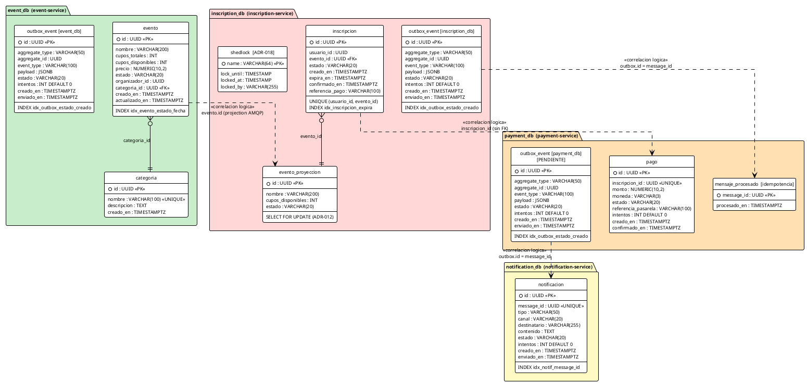
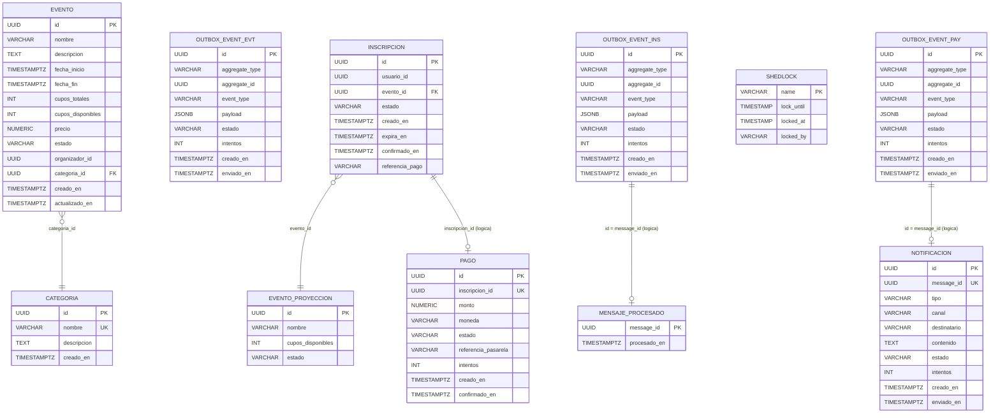
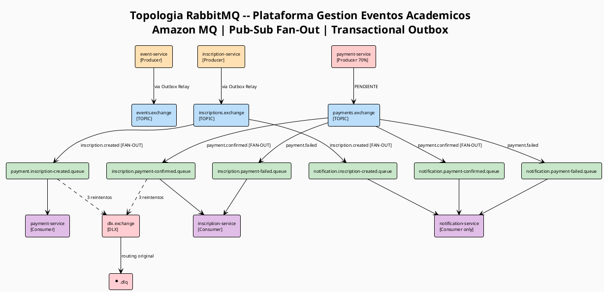
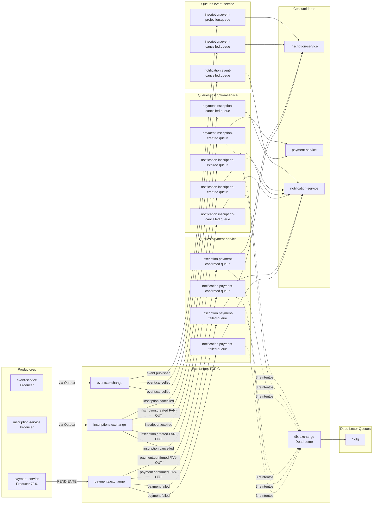
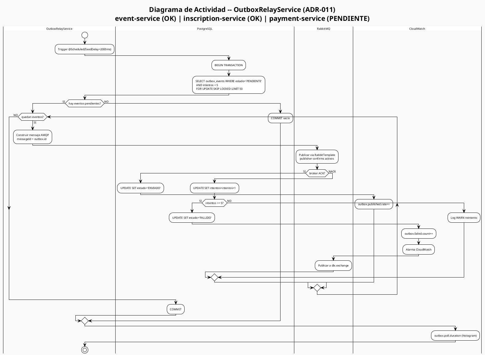
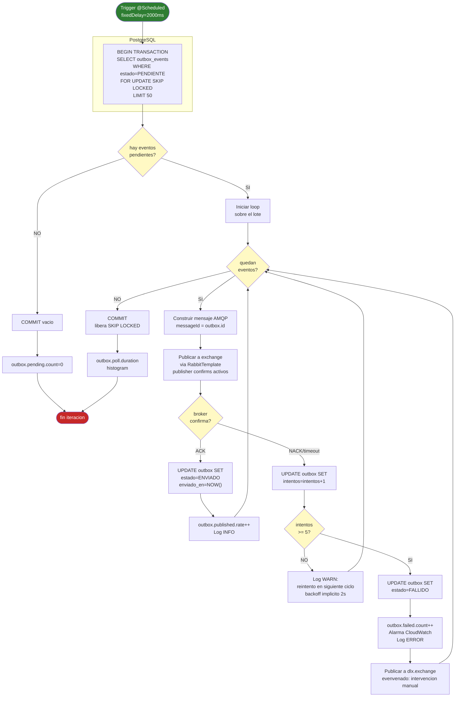

# Diagramas Complementarios — Modelo E-R, Topología RabbitMQ y Actividad Outbox

**Plataforma de Gestión de Eventos Académicos — Javeriana 2026**  
Maestría en Ingeniería de Software · Diseño de Software Basado en Patrones · Entrega 3

---

## Índice

1. [Modelo Entidad-Relación Consolidado](#1-modelo-entidad-relación-consolidado)
2. [Topología de Mensajería RabbitMQ](#2-topología-de-mensajería-rabbitmq)
3. [Diagrama de Actividad: OutboxRelayService](#3-diagrama-de-actividad-outboxrelayservice)

---

## 1. Modelo Entidad-Relación Consolidado

**Cabecera:** Modelo Entidad-Relación Consolidado — Plataforma de Gestión de Eventos Académicos | PostgreSQL 15 | DB per Service Pattern

### 1.1 PlantUML (crow's foot)

Archivo: [er-consolidado.puml](diagramas/er-consolidado.puml)



### 1.2 Mermaid erDiagram



### 1.3 Tabla de tablas críticas

| Tabla | Base de datos | Propósito | Volumen estimado | Índice clave | Restricción de integridad |
|---|---|---|---|---|---|
| `evento` | event_db | Catálogo de eventos publicados | ~1.000 filas / año | `idx_evento_estado_fecha(estado, fecha_inicio)` | — |
| `categoria` | event_db | Taxonomía de eventos | ~20 filas estable | — | `UNIQUE(nombre)` |
| `outbox_event` (event) | event_db | Buffer durable para Outbox Relay | ~5.000 filas / día (purgado) | `idx_outbox_estado_creado(estado, creado_en)` | — |
| `inscripcion` | inscription_db | Registro de inscripciones con estado | ~10.000 filas / año | `idx_inscripcion_expira(estado, expira_en)` | `UNIQUE(usuario_id, evento_id)` |
| `evento_proyeccion` | inscription_db | Proyección local del catálogo para control de cupos | ~1.000 filas | — | `SELECT FOR UPDATE` (ADR-012) |
| `shedlock` | inscription_db | Coordinación distribuida de jobs @Scheduled | 2 filas fijas | — | `PK(name)` (ADR-018) |
| `pago` | payment_db | Registro de pagos y su estado | ~10.000 filas / año | — | `UNIQUE(inscripcion_id)` |
| `mensaje_procesado` | payment_db | Idempotencia de mensajes AMQP consumidos | ~20.000 filas / año | — | `PK(message_id)` |
| `notificacion` | notification_db | Log de notificaciones enviadas | ~30.000 filas / año | `idx_notif_message_id(message_id)` | `UNIQUE(message_id)` |

### 1.4 Relaciones cross-database (correlaciones lógicas — sin FK real)

| ID origen | Tabla origen | Base datos origen | ID destino | Tabla destino | Base datos destino | Mecanismo de correlación |
|---|---|---|---|---|---|---|
| `evento.id` | evento | event_db | `evento_proyeccion.id` | evento_proyeccion | inscription_db | Proyección replicada vía `event.published` AMQP |
| `inscripcion.id` | inscripcion | inscription_db | `pago.inscripcion_id` | pago | payment_db | `inscription.created` AMQP — payment-service recibe el ID |
| `outbox_event.id` | outbox_event | inscription_db | `mensaje_procesado.message_id` | mensaje_procesado | payment_db | `messageId = outbox.id` en el header AMQP |
| `outbox_event.id` | outbox_event | payment_db | `notificacion.message_id` | notificacion | notification_db | `messageId = outbox.id` en el header AMQP |

### 1.5 Decisiones clave del modelo

**DB per Service — sin FKs entre bases de datos**  
Cada microservicio posee su esquema de forma exclusiva. La consistencia entre bases se logra mediante eventos AMQP (choreography) y el patrón Outbox, nunca mediante joins ni transacciones distribuidas. Esto materializa ADR-012 (Hexagonal) y ADR-011 (Outbox).

**`UNIQUE(usuario_id, evento_id)` como invariante de negocio**  
La constraint de unicidad en `inscripcion` evita doble inscripción incluso en escenarios de alta concurrencia donde el `SELECT FOR UPDATE` podría no ser suficiente (e.g., retries de la API con idempotency-key diferente). Es la última línea de defensa en la base de datos.

**Tabla `outbox_event` replicada en 3 servicios productores**  
event-service, inscription-service y payment-service tienen cada uno su propia tabla `outbox_event`. Esta replicación del esquema es intencional: cada servicio es independiente. El patrón Outbox requiere que el evento se persista en la misma transacción que el estado de negocio — imposible con una tabla compartida sin violer el DB per Service pattern.

**Tabla `mensaje_procesado` / `UNIQUE(message_id)` para idempotencia**  
Los consumers AMQP pueden recibir el mismo mensaje más de una vez (at-least-once delivery). La tabla `mensaje_procesado` en payment_db y el campo `message_id UNIQUE` en `notificacion` garantizan que el procesamiento sea idempotente: si el mensaje llega dos veces, la segunda inserción falla con `UNIQUE violation` y se descarta.

**`shedlock` como mecanismo de coordinación distribuida (ADR-018)**  
La tabla `shedlock` en inscription_db tiene exactamente 2 filas activas: una para `expirar-pendientes` y otra para `outbox-relay`. Son los dos jobs `@Scheduled` que no deben ejecutarse en paralelo en instancias múltiples. ShedLock usa `UPDATE ... WHERE lock_until < NOW()` atómico para adquirir el lock.

### 1.6 Scripts Flyway sugeridos

```sql
-- V1__init.sql (inscription_db)
CREATE TABLE evento_proyeccion (
    id UUID PRIMARY KEY,
    nombre VARCHAR(200) NOT NULL,
    cupos_disponibles INT NOT NULL,
    estado VARCHAR(20) NOT NULL
);

CREATE TABLE inscripcion (
    id UUID PRIMARY KEY DEFAULT gen_random_uuid(),
    usuario_id UUID NOT NULL,
    evento_id UUID NOT NULL REFERENCES evento_proyeccion(id),
    estado VARCHAR(20) NOT NULL DEFAULT 'PENDIENTE',
    creado_en TIMESTAMPTZ NOT NULL DEFAULT NOW(),
    expira_en TIMESTAMPTZ NOT NULL,
    confirmado_en TIMESTAMPTZ,
    referencia_pago VARCHAR(100),
    CONSTRAINT uq_usuario_evento UNIQUE (usuario_id, evento_id)
);
```

```sql
-- V2__outbox.sql (inscription_db / event_db / payment_db)
CREATE TABLE outbox_events (
    id UUID PRIMARY KEY DEFAULT gen_random_uuid(),
    aggregate_type VARCHAR(50) NOT NULL,
    aggregate_id UUID NOT NULL,
    event_type VARCHAR(100) NOT NULL,
    payload JSONB NOT NULL,
    estado VARCHAR(20) NOT NULL DEFAULT 'PENDIENTE',
    intentos INT NOT NULL DEFAULT 0,
    creado_en TIMESTAMPTZ NOT NULL DEFAULT NOW(),
    enviado_en TIMESTAMPTZ
);
```

```sql
-- V3__shedlock.sql (solo inscription_db — ADR-018)
CREATE TABLE shedlock (
    name VARCHAR(64) NOT NULL PRIMARY KEY,
    lock_until TIMESTAMP(3) NOT NULL,
    locked_at TIMESTAMP(3) NOT NULL,
    locked_by VARCHAR(255) NOT NULL
);
```

```sql
-- V4__indices.sql
CREATE INDEX idx_outbox_estado_creado
    ON outbox_events (estado, creado_en)
    WHERE estado = 'PENDIENTE';

CREATE INDEX idx_inscripcion_expira
    ON inscripcion (estado, expira_en)
    WHERE estado = 'PENDIENTE';

CREATE INDEX idx_evento_estado_fecha
    ON evento (estado, fecha_inicio)
    WHERE estado = 'PUBLICADO';
```

---

## 2. Topología de Mensajería RabbitMQ

**Cabecera:** Topología de Mensajería RabbitMQ — Plataforma de Gestión de Eventos Académicos | Amazon MQ for RabbitMQ | Patrón Pub-Sub Fan-Out vía Transactional Outbox

### 2.1 PlantUML

Archivo: [topologia-rabbitmq.puml](diagramas/topologia-rabbitmq.puml)



### 2.2 Mermaid flowchart



### 2.3 Tabla maestra Exchange / Queue

| Exchange | Routing Key | Queue | Productor | Consumidor | DLQ asociada | Estado |
|---|---|---|---|---|---|---|
| events.exchange | event.published | inscription.event-projection.queue | event-service | inscription-service | inscription.event-projection.dlq | PROD |
| events.exchange | event.cancelled | inscription.event-cancelled.queue | event-service | inscription-service | inscription.event-cancelled.dlq | PROD |
| events.exchange | event.cancelled | notification.event-cancelled.queue | event-service | notification-service | notification.event-cancelled.dlq | PROD |
| inscriptions.exchange | inscription.created | payment.inscription-created.queue | inscription-service | payment-service | payment.inscription-created.dlq | PROD |
| inscriptions.exchange | inscription.created | notification.inscription-created.queue | inscription-service | notification-service | notification.inscription-created.dlq | PROD |
| inscriptions.exchange | inscription.expired | notification.inscription-expired.queue | inscription-service | notification-service | notification.inscription-expired.dlq | PROD |
| inscriptions.exchange | inscription.cancelled | notification.inscription-cancelled.queue | inscription-service | notification-service | notification.inscription-cancelled.dlq | PROD |
| inscriptions.exchange | inscription.cancelled | payment.inscription-cancelled.queue | inscription-service | payment-service | payment.inscription-cancelled.dlq | PROD |
| payments.exchange | payment.confirmed | inscription.payment-confirmed.queue | payment-service | inscription-service | inscription.payment-confirmed.dlq | **PENDIENTE** |
| payments.exchange | payment.confirmed | notification.payment-confirmed.queue | payment-service | notification-service | notification.payment-confirmed.dlq | **PENDIENTE** |
| payments.exchange | payment.failed | inscription.payment-failed.queue | payment-service | inscription-service | inscription.payment-failed.dlq | **PENDIENTE** |
| payments.exchange | payment.failed | notification.payment-failed.queue | payment-service | notification-service | notification.payment-failed.dlq | **PENDIENTE** |

> **PENDIENTE:** Las queues de payment-service están configuradas en `RabbitMqTopologyConfig`, pero `OutboxRelayService` de payment-service no está implementado (rama `feat/payment-outbox-e2e`). Los mensajes no llegarán hasta completar esa rama.

### 2.4 Tabla de fan-out

| Evento AMQP | Routing key | Nº consumidores | Queues | Justificación |
|---|---|---|---|---|
| InscripcionCreada | `inscription.created` | 2 | payment + notification | payment-service inicia el proceso de pago; notification-service informa al estudiante |
| PaymentConfirmed | `payment.confirmed` | 2 | inscription + notification | inscription-service confirma la inscripción; notification-service envía recibo |
| PaymentFailed | `payment.failed` | 2 | inscription + notification | inscription-service cancela la inscripción y libera cupo; notification-service informa rechazo |
| EventoCancelado | `event.cancelled` | 2 | inscription + notification | inscription-service cancela inscripciones activas; notification-service informa a estudiantes |

### 2.5 Garantías de entrega

| Garantía | Mecanismo | Dónde se configura |
|---|---|---|
| **Publisher confirms** | `RabbitTemplate.setConfirmCallback()` — el broker confirma recepción antes de marcar el Outbox como ENVIADO | `RabbitMqConfig` en cada servicio productor |
| **Consumer ACK manual** | `AcknowledgeMode.MANUAL` — el listener hace ACK solo después de persistir el resultado en BD | `SimpleRabbitListenerContainerFactory` |
| **Idempotencia** | `UNIQUE(message_id)` en `notificacion`; tabla `mensaje_procesado` en payment_db | Base de datos + consumer logic |
| **Reintentos** | `RetryTemplate` con backoff exponencial, 3 intentos antes de DLQ | `RabbitMqTopologyConfig` + `x-dead-letter-exchange` |
| **At-least-once** | El Outbox garantiza que el evento se publique al menos una vez al recuperarse el broker | `OutboxRelayService` @Scheduled |

### 2.6 Naming convention

| Elemento | Patrón | Ejemplo |
|---|---|---|
| Exchange | `<dominio>.exchange` | `inscriptions.exchange` |
| Routing key | `<agregado>.<evento-en-pasado>` | `inscription.created` |
| Queue | `<servicio-consumidor>.<evento-origen>.queue` | `payment.inscription-created.queue` |
| DLQ | `<queue-original>.dlq` | `payment.inscription-created.dlq` |
| DLX | `dlx.exchange` (único global) | `dlx.exchange` |

### 2.7 Estado payment-service

Las queues `inscription.payment-confirmed.queue` y `notification.payment-confirmed.queue` están **declaradas y configuradas** en `RabbitMqTopologyConfig` de inscription-service y notification-service (como consumidores). Sin embargo, el **productor** (payment-service) no publica a `payments.exchange` porque `OutboxRelayService` está pendiente de implementar en la rama `feat/payment-outbox-e2e`. Esto bloquea:
- La confirmación automática de inscripciones tras pago exitoso.
- Las notificaciones de pago confirmado/rechazado.
- Los tests E2E del flujo completo.

---

## 3. Diagrama de Actividad: OutboxRelayService

**Cabecera:** Diagrama de Actividad — OutboxRelayService | Transactional Outbox Pattern (ADR-011) | Plataforma de Gestión de Eventos Académicos

### 3.1 PlantUML (actividad con swimlanes)

Archivo: [actividad-outbox-relay.puml](diagramas/actividad-outbox-relay.puml)



### 3.2 Mermaid flowchart TD



### 3.3 Tabla de estados de un OutboxEvent

| Estado | Significado | Transiciones permitidas | Acción del relay |
|---|---|---|---|
| `PENDIENTE` | Evento registrado en la transacción de negocio, pendiente de publicar | → `ENVIADO`, → `PENDIENTE` (incrementa intentos) | SELECT FOR UPDATE SKIP LOCKED + intento de publicación |
| `ENVIADO` | Publicado exitosamente a RabbitMQ con publisher confirm | — (estado final exitoso) | Ignorado en el SELECT (filtro `WHERE estado='PENDIENTE'`) |
| `FALLIDO` | Máximo de intentos alcanzado (5). Requiere intervención | — (estado final de error) | Publicado a `dlx.exchange`; ignorado en próximos polls |

### 3.4 Métricas a exponer en CloudWatch

| Métrica | Tipo | Descripción | Umbral de alerta |
|---|---|---|---|
| `outbox.pending.count` | Gauge | Número de eventos en estado `PENDIENTE` en la tabla outbox | > 100 durante > 5 min |
| `outbox.published.rate` | Counter | Eventos publicados exitosamente por segundo | — (informativa) |
| `outbox.failed.count` | Counter | Eventos que alcanzaron `intentos >= 5` | > 0 (cualquier fallo) |
| `outbox.poll.duration` | Histogram (ms) | Tiempo de cada iteración del relay (SELECT + publish + UPDATE) | p99 > 500 ms |

### 3.5 Pseudocódigo Java del OutboxRelayService

```java
@Component
@RequiredArgsConstructor
public class OutboxRelayService {

    private final OutboxRepository outboxRepository;   // Puerto hexagonal
    private final EventPublisher eventPublisher;        // Puerto hexagonal
    private static final int BATCH_SIZE = 50;
    private static final int MAX_INTENTOS = 5;

    @Scheduled(fixedDelay = 2000)
    @SchedulerLock(                                     // ADR-018 (solo inscription-service)
        name = "outbox-relay",
        lockAtMostFor = "PT5S",
        lockAtLeastFor = "PT2S"
    )
    @Transactional
    public void procesarEventosPendientes() {
        List<OutboxEvent> pendientes = outboxRepository.buscarPendientes(BATCH_SIZE);
        // Internamente: SELECT ... FOR UPDATE SKIP LOCKED LIMIT 50

        for (OutboxEvent evento : pendientes) {
            try {
                eventPublisher.publicar(evento);
                // Internamente: RabbitTemplate con publisher confirms
                outboxRepository.marcarProcesado(evento.getId());
                // UPDATE SET estado='ENVIADO', enviado_en=NOW()

            } catch (AmqpException ex) {
                evento.incrementarIntentos();
                if (evento.getIntentos() >= MAX_INTENTOS) {
                    evento.marcarFallido();
                    // Alerta CloudWatch + publicar a dlx.exchange
                }
                outboxRepository.guardar(evento);
                // UPDATE SET intentos++ (y estado si FALLIDO)
            }
        }
        // COMMIT al salir del @Transactional — libera SKIP LOCKED
    }
}

// Puerto de dominio
interface OutboxRepository {
    List<OutboxEvent> buscarPendientes(int limite);
    OutboxEvent guardar(OutboxEvent evento);
    void marcarProcesado(UUID id);
}

// Adaptador JPA (driven adapter)
@Repository
class OutboxJpaAdapter implements OutboxRepository {

    @Override
    public List<OutboxEvent> buscarPendientes(int limite) {
        return jpaRepository.findPendientesConLock(
            PageRequest.of(0, limite)
        ).stream().map(mapper::toDomain).toList();
    }
}

// Spring Data repository con SKIP LOCKED
interface OutboxJpaRepository extends JpaRepository<OutboxEventEntity, UUID> {

    @Lock(LockModeType.PESSIMISTIC_WRITE)
    @QueryHints(@QueryHint(name = "jakarta.persistence.lock.timeout", value = "-2"))
    @Query("""
        SELECT o FROM OutboxEventEntity o
        WHERE o.estado = 'PENDIENTE'
          AND o.intentos < 5
        ORDER BY o.creado_en ASC
        """)
    List<OutboxEventEntity> findPendientesConLock(Pageable pageable);
    // Nota: el hint -2 activa SKIP LOCKED en PostgreSQL
}
```

### 3.6 Garantías del patrón

| Garantía | Descripción |
|---|---|
| **At-least-once delivery** | El relay puede publicar el mismo evento más de una vez si falla después del publish pero antes del UPDATE. Los consumidores deben ser idempotentes (`UNIQUE(message_id)`). |
| **Consistencia eventual** | El estado de dominio (inscripción confirmada) y la propagación del evento son consistentes eventualmente. En condiciones normales, el delay es < 2 segundos. |
| **Resistencia a caídas del broker** | Si Amazon MQ cae, los eventos permanecen en `PENDIENTE` en PostgreSQL. Al recuperarse, el relay los publica automáticamente sin pérdida de datos. |
| **Escalabilidad horizontal** | `SKIP LOCKED` permite que N instancias del mismo servicio ejecuten el relay en paralelo, tomando subconjuntos disjuntos del backlog. Sin bloqueos entre instancias. |

### 3.7 Patrones GoF involucrados

| Patrón GoF | Categoría | Rol en OutboxRelayService |
|---|---|---|
| **Template Method** | Comportamiento | El esqueleto del polling (BEGIN → SELECT → loop → publish → COMMIT) es idéntico en los 3 servicios productores. Cada uno puede variar el tipo de exchange/routing key. |
| **Strategy** | Comportamiento | La estrategia de publicación puede variar por tipo de evento: `EventoPublicado` va a `events.exchange`, `InscripcionCreada` a `inscriptions.exchange`. Implementable como `PublicationStrategy` por tipo. |
| **Repository** | Arquitectural | `OutboxRepository` como puerto de dominio abstrae el mecanismo de persistencia del relay. El servicio nunca conoce JPA ni SQL directamente. |
| **Adapter** | Estructural | `OutboxJpaAdapter` adapta Spring Data JPA (con `@Lock(PESSIMISTIC_WRITE)` y SKIP LOCKED) al puerto `OutboxRepository` del dominio. |
| **Singleton** (Spring) | Creacional | `OutboxRelayService` es un bean Spring `@Component` — instancia única por contexto. En multi-instancia (varias JVMs), ShedLock previene ejecución paralela. |

---

*Generado: 2026-05-22 · Autor: Tannia Hernández · Entrega 3 — Diseño de Software Basado en Patrones · Pontificia Universidad Javeriana*
