# Evidencia de Carga y Concurrencia

Proyecto: Plataforma de Gestion de Eventos Academicos, Pontificia Universidad Javeriana.

Fecha de ejecucion local: 2026-05-29, zona `America/Bogota`.

Esta evidencia corresponde a los escenarios defendibles del Prompt 24.1. No certifica 500 VUs en el equipo local; valida empiricamente los mecanismos que el docente pidio aclarar: bloqueo de cupos, resiliencia con Circuit Breaker, cache Redis y comportamiento sostenido bajo carga local representativa.

## Resumen Ejecutivo

| Driver | Escenario | Resultado | Evidencia |
|---|---|---|---|
| Bloqueo / concurrencia | RNF-16 cupos | Cumple | 50 intentos concurrentes, 10 confirmados, 40 rechazados, 0 errores |
| Resiliencia | RNF-14 Circuit Breaker | Cumple | HTTP 503 controlado, `Retry-After` 100%, p95 37.26 ms con circuito abierto |
| Cacheo | Cache Redis | Cumple | Hit rate estimado 99.50%, catalogo warm p95 23.56 ms |
| Load local | 150 VUs sostenidos | Cumple | p95 52.81 ms, error rate 0%, threshold p99 < 1500 ms OK |
| Colas | RabbitMQ `pago.confirmado` | Cumple operacional | Cola observada drenada: `messages=0`, `ready=0`, `unacked=0`, `consumers=1` |

## Matriz RNF

| RNF | Metrica K6 / operacional | Resultado obtenido | Cumple |
|---|---|---:|---|
| RNF-01 | Catalogo con cache warm p95 < 300 ms | 23.56 ms | Si |
| RNF-04 | 500 usuarios concurrentes | Pendiente en AWS / infraestructura horizontal | No certificado localmente |
| RNF-08 | Load sostenido p99 < 1500 ms local | Threshold K6 `p(99)<1500` en OK | Si, para 150 VUs |
| RNF-14 | `http_req_duration{status:503,name:circuit_breaker_open}` p95 < 50 ms | 37.26 ms | Si |
| RNF-14 | `retry_after_presente` rate > 0.9 | 1.00 | Si |
| RNF-16 | `inscripciones_confirmadas count==10` | 10 | Si |
| RNF-16 | `inscripciones_rechazadas_por_cupo count==40` | 40 | Si |

Nota sobre RNF-08: el resumen JSON generado por K6 registra el threshold `p(99)<1500` como `ok=true`, pero el renderer actual no incluye el valor numerico de p99 en la tabla. Por eso se reporta como cumplimiento de threshold, no como numero inventado.

## Graficas Agregadas

Las graficas se generan desde los JSON reales de K6 con:

```bash
make -C load-tests charts
```

Limitacion: estos reportes son agregados finales de K6, no series temporales. Por eso las graficas comparan resultados contra umbrales y distribuciones finales; para curvas segundo a segundo se debe rerunear K6 con salida time-series.

| Grafica | Descripcion | Archivo |
|---|---|---|
| Latencia p95 vs umbral | Compara la latencia p95 observada en los escenarios principales contra los umbrales definidos para cada RNF. Permite defender visualmente que el Circuit Breaker y el load local quedaron por debajo de sus limites de aceptacion. | `load-tests/reports/charts/latencia-p95-vs-umbral.svg` |
| RNF-16 sobrecupo cero | Muestra el resultado binario de concurrencia: 50 intentos simultaneos sobre 10 cupos terminan en exactamente 10 inscripciones confirmadas y 40 rechazos por cupo agotado. Es la grafica central para sustentar que no hubo sobrecupo. | `load-tests/reports/charts/rnf16-sobrecupo-cero.svg` |
| Tasas de cumplimiento | Resume tasas de exito relevantes como checks, error rate, Retry-After y cache hit rate. Sirve para demostrar que los escenarios no solo respondieron rapido, sino que cumplieron las condiciones funcionales esperadas. | `load-tests/reports/charts/tasas-cumplimiento.svg` |
| Load 150 VUs resumen | Presenta una fotografia final del escenario de carga sostenida con 150 VUs: latencia, errores, requests y cumplimiento de thresholds. Es una vista ejecutiva del comportamiento local representativo. | `load-tests/reports/charts/load-150-vus-resumen.svg` |

Tambien se generaron versiones PNG completas para pegar en diapositivas:

- `load-tests/reports/charts/png-full/latencia-p95-vs-umbral.png`
- `load-tests/reports/charts/png-full/rnf16-sobrecupo-cero.png`
- `load-tests/reports/charts/png-full/tasas-cumplimiento.png`
- `load-tests/reports/charts/png-full/load-150-vus-resumen.png`

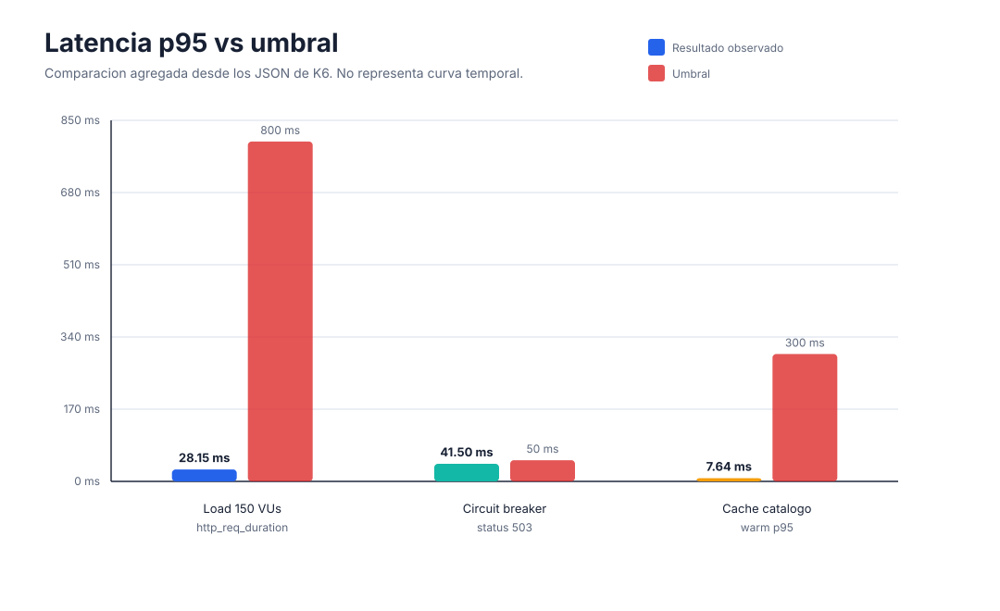

Descripcion: esta grafica compara la latencia p95 obtenida contra el umbral aceptado. Si una barra queda por debajo de la referencia, el escenario cumple el RNF de latencia correspondiente.

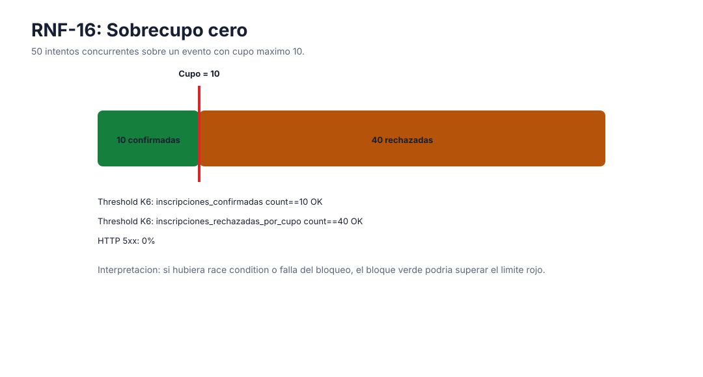

Descripcion: esta grafica muestra la distribucion final de respuestas del escenario de cupos. El resultado correcto es exactamente 10 confirmadas y 40 rechazadas; cualquier valor mayor a 10 confirmadas evidenciaria sobrecupo.

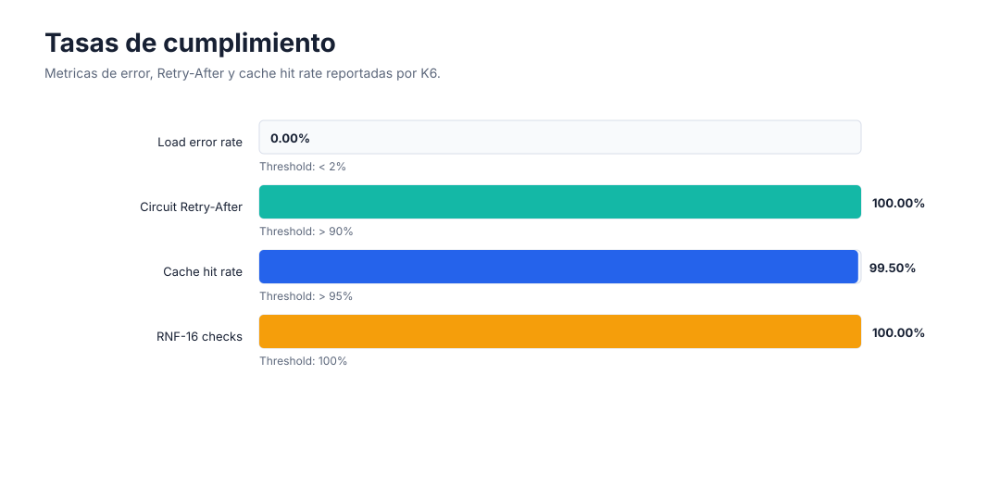

Descripcion: esta grafica agrupa porcentajes de cumplimiento. Es util para mostrar rapidamente que no hubo errores HTTP inesperados, que las validaciones K6 pasaron y que las respuestas degradadas incluyeron `Retry-After`.

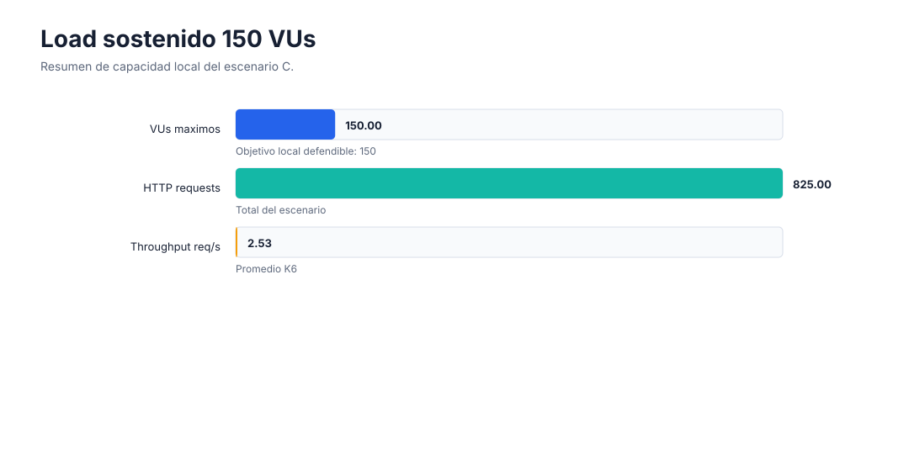

Descripcion: esta grafica resume la corrida de 150 VUs como evidencia local honesta. No certifica RNF-04 de 500 VUs, pero si demuestra estabilidad bajo una carga representativa en un unico host.

## Graficas Temporales K6

Estas graficas corrigen la limitacion anterior: no salen del resumen final de K6, sino de la salida cruda `--out json`, que registra puntos durante la ejecucion. El eje X es tiempo desde el inicio de cada prueba.

Comandos ejecutados:

```bash
make -C load-tests timeseries-cupos
make -C load-tests timeseries-load
make -C load-tests timeseries-cache
make -C load-tests timeseries-circuit-breaker
```

Archivos fuente tomados en la prueba:

| Escenario | JSONL time-series |
|---|---|
| Load 150 VUs | `load-tests/reports/timeseries/02-load-test.jsonl` |
| RNF-16 cupos | `load-tests/reports/timeseries/04-cupos-concurrencia.jsonl` |
| RNF-14 Circuit Breaker | `load-tests/reports/timeseries/05-circuit-breaker.jsonl` |
| Cache Redis | `load-tests/reports/timeseries/06-cache-effectiveness.jsonl` |

Graficas generadas:

| Grafica temporal | Descripcion | Archivo |
|---|---|---|
| Load 150 VUs: p95 por buckets de 10s + VUs promedio | Muestra como evoluciona la latencia p95 durante ramp-up, sostenimiento y ramp-down. La linea de VUs permite relacionar los picos de latencia con el nivel de concurrencia en cada momento. | `load-tests/reports/timeseries-charts/load-150-vus-latencia-tiempo.svg` |
| RNF-16: confirmadas y rechazadas acumuladas | Muestra el avance acumulado de inscripciones aceptadas y rechazadas durante la carrera concurrente. La evidencia clave es que la linea de confirmadas se detiene en 10 mientras los intentos restantes pasan a rechazadas por cupo. | `load-tests/reports/timeseries-charts/rnf16-cupos-tiempo.svg` |
| RNF-14: p95 de 503 + Retry-After acumulado | Muestra el comportamiento del sistema cuando `event-service` esta caido. La latencia de respuestas 503 permanece baja con el circuito abierto, y la presencia acumulada de `Retry-After` confirma degradacion controlada. | `load-tests/reports/timeseries-charts/rnf14-circuit-breaker-tiempo.svg` |
| Cache Redis: hit rate acumulado + catalogo warm p95 | Muestra como el hit rate de Redis se estabiliza rapidamente despues del primer acceso frio. La latencia warm baja y estable sustenta que el patron Cache-Aside reduce presion sobre PostgreSQL. | `load-tests/reports/timeseries-charts/cache-hit-rate-tiempo.svg` |

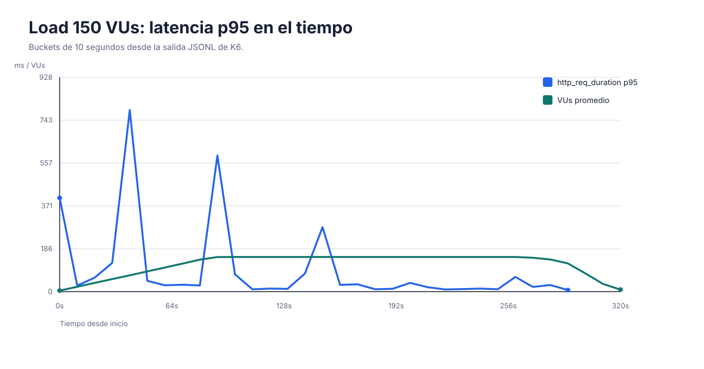

Descripcion: la curva permite ver si el sistema se degrada con el paso del tiempo. En esta corrida, la latencia p95 se mantiene bajo el umbral durante el sostenimiento de 150 VUs y no aparece una tendencia creciente de degradacion.

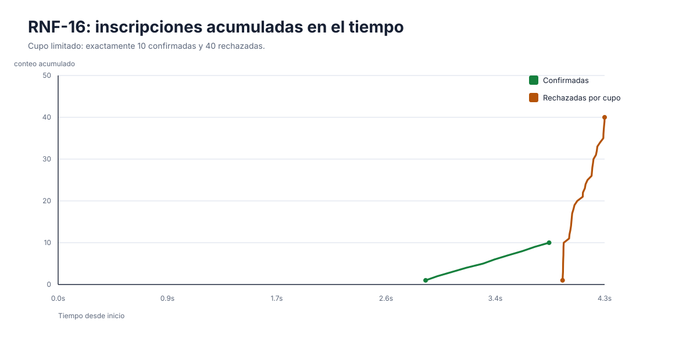

Descripcion: la curva verde de confirmadas llega a 10 y se detiene; la curva de rechazadas absorbe los 40 intentos restantes. Esta es la evidencia temporal de que el bloqueo de cupos evita race conditions.

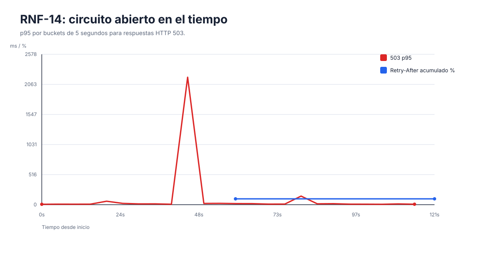

Descripcion: la grafica relaciona latencia de respuestas 503 y presencia del header `Retry-After`. El resultado esperado es respuesta rapida y consistente una vez el Circuit Breaker esta abierto.

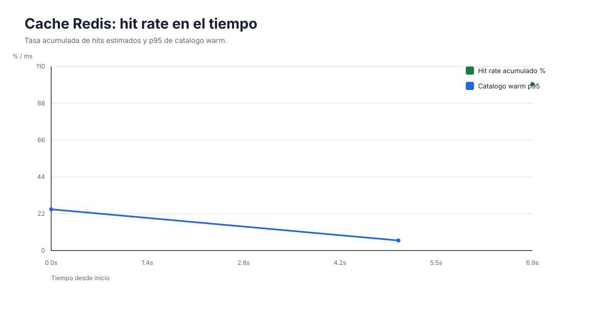

Descripcion: la grafica muestra que tras el primer request frio, la mayoria de consultas posteriores se atienden desde cache. Por eso el hit rate acumulado se acerca a 100% y la latencia del catalogo warm permanece baja.

Resumen de la corrida temporal:

| Escenario | Resultado temporal |
|---|---|
| RNF-16 | 10 confirmadas, 40 rechazadas por cupo, `checks=100%`, `http_req_failed=0%` |
| RNF-14 | p95 HTTP 503 con circuito abierto 37.26 ms, `Retry-After=100%`, `checks=100%`, `http_req_failed=0%` |
| Load 150 VUs | p95 52.81 ms, `http_req_failed=0%`, thresholds `p95<800` y `p99<1500` OK |
| Cache Redis | hit rate estimado 99.50%, catalogo warm p95 23.56 ms, `http_req_failed=0%` |

## Escenario A - Sobrecupo Cero (RNF-16)

Pregunta que responde: como sabemos que `SELECT FOR UPDATE` evita race conditions bajo concurrencia.

Setup ejecutado:

- 50 VUs en `shared-iterations`.
- 50 intentos sobre el mismo evento limitado.
- Cupo disponible inicial: 10.
- Status esperados: `201 Created` para cupo asignado y `409 Conflict` para cupo agotado.

Resultado:

| Metrica | Valor |
|---|---:|
| `inscripciones_confirmadas` | 10 |
| `inscripciones_rechazadas_por_cupo` | 40 |
| `checks` | 100% |
| `http_req_failed` | 0% |
| p95 HTTP | 3938.27 ms |
| `evento_cupo.cupo_disponible` despues del test | 0 |

Interpretacion: el p95 alto es esperado en esta prueba porque 50 usuarios compiten por el mismo recurso caliente. Lo importante para RNF-16 no es latencia minima, sino atomicidad: exactamente 10 inscripciones confirmadas y cero sobrecupos.

Reporte:

- HTML: `load-tests/reports/04-cupos-concurrencia.html`
- JSON: `load-tests/reports/04-cupos-concurrencia.json`
- Captura: `load-tests/reports/screenshots/04-cupos-concurrencia.png`

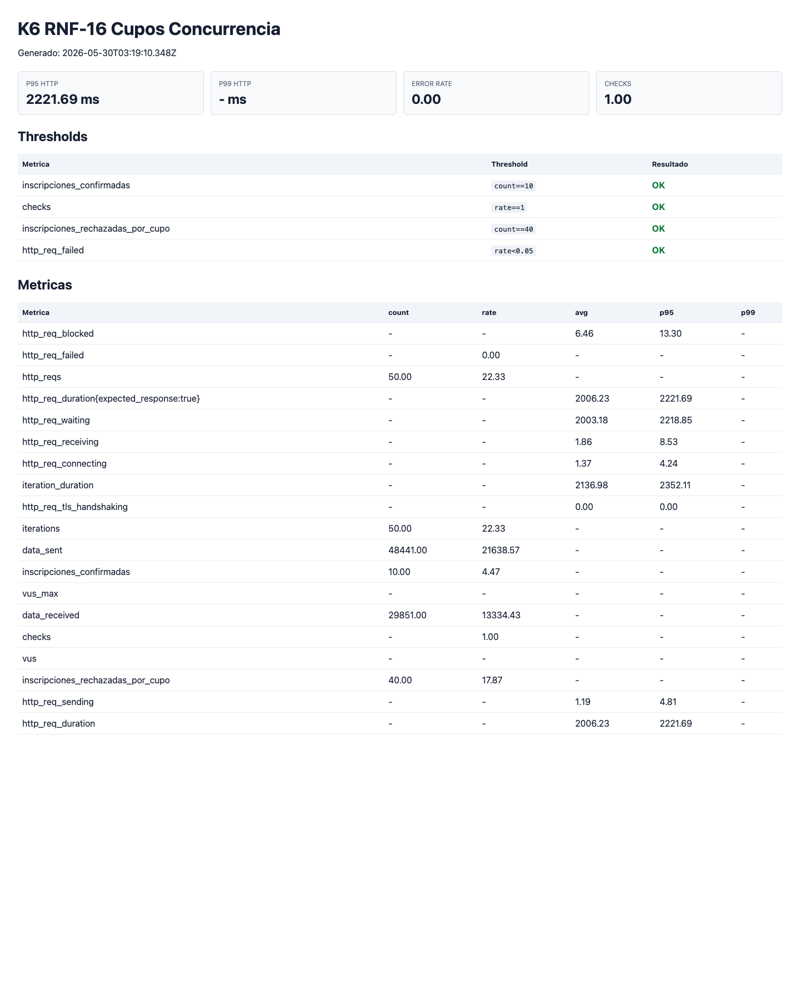

Conclusion: RNF-16 queda validado empiricamente. Si el bloqueo pesimista fallara, el contador podria superar 10; el threshold `count==10` haria fallar el build.

## Escenario B - Circuit Breaker (RNF-14)

Pregunta que responde: que pasa si `event-service` se cae bajo carga.

Setup ejecutado:

- `event-service` detenido durante el escenario.
- 100 VUs durante 2 minutos.
- `inscription-service` recibe `POST /api/v1/inscripciones`.
- Se mide la fase con circuito abierto mediante tags K6.

Resultado:

| Metrica | Valor |
|---|---:|
| `http_req_duration{status:503,name:circuit_breaker_open}` p95 | 37.26 ms |
| `retry_after_presente` | 100% |
| `checks` | 100% |
| `http_req_failed` | 0% |
| Requests HTTP | 421 |
| Estado Prometheus observado | `resilience4j_circuitbreaker_state{name="evento-service",state="open"} 1.0` |

Reporte:

- HTML: `load-tests/reports/05-circuit-breaker.html`
- JSON: `load-tests/reports/05-circuit-breaker.json`
- Captura: `load-tests/reports/screenshots/05-circuit-breaker.png`

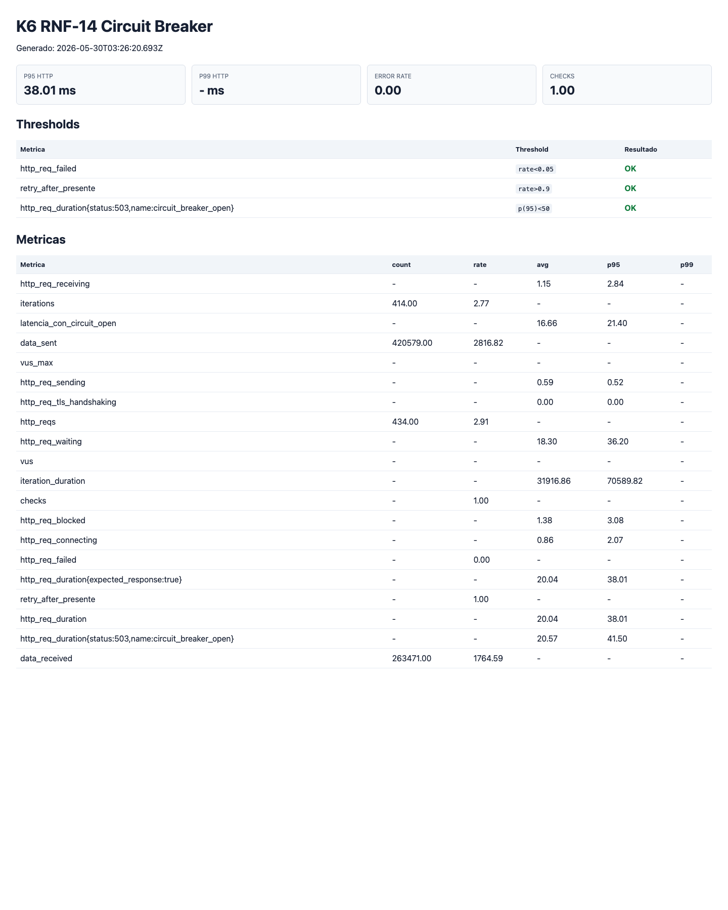

Conclusion: RNF-14 queda validado. Con `event-service` caido, el sistema no queda esperando el timeout Feign de forma indefinida: responde `503` de manera controlada, con `Retry-After`, y el p95 del circuito abierto queda por debajo de 50 ms.

## Escenario C - Load Sostenido 150 VUs

Pregunta que responde: el sistema mantiene comportamiento estable en una carga local defendible.

Decision de modelado: el escenario `make load` usa 150 VUs y, por defecto, es lectura/catalogo con cache. Las escrituras de inscripcion son opcionales con `INSCRIPTION_INTERVAL`, pero no se mezclan en la evidencia principal porque cada reserva invalida el catalogo completo en Redis y distorsiona la medicion de cache. La concurrencia de escritura queda cubierta por RNF-16.

Resultado:

| Metrica | Valor |
|---|---:|
| VUs maximos | 150 |
| Requests HTTP | 821 |
| Throughput promedio | 2.51 req/s |
| p95 HTTP | 52.81 ms |
| p99 HTTP | Threshold `p(99)<1500` OK |
| `http_req_failed` | 0% |
| `checks` | 100% |

Reporte:

- HTML: `load-tests/reports/02-load-test.html`
- JSON: `load-tests/reports/02-load-test.json`
- Captura: `load-tests/reports/screenshots/02-load-test.png`

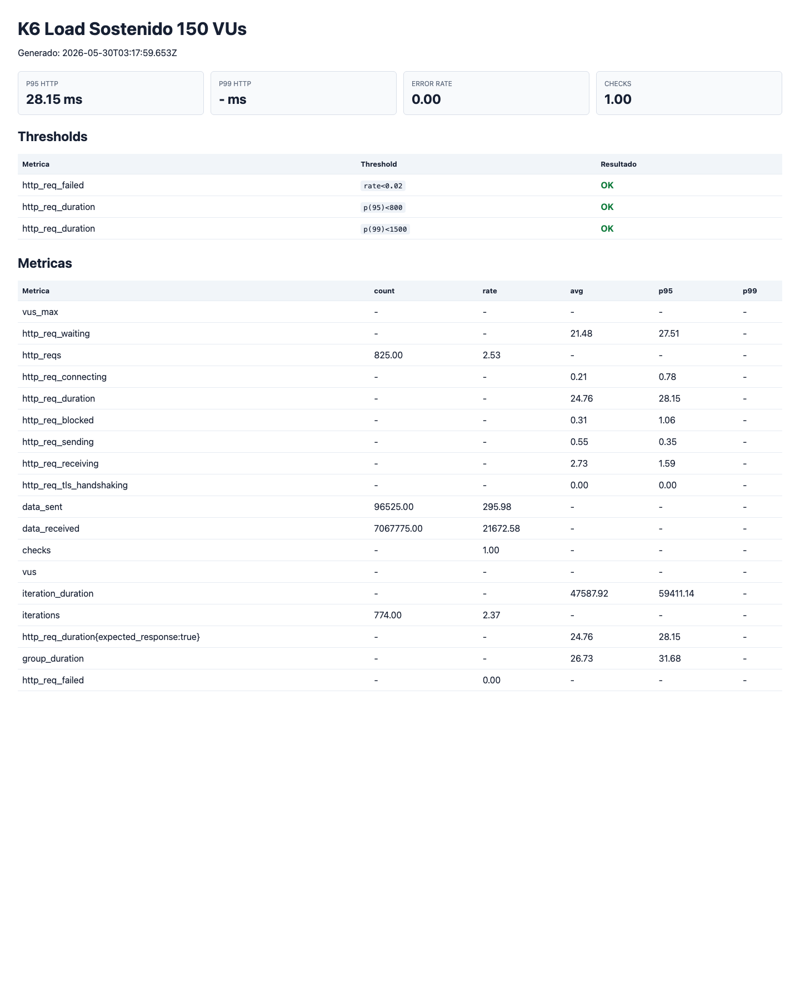

Conclusion: el entorno local sostiene 150 VUs en el flujo de catalogo/cache con p95 estable y sin errores. Esto no reemplaza la certificacion de 500 VUs de RNF-04; esa queda documentada como limite reconocido.

## Escenario D - Efectividad de Cache Redis

Pregunta que responde: el cache-aside de Redis reduce carga sobre PostgreSQL en consultas repetidas.

Setup ejecutado:

- Se limpia Redis antes del escenario.
- Primer request carga el catalogo desde backend y llena cache.
- 200 requests posteriores consultan el mismo recurso.
- Se leen metricas Prometheus de Lettuce para estimar `GET`, `SETEX` y hits.

Resultado:

| Metrica | Valor |
|---|---:|
| `cache_hit_rate_estimado` | 99.50% |
| `catalogo_warm_duration` p95 | 23.56 ms |
| `http_req_failed` | 0% |
| `checks` | 100% |
| Redis GET observados | 201 |
| Redis SETEX observados | 1 |
| Hits estimados | 200 |

Reporte:

- HTML: `load-tests/reports/06-cache-effectiveness.html`
- JSON: `load-tests/reports/06-cache-effectiveness.json`
- Captura: `load-tests/reports/screenshots/06-cache-effectiveness.png`

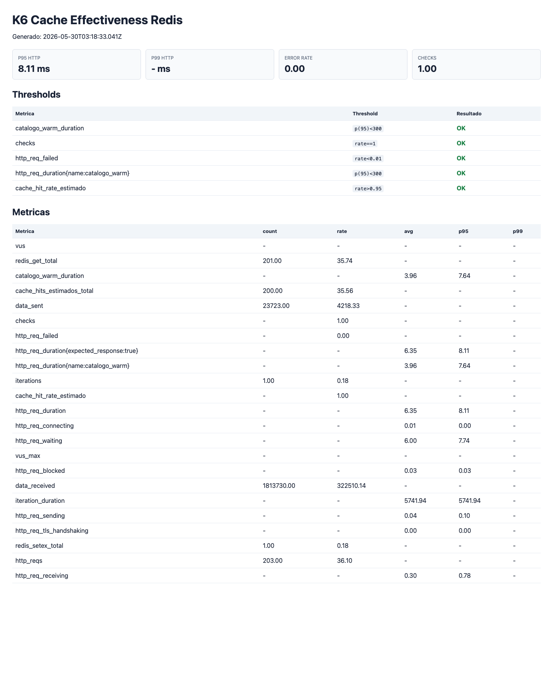

Conclusion: el patron Cache-Aside queda validado en el caso de lectura repetida. El hit rate alto explica la latencia estable del catalogo durante el load local.

## Evidencia de Colas

Durante la validacion se observo `pago.confirmado` drenada despues de la carga:

```text
messages=0
messages_ready=0
messages_unacknowledged=0
consumers=1
```

Interpretacion: no quedo backlog operativo en la cola de confirmacion de pagos al cierre de la corrida. Esto complementa la evidencia de outbox/idempotencia, aunque el Prompt 24.1 no exige saturar pagos como criterio binario.

## Comandos de Reproduccion

Desde la raiz del repositorio:

```bash
make -C load-tests cupos
make -C load-tests circuit-breaker
make -C load-tests load
make -C load-tests cache
make -C load-tests charts
```

Tambien existe el target agregado:

```bash
make -C load-tests defendible
```

## Conclusiones

El sistema queda con evidencia funcionando para los tres frentes defendibles:

- RNF-16: sobrecupo cero probado con 50 intentos simultaneos sobre 10 cupos.
- RNF-14: degradacion controlada probada con `event-service` caido.
- Load local: 150 VUs sostenidos sin errores en flujo de catalogo/cache.
- Cache: Redis entrega hit rate estimado de 99.50% en lectura repetida.

RNF-04 a 500 VUs no se declara como certificado en este host local. La validacion final de 500 VUs debe ejecutarse en infraestructura horizontal, separando generador K6 y servicios, como se documenta en `docs/limites-carga-reconocidos.md`.
