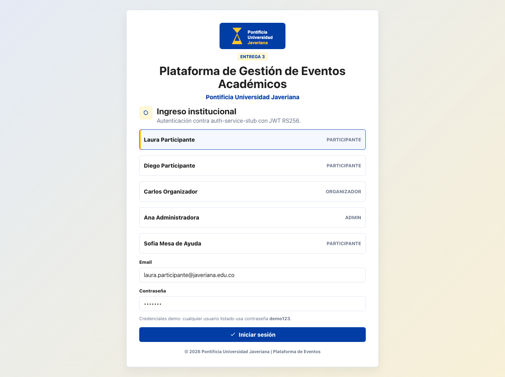
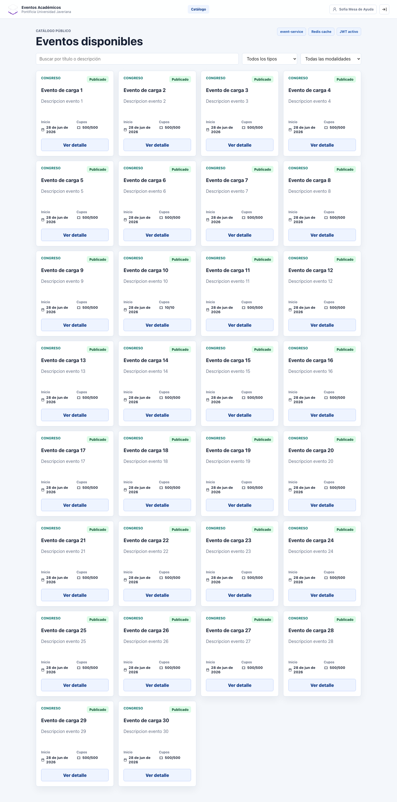
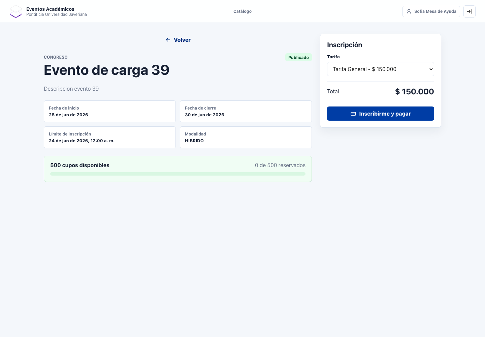
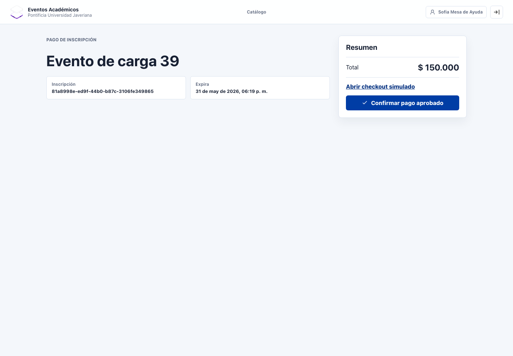
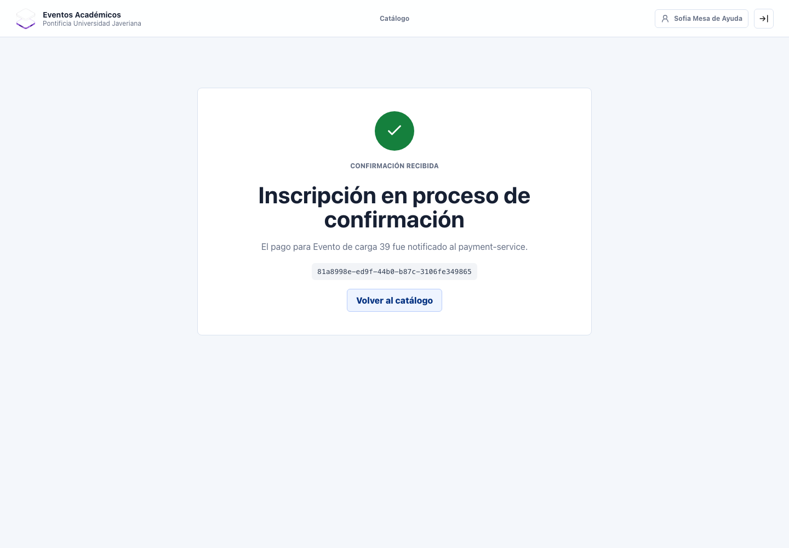
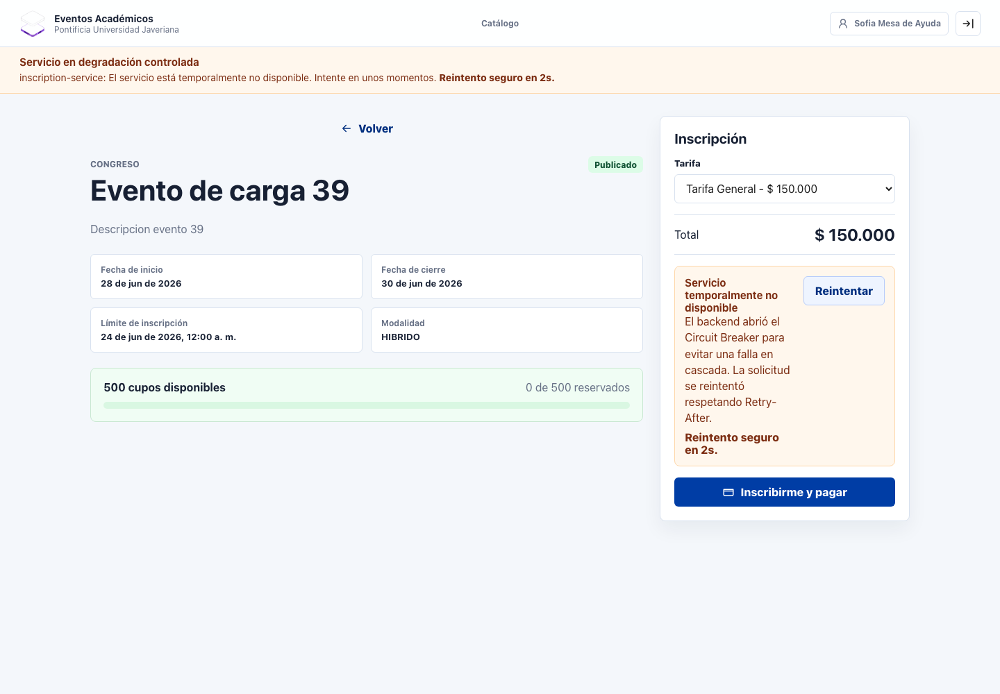

# Evidencia Frontend SPA - Prompts 25, 26 y 26.5

Proyecto: Plataforma de Gestion de Eventos Academicos, Pontificia Universidad Javeriana.

Fecha de verificacion local: 2026-05-31, zona `America/Bogota`.

## Resumen

El SPA React + Vite + TypeScript implementa el flujo critico de Entrega 3:

```text
login real -> catalogo -> detalle -> inscripcion -> pago -> confirmacion
```

La validacion se ejecuto contra el entorno E2E real con los tres microservicios levantados:

- `event-service`: `http://localhost:8082`
- `inscription-service`: `http://localhost:8083`
- `payment-service`: `http://localhost:8084`
- SPA Vite: `http://127.0.0.1:3000`

El Prompt 26 agrega UX de degradacion controlada para reflejar la semantica del Circuit Breaker del backend: `HTTP 503`, header `Retry-After`, reintento automatico y comunicacion clara al usuario.

El Prompt 26.5 agrega login real minimo: el SPA llama a `auth-service-stub` via `POST /api/v1/auth/login`, guarda el JWT en `sessionStorage` y usa ese token para el flujo completo.

## Evidencia Funcional

Comando:

```bash
npm run smoke:e2e
```

Resultado obtenido:

```json
{
  "login": "diego.participante@javeriana.edu.co",
  "catalogo": "00000000-0000-0000-0000-000000000013",
  "tarifa": "00000000-0000-0000-0001-000000000013",
  "inscripcion": "0e835617-59b7-4844-9466-160f03ccc636",
  "pago": {
    "resultado": "CONFIRMADO"
  }
}
```

Interpretacion: el smoke cruza Vite/proxies, `auth-service-stub` y los tres microservicios reales. Inicia sesion con credenciales demo, recibe JWT RS256, consulta catalogo, obtiene tarifa, crea inscripcion y confirma pago mediante webhook HMAC hacia `payment-service`.

## Evidencia Visual

Comando:

```bash
npm run screenshots:e2e
```

Resultado:

```text
Captured SPA E2E screenshots in frontend/evidence/screenshots
```

Capturas generadas:

| Paso | Pantalla | Archivo |
|---|---|---|
| 1 | Login real contra `auth-service-stub` | `frontend/evidence/screenshots/01-login.png` |
| 2 | Catalogo con eventos reales | `frontend/evidence/screenshots/02-catalogo.png` |
| 3 | Detalle de evento y seleccion de tarifa | `frontend/evidence/screenshots/03-detalle-evento.png` |
| 4 | Pago simulado | `frontend/evidence/screenshots/04-pago.png` |
| 5 | Confirmacion | `frontend/evidence/screenshots/05-confirmacion.png` |
| 6 | Degradacion controlada con `503` + `Retry-After` | `frontend/evidence/screenshots/06-degradacion-controlada.png` |













## Evidencia de Degradacion Controlada

El script `npm run screenshots:e2e` intercepta una solicitud de inscripcion y responde desde Chrome DevTools Protocol con:

```text
HTTP 503 Service Unavailable
Retry-After: 2
```

Resultado esperado y observado:

- Banner global: "Servicio en degradacion controlada".
- Servicio afectado: `inscription-service`.
- Cuenta regresiva visible: "Reintento seguro en 2s".
- Error contextual en el panel de inscripcion.
- Boton de reintento accionable.

Interpretacion: el SPA ya no muestra un error generico ante el Circuit Breaker. Explica que el backend esta protegiendo el sistema de una falla en cascada, respeta `Retry-After` y permite reintentar de forma controlada.

El script tambien falla si Chrome reporta excepciones de JavaScript o `console.error` durante el recorrido, excluyendo solo los `503 Service Unavailable` simulados para este escenario.

Nota de implementacion: se intento instalar `@tanstack/react-query`, primero contra el registry privado y luego contra `registry.npmjs.org`; ambos intentos fallaron por restricciones de red/registry (`403` y `ENOTFOUND`). Para no bloquear la entrega ni inventar dependencias, la politica equivalente de retry quedo implementada en `src/lib/retry/withRetry.ts`, usando `ServiceUnavailableError.retryAfterSeconds` como fuente de verdad.

## Verificaciones Tecnicas

| Criterio | Evidencia | Estado |
|---|---|---|
| Arquitectura por capas | `src/app`, `src/features`, `src/entities`, `src/services`, `src/shared` | Cumple |
| TypeScript strict | `tsconfig.json` con `strict`, `noUnusedLocals`, `noUnusedParameters` | Cumple |
| Build productivo | `npm run build` | Cumple |
| Lint reproducible | `npm run lint` valida ESLint + 55 fuentes TS/TSX | Cumple |
| Login HTTP real minimo | `auth-service-stub` + `src/services/authService.ts` | Cumple |
| JWT con expiracion | `shared/api/http.ts` limpia sesion expirada en `sessionStorage` | Cumple |
| Correlation ID | interceptor Axios agrega `X-Correlation-Id` | Cumple |
| Sanitizacion XSS | render React + `sanitizeText` + bloqueo de `dangerouslySetInnerHTML` en lint local | Cumple |
| Integracion backend real | `npm run smoke:e2e` con login real | Cumple |
| Errores tipados | `AppError`, `ServiceUnavailableError`, `NetworkError`, `BusinessRuleError`, `AuthError` | Cumple |
| Retry con `Retry-After` | `src/lib/retry/withRetry.ts` | Cumple |
| Banner global de degradacion | `DegradedServiceBanner` + `useServiceHealth` | Cumple |
| Estado offline | `NetworkOfflineBanner` + `useNetworkStatus` | Cumple |
| ErrorBoundary global | `components/ErrorBoundary.tsx` | Cumple |

## Comandos Reproducibles

Desde `frontend/`:

```bash
npm run lint
npm run build
npm run smoke:e2e
npm run screenshots:e2e
```

Prerequisitos:

```bash
make -C load-tests seed
mvn -f auth-service-stub/pom.xml package -DskipTests
java -jar auth-service-stub/target/auth-service-stub-1.0.0-SNAPSHOT.jar
npm run dev -- --host 127.0.0.1
```

## Limites Declarados

El login actual usa `auth-service-stub`, un stub HTTP minimo y documentado con 5 usuarios demo. No es IdP productivo y debe reemplazarse por Azure AD, Keycloak u OIDC institucional. Las pantallas completas de organizador, administrador y perfil participante quedan declaradas en `TECH_DEBT.md`; el alcance de mocks queda en `docs/alcance-y-decisiones-de-mocks.md`.
