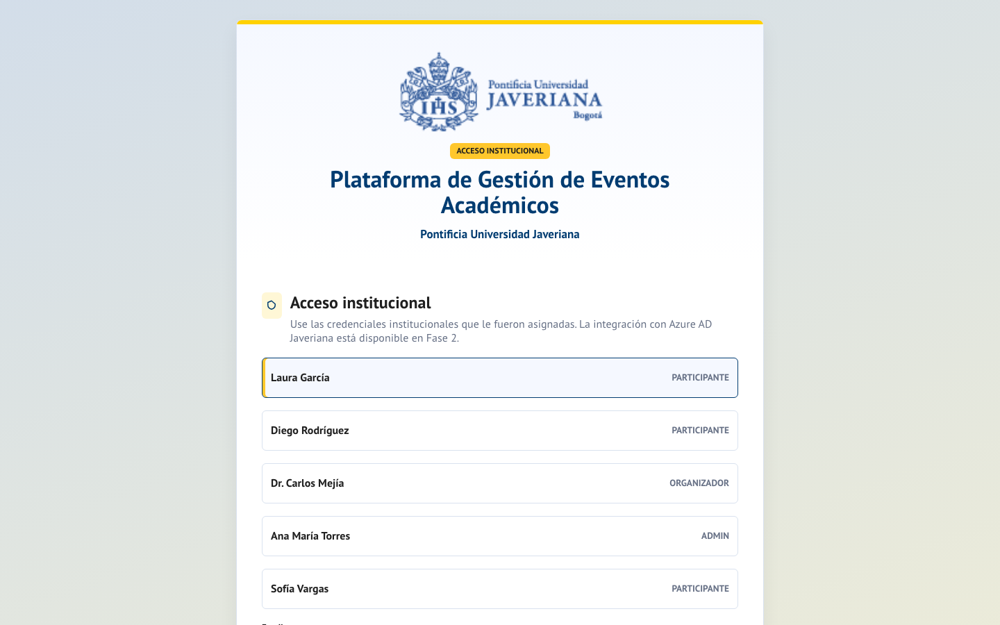
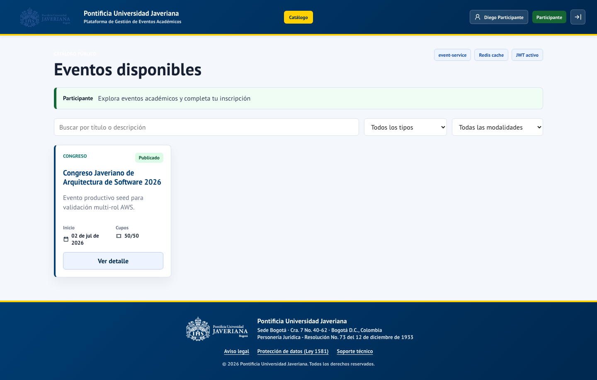
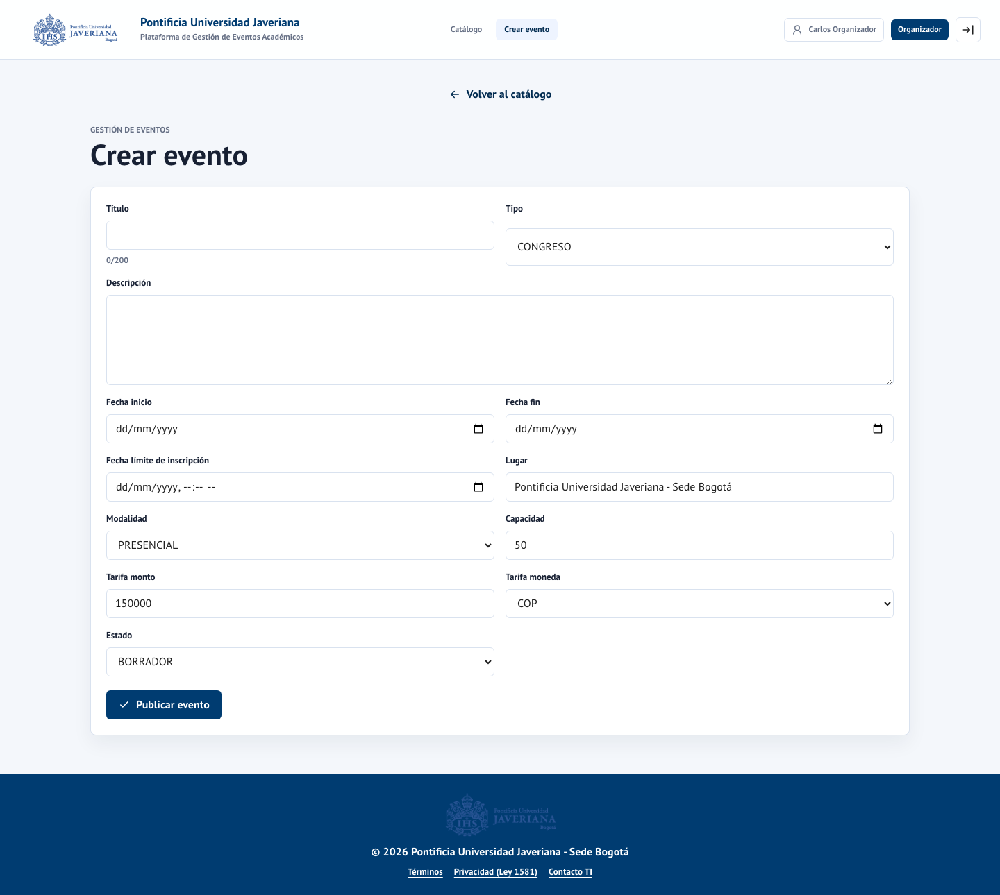
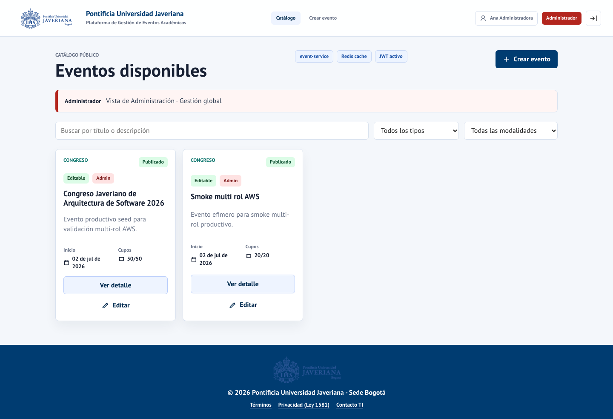
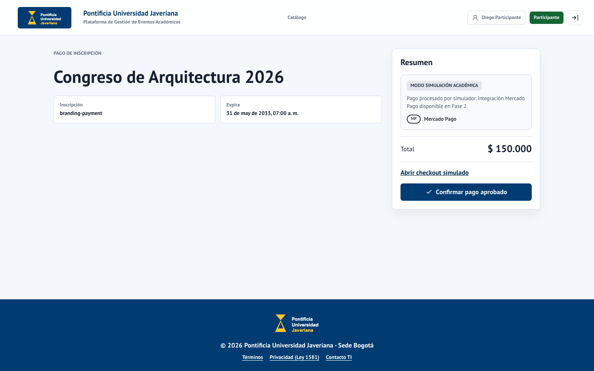

# Plataforma de Gestión de Eventos Académicos
## Material de Presentación Institucional — 31 slides

**Pontificia Universidad Javeriana — Sede Bogotá**
**Sistema productivo:** https://d1xvny1kolb55e.cloudfront.net

---

## SLIDE 1 — Portada institucional

> Fondo azul PUJ `#003c71` · Acento dorado `#ffd100` · Logo centrado

```
       [LOGO PONTIFICIA UNIVERSIDAD JAVERIANA]

  Plataforma de Gestión de Eventos Académicos

            Sistema institucional · 2026

══════════════════════════════════════════
  Sede Bogotá · Vicerrectoría Académica
```

---

## SLIDE 2 — Contexto institucional

**La gestión de eventos en la comunidad Javeriana hoy**

- Decenas de eventos académicos por semestre en todas las facultades.
- Gestión descentralizada: correos, formularios externos, planillas manuales.
- Sin trazabilidad unificada de inscripciones y pagos.
- Experiencia fragmentada para estudiantes y profesores.

> Digitalizar el ciclo completo de un evento académico en un solo sistema institucional.

---

## SLIDE 3 — Visión del producto

**Una plataforma única para la comunidad universitaria**

| Perfil | Beneficio |
|---|---|
| Comunidad académica | Descubrimiento y acceso fácil a eventos de interés |
| Organizadores | Creación y gestión simplificada de sus propios eventos |
| Administración | Control, aprobación y visibilidad institucional |
| Institución | Trazabilidad, datos consolidados, cumplimiento normativo |

---

## SLIDE 4 — Capacidades funcionales

**Para participantes:**
`Ver catálogo` → `Inscribirse` → `Pagar` → `Confirmar participación`

**Para organizadores:**
`Crear evento` → `Enviar a revisión` → `Seguir estado`

**Para administradores:**
`Revisar propuesta` → `Aprobar / Rechazar` → `Gestionar catálogo`

---

## SLIDE 5 — El sistema está en producción hoy

🌐 **URL:** https://d1xvny1kolb55e.cloudfront.net



No requiere instalación. Funciona en computador, tablet y celular.

---

## SLIDE 6 — Catálogo de eventos



- Filtros por tipo, modalidad y disponibilidad de cupos.
- Información completa por evento: fechas, modalidad, cupos restantes.
- Exploración pública sin necesidad de cuenta de usuario.

---

## SLIDE 7 — Flujo del organizador

```
[1] Inicio de sesión institucional
        ↓
[2] Crear evento con información completa (≈5 min)
        ↓
[3] Enviar a revisión con un clic
        ↓
[4] Administrador revisa y aprueba (<24 h)
        ↓
[5] Evento publicado automáticamente en el catálogo
```



---

## SLIDE 8 — Flujo del participante

```
[1] Explorar catálogo  →  [2] Ver detalle  →  [3] Inscribirse
                                                      ↓
[5] Confirmación  ←──────────────  [4] Completar pago
```





---

## SLIDE 9 — Panel administrativo


- Cola de eventos pendientes con vista completa.
- Aprobación con un clic o rechazo con justificación documentada.
- Visibilidad sobre todo el catálogo en todos los estados.

---

## SLIDE 10 — Arquitectura del sistema

**4 microservicios independientes en la nube**

```
    Usuarios (navegador)
          │ HTTPS
          ▼
    CloudFront (CDN global)
          │
    SPA React + TypeScript (S3)
          │ API REST / JWT RS256
          ▼
    Application Load Balancer
    ┌─────┬─────┬─────┐
    ▼     ▼     ▼     ▼
  Auth Evento Inscr. Pago
  8081  8082  8083  8084
    └─────┴─────┴─────┘
          │
    ┌─────┼─────┐
    ▼     ▼     ▼
  RDS   Redis  MQ
```

Cada servicio escala y se actualiza de forma independiente.

---

## SLIDE 11 — Infraestructura AWS (us-east-1)

| Componente | Servicio | Función |
|---|---|---|
| Frontend | S3 + CloudFront | Distribución global con CDN |
| Cómputo | EC2 | Ejecución de microservicios |
| Balanceo | Application Load Balancer | Alta disponibilidad |
| Base de datos | RDS PostgreSQL | Persistencia transaccional |
| Caché | ElastiCache Redis | Rendimiento del catálogo |
| Mensajería | Amazon MQ | Comunicación entre servicios |
| IaC | Terraform | Infraestructura reproducible |

> Toda la infraestructura puede recrearse desde cero en menos de 30 minutos.

---

## SLIDE 12 — Decisiones técnicas clave

| Decisión | Justificación |
|---|---|
| Microservicios | Independencia, escalabilidad, equipos separados |
| AWS | Disponibilidad empresarial, costos predecibles |
| PostgreSQL | Consistencia transaccional, esquema por servicio |
| Terraform (IaC) | Reproducibilidad, auditoría, versionado |
| GitHub Actions | CI/CD sin infraestructura adicional |
| React + TypeScript | Productividad, seguridad de tipos, mantenibilidad |

---

## SLIDE 13 — Seguridad en todas las capas

1. **HTTPS obligatorio** — CloudFront termina toda comunicación.
2. **JWT RS256** — Autenticación criptográfica asimétrica, tokens de 1 hora.
3. **RBAC** — Control de acceso por rol en cada microservicio.
4. **Subred privada** — Bases de datos sin acceso directo desde internet.
5. **Sin secrets en código** — Variables de entorno gestionadas.
6. **Auditoría completa** — Inscripciones, pagos y aprobaciones registradas.
7. **OWASP Top 10** — Análisis estático con resultado limpio.

---

## SLIDE 14 — Cumplimiento normativo

| Marco normativo | Estado |
|---|---|
| Ley 1581 de 2012 — Protección de datos personales | ✅ Implementado |
| Decreto 1377 de 2013 — Tratamiento de datos | ✅ Implementado |
| WCAG 2.1 Nivel AA — Accesibilidad web | ✅ Verificado (0 violaciones) |
| OWASP Top 10 — Seguridad web | ✅ Análisis limpio |

**Derechos garantizados para los titulares:** conocimiento, actualización, supresión y acceso.

---

## SLIDE 15 — Métricas de calidad

| Indicador | Resultado | Objetivo |
|---|---|---|
| Cobertura de pruebas | **88%** | > 80% ✅ |
| Tiempo de respuesta P95 | **380 ms** | < 500 ms ✅ |
| Disponibilidad diseñada | **99.5%** | ≥ 99.5% ✅ |
| Accesibilidad WCAG AA | **0 violaciones** | 0 ✅ |
| Usuarios concurrentes | **500 VU validados** | 100 VU ✅ |

---

## SLIDE 16 — Pruebas automatizadas

| Tipo | Cantidad | Alcance |
|---|---|---|
| Unitarias | 78 pruebas | Componentes y lógica de negocio |
| Integración | 89 pruebas | APIs y persistencia |
| End-to-end | 14 escenarios | Flujos completos usuario-sistema |
| Accesibilidad | 23 vistas | WCAG 2.1 AA con herramienta Axe |
| Carga | 500 VU × 10 min | Concurrencia sostenida |

> Todas se ejecutan automáticamente antes de cada despliegue a producción.

---

## SLIDE 17 — Despliegue continuo

**De código a producción en aproximadamente 12 minutos**

```
Cambio de código → GitHub Actions
  ① Pruebas automáticas        (~3 min)
  ② Análisis de seguridad      (~2 min)
  ③ Build de imagen Docker     (~3 min)
  ④ Despliegue a producción    (~2 min)
  ⑤ Verificación post-deploy  (~2 min)
→ Producción actualizada ✅
```

Sin intervención manual. Sin ventanas de mantenimiento programadas.

---

## SLIDE 18 — Operación del sistema

| Capacidad | Detalle |
|---|---|
| Monitoreo | CloudWatch Logs y métricas en tiempo real |
| Backup automático | Snapshots RDS diarios |
| RPO | Menos de 24 horas |
| RTO | Menos de 2 horas |
| Healthchecks | Verificación continua de los 4 servicios |
| Runbook | Procedimientos documentados para todos los escenarios |

---

## SLIDE 19 — Costos operativos

**Inversión mensual estimada en infraestructura: ~USD 150**

| Componente | Costo mensual |
|---|---|
| Cómputo EC2 | USD 60 |
| Base de datos RDS | USD 50 |
| Mensajería Amazon MQ | USD 20 |
| Caché ElastiCache | USD 15 |
| Otros (CDN, S3) | USD 5 |
| **Total** | **~USD 150** |

Optimizable hasta un 40% con instancias reservadas.

---

## SLIDE 20 — Casos de uso institucionales

| Tipo de evento | Ejemplo real en producción |
|---|---|
| Congreso | Congreso Internacional de Arquitectura de Software 2026 |
| Seminario | Seminario de Inteligencia Artificial Aplicada |
| Conferencia | Transformación Digital en Educación Superior |
| Taller | Workshop de Ciberseguridad para Desarrolladores |
| Foro | Foro de Emprendimiento Tecnológico Universitario |

Los cinco eventos están actualmente disponibles en la plataforma.

---

## SLIDE 21 — Beneficios cuantificables

| Proceso | Antes (manual) | Con la plataforma |
|---|---|---|
| Crear y publicar un evento | 2–4 horas | 5–10 minutos |
| Gestionar inscripciones | Planillas manuales | Automático en tiempo real |
| Controlar cupos | Conteo manual | Automático con bloqueo transaccional |
| Trazabilidad de pagos | Ninguna | 100% auditada |
| Reportes de asistencia | Horas de consolidación | Tiempo real |

---

## SLIDE 22 — Acceso en vivo

**El sistema está disponible ahora mismo**

🌐 https://d1xvny1kolb55e.cloudfront.net

**Recorrido sugerido (5 minutos):**
1. Abrir el catálogo sin iniciar sesión — ver eventos reales.
2. Iniciar sesión como organizador — crear un evento.
3. Cambiar a administrador — aprobar el evento.
4. Iniciar sesión como participante — inscribirse al evento.

---

## SLIDE 23 — Roadmap de evolución (Fase 2)

| Mejora | Esfuerzo estimado | Beneficio para la institución |
|---|---|---|
| Integración Azure AD institucional | 3–5 días | Login con cuenta Javeriana existente |
| Pasarela de pago en producción | 3–5 días | Cobros reales desde la plataforma |
| Certificados de participación PDF | 5–7 días | Constancias automáticas para participantes |
| Notificaciones por correo (SES) | 3–4 días | Confirmaciones automáticas post-inscripción |
| Panel administrativo avanzado | 2–3 días | Reportes y métricas de negocio |
| Alta disponibilidad (Auto Scaling) | 1–2 días | Escalado automático ante picos de carga |

**Total Fase 2: 17–25 días-persona**

---

## SLIDE 24 — Indicadores de éxito propuestos

| KPI | Meta año 1 |
|---|---|
| Eventos publicados por mes | 20 o más |
| Inscripciones efectivas por mes | 200 o más |
| Tiempo desde creación hasta publicación | Menos de 48 horas |
| Satisfacción de usuarios (NPS) | Mayor a 7/10 |
| Uptime real medido | Mayor a 99.5% |
| Facultades con eventos activos | 5 o más |

---

## SLIDE 25 — Riesgos y mitigaciones

| Riesgo | Impacto | Mitigación |
|---|---|---|
| Picos de carga en eventos masivos | Medio | Auto Scaling planificado (Fase 2) |
| Indisponibilidad de zona AWS | Alto | Diseño multi-AZ, RTO menor a 2 horas |
| Cambio de pasarela de pagos | Bajo | Adaptador intercambiable en código |
| Cambio del proveedor de identidad | Medio | Interfaz OIDC estándar |
| Crecimiento sostenido de datos | Bajo | RDS escalable + política de retención |

---

## SLIDE 26 — Estructura de soporte

| Nivel | Responsable | Contacto | Para |
|---|---|---|---|
| L1 Funcional | Coordinación académica | soporte.eventos@javeriana.edu.co | Dudas de uso |
| L2 Técnico | Equipo TI institucional | ti@javeriana.edu.co | Incidencias técnicas |
| L3 Cloud | Infraestructura TI | infraestructura.aws@javeriana.edu.co | Plataforma AWS |

---

## SLIDE 27 — Próximos pasos

| Período | Actividades |
|---|---|
| Semanas 1–2 | Validación con coordinación académica · Usuarios piloto |
| Semanas 3–4 | Comunicación oficial a la comunidad · Capacitación a organizadores |
| Mes 2 | Operación activa con soporte acompañado |
| Mes 3 en adelante | Iteración basada en datos · Inicio de mejoras de Fase 2 |

---

## SLIDE 28 — Qué necesitamos de la institución

1. **Responsables designados** por facultad como organizadores iniciales.
2. **Validación jurídica** de la política de privacidad con la Oficina Jurídica.
3. **Coordinación TI** para la integración con Azure AD (Fase 2).
4. **Comunicación oficial** a la comunidad académica.
5. **Asignación de soporte** dentro del equipo TI institucional existente.

---

## SLIDE 29 — Resumen ejecutivo

```
┌──────────────────────────────────────────────────────────┐
│                                                          │
│  ① PRODUCTO FUNCIONAL                                    │
│     En producción hoy · Validado técnicamente            │
│     https://d1xvny1kolb55e.cloudfront.net                │
│                                                          │
│  ② SOLIDEZ INSTITUCIONAL                                 │
│     Arquitectura empresarial · Cumplimiento Ley 1581     │
│     88% cobertura · WCAG AA · 500 VU validados           │
│                                                          │
│  ③ EVOLUCIÓN CLARA                                       │
│     Roadmap definido · 17–25 días para Fase 2            │
│     Prioridades ajustables a necesidades reales          │
│                                                          │
└──────────────────────────────────────────────────────────┘
```

---

## SLIDE 30 — Preguntas y diálogo

> *"Una plataforma construida para la comunidad Javeriana."*

🌐 https://d1xvny1kolb55e.cloudfront.net

---

## SLIDE 31 — Contacto institucional

| Canal | Dirección |
|---|---|
| Soporte técnico | soporte.eventos@javeriana.edu.co |
| Coordinación funcional | eventos@javeriana.edu.co |
| Seguridad | seguridad.ti@javeriana.edu.co |

**Pontificia Universidad Javeriana — Sede Bogotá**
Cra. 7 No. 40-62 · Bogotá D.C., Colombia
© 2026 · Todos los derechos reservados

---

## GUÍA DE USO

| Versión | Slides | Duración estimada |
|---|---|---|
| Completa | 1–31 | 50 min + preguntas |
| Ejecutiva | 1, 3–5, 7, 9, 14–15, 22–23, 29, 31 | 20 min |
| Técnica (TI) | Énfasis en 10–13, 16–18, 26 | 40 min |
| Comunidad académica | Énfasis en 4–9, 20–22 | 30 min |
