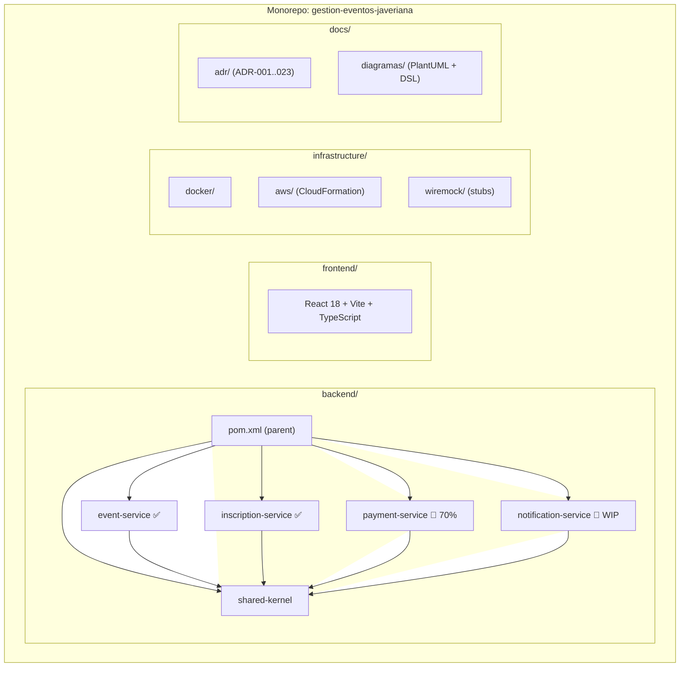
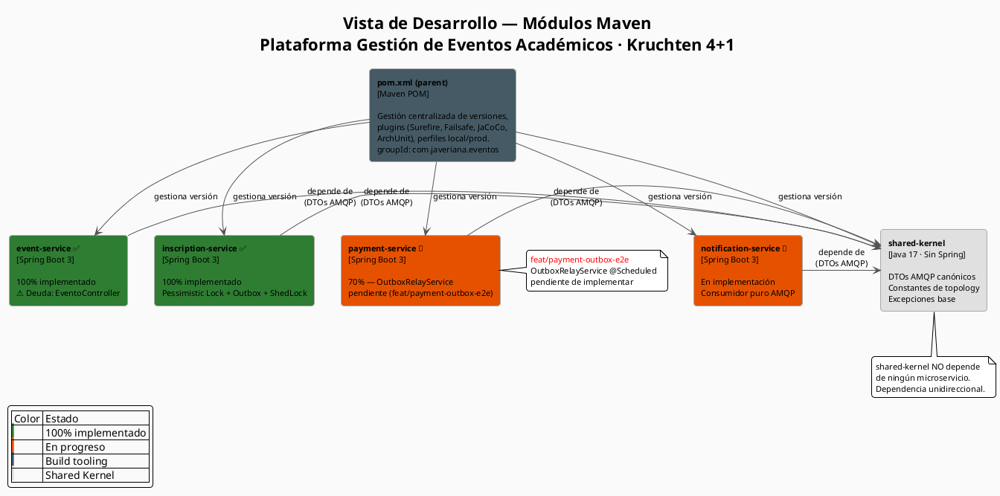
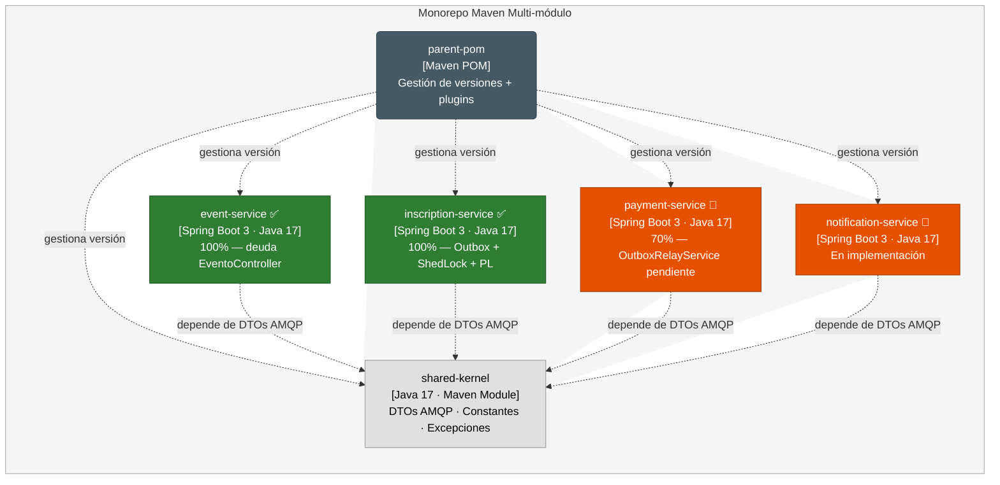
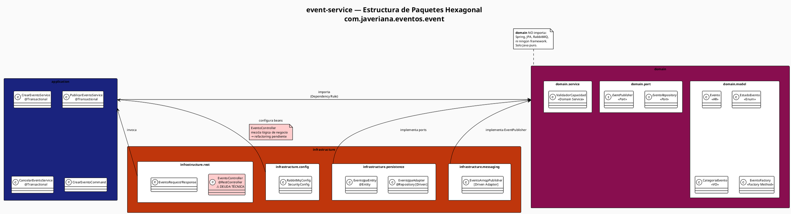
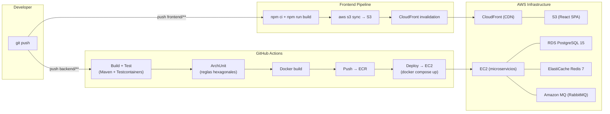

# Vista de Desarrollo — Kruchten 4+1

**Plataforma de Gestión de Eventos Académicos — Javeriana 2026**  
Maestría en Ingeniería de Software · Diseño de Software Basado en Patrones · Entrega 3

---

## Leyenda de colores y notación

| Color / Notación | Significado |
|---|---|
| 🟢 Verde (`#2E7D32`) | Módulo/servicio 100% implementado |
| 🟠 Naranja (`#E65100`) | Módulo/servicio en progreso |
| 🟣 Morado (`#880E4F`) | Capa Domain (núcleo hexagonal) |
| 🔵 Azul oscuro (`#1A237E`) | Capa Application (casos de uso) |
| 🔴 Rojo (`#BF360C`) | Capa Infrastructure (adaptadores) |
| ⚠️ Borde discontinuo | Deuda técnica detectada |
| `«Port»` | Interfaz de puerto hexagonal |
| `«AR»` | Aggregate Root (DDD) |
| `«VO»` | Value Object (DDD) |
| `[Driving]` | Adaptador primario (inicia flujo) |
| `[Driven]` | Adaptador secundario (implementa puerto) |

---

## 1. Organización del Repositorio

### 1.1 Árbol del monorepo (texto)

```
gestion-eventos-javeriana/          ← raíz del monorepo
├── backend/
│   ├── pom.xml                     ← POM parent (multi-módulo)
│   ├── shared-kernel/              ← DTOs AMQP compartidos
│   │   └── src/main/java/com/javeriana/eventos/shared/
│   ├── event-service/              ✅ 100% (deuda en EventoController)
│   │   └── src/
│   ├── inscription-service/        ✅ 100% (Outbox + ShedLock + PL)
│   │   └── src/
│   ├── payment-service/            🔶 70% (OutboxRelayService pendiente)
│   │   └── src/
│   └── notification-service/       🔶 En implementación
│       └── src/
├── frontend/
│   ├── package.json
│   ├── vite.config.ts
│   └── src/
│       ├── api/
│       ├── components/
│       ├── features/
│       ├── hooks/
│       ├── pages/
│       ├── store/
│       ├── types/
│       └── utils/
├── infrastructure/
│   ├── docker/
│   │   ├── docker-compose.yml
│   │   └── docker-compose.prod.yml
│   ├── aws/
│   │   ├── ec2-backend.yml         ← CloudFormation
│   │   └── s3-frontend.yml
│   └── wiremock/
│       └── mappings/               ← stubs de pasarela MercadoPago
└── docs/
    ├── adr/                        ← ADR-001..ADR-023 (MADR 3-digit)
    ├── diagramas/                  ← PlantUML, DSL Structurizr
    └── vista-desarrollo-kruchten.md ← este documento
```

### 1.2 Diagrama Mermaid — Árbol de módulos



### 1.3 Tabla de carpetas raíz

| Carpeta | Propósito | Tecnología |
|---|---|---|
| `backend/` | Monorepo de microservicios Java — 4 servicios + shared-kernel | Maven multi-módulo, Java 17 |
| `backend/shared-kernel/` | Contrato AMQP compartido: DTOs de eventos, constantes, excepciones base | Java 17, sin dependencias Spring |
| `frontend/` | SPA de gestión de eventos para estudiantes y coordinadores | React 18, Vite, TypeScript |
| `infrastructure/docker/` | Composición de contenedores para desarrollo local | Docker Compose |
| `infrastructure/aws/` | Definición de infraestructura cloud | CloudFormation (EC2 + S3 + RDS + ElastiCache) |
| `infrastructure/wiremock/` | Stubs de la pasarela de pago para tests E2E y desarrollo local | WireMock JSON mappings |
| `docs/adr/` | Decisiones de arquitectura formalizadas (MADR 3-digit, ADR-001..023) | Markdown |
| `docs/diagramas/` | Diagramas PlantUML y DSL Structurizr para todas las vistas Kruchten | PlantUML, Structurizr DSL |

### 1.4 Justificación: Monorepo vs Polyrepo

**Decisión: Monorepo Maven multi-módulo** (ver ADR sugerido §11)

| Criterio | Monorepo ✅ (elegido) | Polyrepo |
|---|---|---|
| Refactoring cross-service | Un solo PR, cambios atómicos | Coordinación entre múltiples repos |
| Shared-kernel | Dependencia local (`../shared-kernel`) | Publicar al repositorio de artefactos |
| Visibilidad del estado real | `mvn test` en raíz corre todo | CI distribuido, estado fragmentado |
| Escala del equipo | Adecuado para equipo pequeño (1 persona, académico) | Óptimo para equipos grandes independientes |
| Refuerzo de ADRs | ArchUnit en parent POM aplica a todos | Cada repo configura sus propias reglas |

---

## 2. Diagrama de Módulos Maven (multi-módulo)

### 2.1 PlantUML — Módulos Maven (exportado desde Structurizr)



### 2.2 Mermaid — Módulos Maven (exportado desde Structurizr)



### 2.3 Tabla de módulos Maven

| Módulo | groupId | artifactId | Dependencias | Propósito |
|---|---|---|---|---|
| parent | `com.javeriana.eventos` | `eventos-parent` | — | Gestión de versiones, plugins, perfiles |
| shared-kernel | `com.javeriana.eventos` | `shared-kernel` | Jackson, Lombok | DTOs AMQP canónicos y constantes de topology |
| event-service | `com.javeriana.eventos` | `event-service` | shared-kernel, Spring Boot, Spring AMQP, Spring Data JPA, Flyway | Catálogo de eventos académicos |
| inscription-service | `com.javeriana.eventos` | `inscription-service` | shared-kernel, Spring Boot, Spring AMQP, ShedLock, Testcontainers | Core domain: inscripciones con control de concurrencia |
| payment-service | `com.javeriana.eventos` | `payment-service` | shared-kernel, Spring Boot, Spring AMQP, ShedLock, WireMock | Procesamiento de pagos + integración pasarela |
| notification-service | `com.javeriana.eventos` | `notification-service` | shared-kernel, Spring Boot, Spring AMQP, Spring Mail, Thymeleaf | Worker asíncrono de notificaciones por email |

---

## 3. Estructura de Paquetes por Microservicio (Hexagonal)

### 3.1 event-service

#### Árbol de paquetes

```
com.javeriana.eventos.event
├── domain
│   ├── model
│   │   ├── Evento.java                    «Aggregate Root»
│   │   ├── EstadoEvento.java              «Enumeration»
│   │   ├── CategoriaEvento.java           «Value Object»
│   │   └── EventoFactory.java             «Factory Method»
│   ├── port
│   │   ├── EventoRepository.java          «Port» (driven)
│   │   └── EventPublisher.java            «Port» (driven)
│   └── service
│       └── ValidadorCapacidadEvento.java  «Domain Service»
├── application
│   └── service
│       ├── CrearEventoService.java        @Transactional
│       ├── PublicarEventoService.java     @Transactional
│       ├── CancelarEventoService.java     @Transactional
│       └── command
│           ├── CrearEventoCommand.java
│           └── PublicarEventoCommand.java
└── infrastructure
    ├── rest
    │   ├── EventoController.java          @RestController ⚠ DEUDA TÉCNICA
    │   ├── dto
    │   │   ├── EventoRequest.java
    │   │   └── EventoResponse.java
    │   └── mapper
    │       └── EventoRestMapper.java
    ├── persistence
    │   ├── EventoJpaAdapter.java          @Repository [Driven Adapter]
    │   ├── EventoJpaRepository.java       Spring Data
    │   ├── EventoJpaEntity.java           @Entity
    │   └── EventoJpaMapper.java
    ├── messaging
    │   ├── EventoAmqpPublisher.java       [Driven Adapter]
    │   └── dto
    │       └── EventoPublicadoEventDto.java
    └── config
        ├── RabbitMqConfig.java
        ├── SecurityConfig.java
        └── FlywayConfig.java
```

#### Diagrama de paquetes PlantUML



#### Patrones GoF por capa — event-service

| Capa | Patrón GoF | Clase Ejemplo | Justificación |
|---|---|---|---|
| domain.model | Aggregate Root (DDD) | `Evento` | Controla invariantes de consistencia del evento |
| domain.model | Value Object | `CategoriaEvento` | Inmutable, sin identidad, comparable por valor |
| domain.model | Factory Method | `EventoFactory.crear()` | Encapsula reglas de construcción del agregado |
| domain.model | State | `EstadoEvento` (BORRADOR→PUBLICADO→CANCELADO) | Transiciones controladas por el agregado |
| application | Command | `CrearEventoCommand` | Encapsula datos de entrada del caso de uso |
| application | Facade | `CrearEventoService` | Orquesta domain + ports sin exponer complejidad |
| infrastructure.rest | Adapter (GoF) | `EventoController` | Adapta HTTP al modelo de la aplicación |
| infrastructure.persistence | Repository (P of EAA) | `EventoJpaAdapter` | Abstrae persistencia del dominio |
| infrastructure.persistence | DTO + Mapper | `EventoJpaEntity` + `EventoJpaMapper` | Desacopla modelo JPA del modelo de dominio |

---

### 3.2 inscription-service

#### Árbol de paquetes

```
com.javeriana.eventos.inscription
├── domain
│   ├── model
│   │   ├── Inscripcion.java               «Aggregate Root»
│   │   ├── EstadoInscripcion.java         «Enumeration» PENDIENTE|CONFIRMADA|CANCELADA|EXPIRADA
│   │   ├── Evento.java                    «Entity» (referencia local)
│   │   └── OutboxEvent.java               «Entity» (Transactional Outbox)
│   ├── port
│   │   ├── InscripcionRepository.java     «Port» (driven)
│   │   ├── EventoRepository.java          «Port» (driven, con SELECT FOR UPDATE)
│   │   ├── OutboxRepository.java          «Port» (driven)
│   │   └── EventPublisher.java            «Port» (driven)
│   └── service
│       └── PoliticaCancelacion.java       «Domain Service» — Strategy
├── application
│   └── service
│       ├── CrearInscripcionService.java   @Transactional (PL + Outbox en misma TX)
│       ├── ConfirmarInscripcionService.java @Transactional
│       ├── CancelarInscripcionService.java  @Transactional
│       ├── ExpirarPendientesService.java    @Scheduled @SchedulerLock
│       ├── OutboxRelayService.java          @Scheduled @SchedulerLock
│       └── command
│           └── CrearInscripcionCommand.java
└── infrastructure
    ├── rest
    │   ├── InscripcionController.java     @RestController [Driving]
    │   ├── dto
    │   │   ├── InscripcionRequest.java
    │   │   └── InscripcionResponse.java
    │   └── mapper
    │       └── InscripcionRestMapper.java
    ├── persistence
    │   ├── InscripcionJpaAdapter.java     @Repository [Driven]
    │   ├── EventoJpaAdapter.java          @Repository [Driven] ⚡ PESSIMISTIC_WRITE
    │   ├── OutboxJpaAdapter.java          @Repository [Driven]
    │   ├── InscripcionJpaRepository.java  Spring Data
    │   ├── EventoJpaRepository.java       Spring Data + @Lock(PESSIMISTIC_WRITE)
    │   ├── OutboxJpaRepository.java       Spring Data
    │   └── entity/
    │       ├── InscripcionJpaEntity.java
    │       ├── EventoJpaEntity.java
    │       └── OutboxEventJpaEntity.java
    ├── messaging
    │   ├── EventoConsumerListener.java    @RabbitListener [Driving]
    │   ├── RabbitMqEventPublisher.java    [Driven] implementa EventPublisher
    │   └── dto/
    │       └── (usa shared-kernel DTOs)
    └── config
        ├── RabbitMqTopologyConfig.java    exchanges + queues + DLQ + bindings
        ├── ShedLockConfig.java
        └── SecurityConfig.java
```

#### Diagrama de paquetes PlantUML



```plantuml
@startuml paquetes-inscription-service
title <b>inscription-service</b> — Core Domain · Hexagonal Architecture\ncom.javeriana.eventos.inscription

!theme plain
skinparam backgroundColor #FAFAFA
skinparam packageStyle rectangle
skinparam defaultFontSize 10
skinparam shadowing false

package "domain" as DOM #880E4F {
  package "domain.model" as DM {
    class "Inscripcion\n«AR»" as INS
    class "EstadoInscripcion\n«Enum»\nPENDIENTE|CONFIRMADA\nCANCELADA|EXPIRADA" as EST
    class "Evento «Entity»" as EV
    class "OutboxEvent «Entity»" as OB
  }
  package "domain.port" as DP {
    interface "InscripcionRepository\n«Port»" as IR
    interface "EventoRepository\n«Port»\n⚡ SELECT FOR UPDATE" as ER
    interface "OutboxRepository\n«Port»" as OR
    interface "EventPublisher\n«Port»" as EP
  }
  package "domain.service" as DS {
    class "PoliticaCancelacion\n«Strategy»" as PC
  }
}

package "application" as APP #1A237E {
  class "CrearInscripcionService\n@Transactional\n(PL + Outbox en misma TX)" as CIS
  class "ConfirmarInscripcionService\n@Transactional" as CFIS
  class "CancelarInscripcionService\n@Transactional" as CAIS
  class "ExpirarPendientesService\n@Scheduled @SchedulerLock\ncada 60s" as EPS
  class "OutboxRelayService\n@Scheduled @SchedulerLock\ncada 2s" as ORS
}

package "infrastructure" as INF #BF360C {
  package "infrastructure.rest [Driving]" as REST {
    class "InscripcionController\n@RestController\nPOST/GET/DELETE /api/v1/inscripciones" as CTR
  }
  package "infrastructure.messaging [Driving/Driven]" as MSG {
    class "EventoConsumerListener\n@RabbitListener [Driving]\npago.confirmado | pago.expirado" as LIST
    class "RabbitMqEventPublisher\n[Driven Adapter]" as PUB
  }
  package "infrastructure.persistence [Driven]" as PERS {
    class "InscripcionJpaAdapter\n@Repository" as IJA
    class "EventoJpaAdapter\n@Repository ⚡ PESSIMISTIC_WRITE" as EJA
    class "OutboxJpaAdapter\n@Repository" as OJA
  }
  package "infrastructure.config" as CFG {
    class "RabbitMqTopologyConfig\nShedLockConfig\nSecurityConfig" as CONF
  }
}

APP -down-> DOM : importa (Dependency Rule)
REST -right-> APP : invoca Application Services
MSG -right-> APP : invoca al recibir AMQP
PERS -up-> DOM : implementa ports
PUB -up-> DOM : implementa EventPublisher
CFG .up.> APP : configura ShedLock + AMQP

@enduml
```

#### Patrones GoF por capa — inscription-service

| Capa | Patrón GoF | Clase Ejemplo | Justificación |
|---|---|---|---|
| domain.model | Aggregate Root | `Inscripcion` | Controla ciclo de vida y transiciones de estado |
| domain.model | State | `EstadoInscripcion` | Máquina de estados: PENDIENTE→CONFIRMADA/CANCELADA/EXPIRADA |
| domain.model | Entity | `OutboxEvent` | Identidad propia, ciclo de vida independiente |
| domain.service | Strategy | `PoliticaCancelacion` | Algoritmos intercambiables de reglas de cancelación/reembolso |
| application | Command | `CrearInscripcionCommand` | Inmutable, encapsula datos de entrada |
| application | Template Method | `ExpirarPendientesService` | Esqueleto fijo (@Scheduled), detalle en pasos concretos |
| application | Facade | `CrearInscripcionService` | Orquesta PL + Outbox + persistencia en una transacción |
| infrastructure.persistence | Adapter | `EventoJpaAdapter` | Adapta JPA + PESSIMISTIC_WRITE al puerto `EventoRepository` |
| infrastructure.persistence | Repository | `InscripcionJpaAdapter` | Abstrae Spring Data del dominio |
| infrastructure.messaging | Observer | `EventoConsumerListener` | Reacciona a eventos AMQP sin conocer al publicador |

---

### 3.3 payment-service

#### Árbol de paquetes

```
com.javeriana.eventos.payment
├── domain
│   ├── model
│   │   ├── Pago.java                      «Aggregate Root»
│   │   ├── EstadoPago.java                «Enumeration» INICIADO|CONFIRMADO|RECHAZADO|REEMBOLSADO
│   │   ├── IdempotencyKey.java            «Value Object»
│   │   └── OutboxEvent.java               «Entity» (Transactional Outbox)
│   ├── port
│   │   ├── PagoRepository.java            «Port» (driven)
│   │   ├── OutboxRepository.java          «Port» (driven)
│   │   ├── EventPublisher.java            «Port» (driven)
│   │   └── PaymentGatewayPort.java        «Port» (driven) → MercadoPago
│   └── service
│       └── ReembolsoCalculator.java       «Domain Service»
├── application
│   └── service
│       ├── ProcesarPagoService.java       @Transactional
│       ├── ConfirmarPagoWebhookService.java @Transactional (idempotente)
│       ├── ReembolsarPagoService.java     @Transactional
│       └── OutboxRelayService.java        @Scheduled @SchedulerLock ⚠ PENDIENTE
└── infrastructure
    ├── rest
    │   ├── PagoController.java            @RestController [Driving]
    │   │                                  POST /api/v1/pagos
    │   │                                  POST /api/v1/pagos/webhook
    │   └── dto/
    ├── persistence
    │   ├── PagoJpaAdapter.java            @Repository [Driven]
    │   ├── OutboxJpaAdapter.java          @Repository [Driven]
    │   └── entity/
    ├── messaging
    │   ├── InscripcionCreadaListener.java @RabbitListener [Driving]
    │   └── RabbitMqEventPublisher.java    [Driven]
    ├── gateway
    │   └── MercadoPagoAdapter.java        [Driven] implementa PaymentGatewayPort
    │                                      (WireMock en tests, real en prod)
    └── config
        ├── RabbitMqTopologyConfig.java    + DLQ para pagos
        ├── ShedLockConfig.java
        ├── WireMockConfig.java            (perfil local/test)
        └── SecurityConfig.java
```

#### Diagrama de paquetes PlantUML



```plantuml
@startuml paquetes-payment-service
title <b>payment-service</b> — 70% implementado\ncom.javeriana.eventos.payment · OutboxRelayService pendiente

!theme plain
skinparam backgroundColor #FAFAFA
skinparam packageStyle rectangle
skinparam defaultFontSize 10
skinparam shadowing false

package "domain" as DOM #880E4F {
  package "domain.model" as DM {
    class "Pago «AR»" as PA
    class "EstadoPago «Enum»\nINICIADO|CONFIRMADO\nRECHAZADO|REEMBOLSADO" as EP
    class "IdempotencyKey «VO»" as IK
    class "OutboxEvent «Entity»" as OE
  }
  package "domain.port" as DP {
    interface "PagoRepository «Port»" as PR
    interface "OutboxRepository «Port»" as OR
    interface "EventPublisher «Port»" as EPP
    interface "PaymentGatewayPort «Port»" as PGP
  }
  package "domain.service" as DS {
    class "ReembolsoCalculator\n«Domain Service»" as RC
  }
}

package "application" as APP #1A237E {
  class "ProcesarPagoService\n@Transactional" as PPS
  class "ConfirmarPagoWebhookService\n@Transactional (idempotente)" as CPWS
  class "ReembolsarPagoService\n@Transactional" as RPS
  class "OutboxRelayService\n@Scheduled @SchedulerLock\n<color:red>⚠ PENDIENTE (feat/payment-outbox-e2e)</color>" as ORS #FFEECC
}

package "infrastructure" as INF #BF360C {
  package "infrastructure.rest [Driving]" as REST {
    class "PagoController\n@RestController\nPOST /pagos\nPOST /pagos/webhook" as CTR
  }
  package "infrastructure.messaging [Driving/Driven]" as MSG {
    class "InscripcionCreadaListener\n@RabbitListener [Driving]" as ICL
    class "RabbitMqEventPublisher\n[Driven]" as PUB
  }
  package "infrastructure.persistence [Driven]" as PERS {
    class "PagoJpaAdapter @Repository" as PJA
    class "OutboxJpaAdapter @Repository" as OJA
  }
  package "infrastructure.gateway [Driven]" as GW {
    class "MercadoPagoAdapter\n[Driven] implementa\nPaymentGatewayPort\n(WireMock en tests)" as MPA
  }
  package "infrastructure.config" as CFG {
    class "RabbitMqTopologyConfig\n+DLQ · ShedLockConfig\nWireMockConfig (local)" as CONF
  }
}

APP -down-> DOM : importa (Dependency Rule)
REST -right-> APP : invoca
MSG -right-> APP : invoca al recibir InscripcionCreada
PERS -up-> DOM : implementa PagoRepository + OutboxRepository
PUB -up-> DOM : implementa EventPublisher
MPA -up-> DOM : implementa PaymentGatewayPort
CFG .up.> APP : configura beans

@enduml
```

#### Patrones GoF por capa — payment-service

| Capa | Patrón GoF | Clase Ejemplo | Justificación |
|---|---|---|---|
| domain.model | Aggregate Root | `Pago` | Controla creación de pago, transiciones y reembolso |
| domain.model | Value Object | `IdempotencyKey` | Clave de idempotencia inmutable para webhooks |
| domain.model | State | `EstadoPago` | Evita transiciones inválidas en el agregado |
| application | Command | Input de `ProcesarPagoService` | Encapsula datos de solicitud de pago |
| application | Template Method | `OutboxRelayService` (pendiente) | Esqueleto @Scheduled con lógica de relay variable |
| infrastructure.gateway | Adapter | `MercadoPagoAdapter` | Adapta API externa al puerto `PaymentGatewayPort` |
| infrastructure.persistence | Repository | `PagoJpaAdapter` | Aísla Spring Data del dominio |
| infrastructure.messaging | Observer | `InscripcionCreadaListener` | Reacciona a evento AMQP de inscription-service |

---

### 3.4 notification-service

#### Árbol de paquetes

```
com.javeriana.eventos.notification
├── domain
│   ├── model
│   │   ├── Notificacion.java          «Entity»
│   │   ├── TipoNotificacion.java      «Enumeration» INSCRIPCION_CONFIRMADA|PAGO_CONFIRMADO|...
│   │   └── PlantillaEmail.java        «Value Object»
│   ├── port
│   │   ├── NotificacionRepository.java «Port» (driven)
│   │   └── EmailSenderPort.java        «Port» (driven)
│   └── (sin domain services — lógica simple)
├── application
│   └── service
│       ├── EnviarNotificacionService.java   @Transactional
│       ├── RegistrarNotificacionService.java
│       └── ReintentarEnvioService.java      @Scheduled
└── infrastructure
    ├── messaging
    │   ├── InscripcionConfirmadaListener.java @RabbitListener [Driving]
    │   ├── PagoConfirmadoListener.java        @RabbitListener [Driving]
    │   └── CertificadoGeneradoListener.java   @RabbitListener [Driving]
    ├── email
    │   ├── JavaMailSenderAdapter.java         [Driven] implementa EmailSenderPort
    │   └── templates/                         Thymeleaf HTML templates
    │       ├── inscripcion-confirmada.html
    │       ├── pago-confirmado.html
    │       └── certificado-disponible.html
    ├── persistence
    │   ├── NotificacionJpaAdapter.java        @Repository [Driven]
    │   └── NotificacionJpaRepository.java     Spring Data
    └── config
        ├── RabbitMqBindingsConfig.java
        ├── MailConfig.java
        └── ThymeleafConfig.java
```

#### Patrones GoF por capa — notification-service

| Capa | Patrón GoF | Clase Ejemplo | Justificación |
|---|---|---|---|
| domain.model | Value Object | `PlantillaEmail` | Inmutable, identifica plantilla por nombre y tipo |
| application | Facade | `EnviarNotificacionService` | Orquesta EmailSenderPort + NotificacionRepository |
| infrastructure.messaging | Observer | `InscripcionConfirmadaListener` | Reacciona a evento sin acoplar al publicador |
| infrastructure.email | Adapter | `JavaMailSenderAdapter` | Adapta `JavaMailSender` de Spring al puerto de dominio |
| infrastructure.email | Template Method | Thymeleaf templates | Estructura fija de email, contenido variable por tipo |

---

## 4. Shared-Kernel

### 4.1 Contenido del módulo

```
com.javeriana.eventos.shared
├── event
│   ├── InscriptionCreatedEvent.java      ← inscription-service publica
│   ├── PaymentConfirmedEvent.java        ← payment-service publica
│   ├── PaymentFailedEvent.java           ← payment-service publica
│   ├── InscriptionExpiredEvent.java      ← inscription-service publica
│   └── InscriptionCancelledEvent.java    ← inscription-service publica
├── topology
│   └── AmqpTopology.java                 ← constantes de exchanges, queues, routing keys
└── exception
    ├── DomainException.java              ← base de excepciones de dominio
    ├── BusinessRuleException.java
    └── NotFoundException.java
```

### 4.2 DTOs de eventos AMQP

```java
// InscriptionCreatedEvent.java
public record InscriptionCreatedEvent(
    UUID inscriptionId,
    UUID studentId,
    UUID eventId,
    BigDecimal amount,
    Instant createdAt
) {}

// PaymentConfirmedEvent.java
public record PaymentConfirmedEvent(
    UUID paymentId,
    UUID inscriptionId,
    BigDecimal amountPaid,
    Instant confirmedAt
) {}

// PaymentFailedEvent.java
public record PaymentFailedEvent(
    UUID paymentId,
    UUID inscriptionId,
    String reason,
    Instant failedAt
) {}

// InscriptionExpiredEvent.java
public record InscriptionExpiredEvent(
    UUID inscriptionId,
    UUID eventId,
    Instant expiredAt
) {}

// InscriptionCancelledEvent.java
public record InscriptionCancelledEvent(
    UUID inscriptionId,
    UUID eventId,
    String reason,
    boolean refundApplicable,
    Instant cancelledAt
) {}
```

### 4.3 Constantes de topology AMQP

```java
// AmqpTopology.java
public final class AmqpTopology {

    // Exchanges
    public static final String INSCRIPTION_EXCHANGE = "inscription.events";
    public static final String PAYMENT_EXCHANGE     = "payment.events";
    public static final String DLX_EXCHANGE         = "events.dlx";

    // Queues — inscription-service → payment-service
    public static final String INSCRIPTION_CREATED_QUEUE   = "payment.inscription.created";
    public static final String INSCRIPTION_EXPIRED_QUEUE   = "payment.inscription.expired";

    // Queues — payment-service → inscription-service
    public static final String PAYMENT_CONFIRMED_QUEUE     = "inscription.payment.confirmed";
    public static final String PAYMENT_FAILED_QUEUE        = "inscription.payment.failed";

    // Queues — → notification-service
    public static final String NOTIF_INSCRIPTION_QUEUE     = "notification.inscription.confirmed";
    public static final String NOTIF_PAYMENT_QUEUE         = "notification.payment.confirmed";

    // Routing Keys
    public static final String RK_INSCRIPTION_CREATED      = "inscription.created";
    public static final String RK_PAYMENT_CONFIRMED        = "payment.confirmed";
    public static final String RK_PAYMENT_FAILED           = "payment.failed";
    public static final String RK_INSCRIPTION_EXPIRED      = "inscription.expired";
    public static final String RK_INSCRIPTION_CANCELLED    = "inscription.cancelled";

    // Dead Letter Queues
    public static final String DLQ_INSCRIPTION_CREATED     = "payment.inscription.created.dlq";
    public static final String DLQ_PAYMENT_CONFIRMED       = "inscription.payment.confirmed.dlq";

    private AmqpTopology() {}
}
```

### 4.4 Qué SÍ y qué NO debe ir en shared-kernel

| ¿Qué va en shared-kernel? | ¿Qué NO va en shared-kernel? |
|---|---|
| DTOs de eventos AMQP (records Java, sin lógica) | Entidades de dominio de ningún microservicio |
| Constantes de exchanges, queues, routing keys | Application Services de cualquier servicio |
| Excepciones base (`DomainException`) | Lógica de negocio, reglas, validaciones |
| Records de serialización Jackson | Dependencias de Spring (excepto `@JsonProperty`) |
| — | Configuración de infraestructura (RabbitMQ beans) |
| — | Repositorios ni adaptadores |

**Principio clave:** shared-kernel es un contrato de comunicación, no una librería de utilidades. Cualquier cambio requiere coordinación entre todos los servicios.

---

## 5. Reglas de Dependencia (Hexagonal Dependency Rule)

### 5.1 Diagrama PlantUML — Flujo de dependencias

```plantuml
@startuml dependency-rule-hexagonal
title <b>Dependency Rule — Arquitectura Hexagonal</b>\nFlujo de dependencias entre capas

!theme plain
skinparam backgroundColor #FAFAFA
skinparam defaultFontSize 11
skinparam shadowing false
skinparam roundcorner 8

skinparam package {
  BackgroundColor #FFFFFF
  BorderColor #AAAAAA
}

' ────── Capa Domain (núcleo) ──────────────────────────────
package "**DOMAIN**\n(núcleo hexagonal)" as DOM #FFD7D7 {
  [model] as MDL
  [port (interfaces)] as PORT
  [domain service] as DS
  MDL -[hidden]- PORT
  PORT -[hidden]- DS
}

' ────── Capa Application ──────────────────────────────────
package "**APPLICATION**\n(casos de uso)" as APP #D7E8FF {
  [use case services] as UCS
  [commands / DTOs] as CMD
  UCS -[hidden]- CMD
}

' ────── Capa Infrastructure ───────────────────────────────
package "**INFRASTRUCTURE**\n(adaptadores)" as INF #FFE8D7 {
  [REST Controllers\n[Driving Adapters]] as REST
  [JPA Adapters\n[Driven Adapters]] as JPA
  [AMQP Adapters\n[Driving / Driven]] as AMQP
  [Config / Beans] as CFG
  REST -[hidden]- JPA
  JPA -[hidden]- AMQP
  AMQP -[hidden]- CFG
}

' ────── Reglas de dependencia (flechas solo hacia adentro) ─
APP -right-> DOM : «import»\nsolo interfaces de port\ny clases de model
INF -right-> APP : «import»\nApplication Services\n(via constructor DI)
JPA -up-> PORT : «implement»\nDriven Adapter
AMQP -up-> PORT : «implement»\nDriven Adapter

note top of DOM
  <b>domain</b> NO importa:
  ✗ org.springframework.*
  ✗ javax.persistence.*
  ✗ com.rabbitmq.*
  ✗ java.sql.*
  Solo Java SE + Lombok
end note

note bottom of INF
  <b>infrastructure</b> puede importar:
  ✓ Spring Framework
  ✓ Spring Data JPA
  ✓ Spring AMQP
  ✓ Flyway, ShedLock
  ✓ application + domain
end note

note right of APP
  <b>application</b> solo importa:
  ✓ domain (model + port + service)
  ✗ NO Spring annotations
  ✗ NO JPA, NO RabbitMQ
  Solo @Transactional (Spring TX API)
  y @Scheduled (aceptado como excepción)
end note

@enduml
```

### 5.2 Validaciones ArchUnit recomendadas para CI

```java
// ArchitectureRulesTest.java (en src/test/java de cada microservicio)

public class ArchitectureRulesTest {

    private static final JavaClasses classes = new ClassFileImporter()
        .importPackages("com.javeriana.eventos");

    @Test
    void domain_should_not_depend_on_spring() {
        noClasses()
            .that().resideInAPackage("..domain..")
            .should().dependOnClassesThat()
            .resideInAnyPackage(
                "org.springframework..",
                "javax.persistence..",
                "jakarta.persistence..",
                "com.rabbitmq..",
                "org.springframework.data.."
            )
            .check(classes);
    }

    @Test
    void domain_should_not_depend_on_application_or_infrastructure() {
        noClasses()
            .that().resideInAPackage("..domain..")
            .should().dependOnClassesThat()
            .resideInAnyPackage("..application..", "..infrastructure..")
            .check(classes);
    }

    @Test
    void application_should_only_depend_on_domain() {
        classes()
            .that().resideInAPackage("..application..")
            .should().onlyDependOnClassesThat()
            .resideInAnyPackage(
                "..domain..",
                "..application..",
                "java..",
                "org.springframework.transaction..",    // @Transactional
                "org.springframework.scheduling..",     // @Scheduled (excepción)
                "net.javacrumbs.shedlock.."             // @SchedulerLock
            )
            .check(classes);
    }

    @Test
    void infrastructure_adapters_must_implement_domain_ports() {
        classes()
            .that().resideInAPackage("..infrastructure.persistence..")
            .and().haveSimpleNameEndingWith("Adapter")
            .should().implement(
                JavaClass.Predicates.resideInAPackage("..domain.port..")
            )
            .check(classes);
    }

    @Test
    void controllers_should_not_access_domain_directly() {
        noClasses()
            .that().resideInAPackage("..infrastructure.rest..")
            .should().dependOnClassesThat()
            .resideInAPackage("..domain.model..")
            .check(classes);
        // Controllers solo acceden a Application Services y DTOs REST propios
    }
}
```

### 5.3 Tabla de reglas ArchUnit

| Regla | Paquete origen | Restricción | Motivación |
|---|---|---|---|
| domain no importa Spring | `..domain..` | No `org.springframework..` | Testabilidad pura, sin contexto Spring |
| domain no importa JPA | `..domain..` | No `jakarta.persistence..` | Independencia de mecanismo de persistencia |
| domain no importa RabbitMQ | `..domain..` | No `com.rabbitmq..`, no `org.springframework.amqp..` | Independencia del broker de mensajes |
| application solo importa domain | `..application..` | Solo `..domain..`, TX API, Scheduled | Casos de uso sin acoplamiento a infra |
| infrastructure.rest no accede a domain.model | `..infrastructure.rest..` | No `..domain.model..` directamente | Controllers solo hablan con Application Services |
| adapters implementan ports | `..infrastructure.persistence..*Adapter` | Implementa `..domain.port..` | Garantiza inversión de dependencia |

---

## 6. Estrategia de Testing (Pirámide)

### 6.1 Pirámide de tests

```
         /▲\
        / E2E \          ← 5%  — Flujo completo (feat/payment-outbox-e2e)
       /───────\
      /Integración\      ← 25% — Testcontainers (PostgreSQL + RabbitMQ + Redis)
     /─────────────\
    /   Unit Tests   \   ← 70% — JUnit 5 + Mockito + AssertJ (sin Spring)
   /─────────────────\
```

### 6.2 Unit Tests (capa domain + application)

```java
// Ejemplo: CrearInscripcionServiceTest.java
@ExtendWith(MockitoExtension.class)
class CrearInscripcionServiceTest {

    @Mock InscripcionRepository inscripcionRepository;
    @Mock EventoRepository eventoRepository;
    @Mock OutboxRepository outboxRepository;

    @InjectMocks CrearInscripcionService service;

    @Test
    void deberia_crear_inscripcion_y_registrar_outbox_event() {
        // given
        var evento = buildEvento(cuposDisponibles = 10);
        given(eventoRepository.findByIdWithLock(any())).willReturn(Optional.of(evento));

        // when
        service.crear(new CrearInscripcionCommand(STUDENT_ID, evento.getId()));

        // then
        verify(inscripcionRepository).save(argThat(i -> i.getEstado() == PENDIENTE));
        verify(outboxRepository).save(argThat(o -> o.getPayload().contains("InscripcionCreada")));
    }

    @Test
    void deberia_rechazar_si_no_hay_cupos() {
        var evento = buildEvento(cuposDisponibles = 0);
        given(eventoRepository.findByIdWithLock(any())).willReturn(Optional.of(evento));

        assertThatThrownBy(() -> service.crear(command))
            .isInstanceOf(BusinessRuleException.class)
            .hasMessageContaining("cupos");
    }
}
```

### 6.3 Integration Tests (Testcontainers)

```java
// InscripcionRepositoryIT.java — Testcontainers PostgreSQL
@SpringBootTest
@Testcontainers
class InscripcionRepositoryIT {

    @Container
    static PostgreSQLContainer<?> postgres = new PostgreSQLContainer<>("postgres:15")
        .withDatabaseName("inscription_test");

    @Container
    static RabbitMQContainer rabbit = new RabbitMQContainer("rabbitmq:3-management");

    @DynamicPropertySource
    static void configureProperties(DynamicPropertyRegistry registry) {
        registry.add("spring.datasource.url", postgres::getJdbcUrl);
        registry.add("spring.rabbitmq.host", rabbit::getHost);
    }

    @Autowired InscripcionRepository inscripcionRepository;

    @Test
    void deberia_persistir_y_recuperar_inscripcion() {
        var inscripcion = Inscripcion.crear(STUDENT_ID, EVENT_ID);
        inscripcionRepository.save(inscripcion);

        var found = inscripcionRepository.findById(inscripcion.getId());
        assertThat(found).isPresent();
        assertThat(found.get().getEstado()).isEqualTo(PENDIENTE);
    }
}
```

### 6.4 E2E Tests (flujo completo — feat/payment-outbox-e2e)

```java
// PaymentOutboxE2ETest.java — todos los contenedores levantados
@SpringBootTest(webEnvironment = RANDOM_PORT)
@Testcontainers
class PaymentOutboxE2ETest {

    // PostgreSQL (inscription) + PostgreSQL (payment) + RabbitMQ + Redis
    @Container static PostgreSQLContainer<?> inscriptionDb = ...;
    @Container static PostgreSQLContainer<?> paymentDb = ...;
    @Container static RabbitMQContainer rabbit = ...;
    @Container static GenericContainer<?> redis = ...;

    @Test
    @Timeout(30)
    void flujo_completo_inscripcion_pago_notificacion() throws Exception {
        // 1. Crear inscripción → estado PENDIENTE
        var response = createInscription(studentId, eventId);
        assertThat(response.getStatus()).isEqualTo(PENDIENTE);

        // 2. Outbox relay publica InscripcionCreatedEvent → RabbitMQ
        await().atMost(5, SECONDS).until(() ->
            rabbitMessageReceived("payment.inscription.created"));

        // 3. payment-service procesa → PaymentConfirmedEvent
        await().atMost(10, SECONDS).until(() ->
            rabbitMessageReceived("inscription.payment.confirmed"));

        // 4. inscription-service confirma → estado CONFIRMADA
        await().atMost(5, SECONDS).until(() ->
            getInscriptionStatus(inscriptionId) == CONFIRMADA);
    }
}
```

> **Nota:** El test E2E del flujo pago está en rama `feat/payment-outbox-e2e`, bloqueado por `OutboxRelayService` pendiente en payment-service.

### 6.5 Tabla resumen de testing

| Tipo | Herramienta | Cobertura objetivo | Ubicación en repo |
|---|---|---|---|
| Unit — domain | JUnit 5, Mockito, AssertJ | 90% líneas | `*/src/test/java/..domain../` |
| Unit — application | JUnit 5, Mockito | 85% líneas | `*/src/test/java/..application../` |
| Integration — persistence | Testcontainers + PostgreSQL 15 | Todos los adapters | `*/src/test/java/..infrastructure.persistence../` |
| Integration — messaging | Testcontainers + RabbitMQ 3 | Listeners + Publishers | `*/src/test/java/..infrastructure.messaging../` |
| Integration — gateway | WireMock (stubs MercadoPago) | Happy path + error cases | `payment-service/src/test/` |
| E2E — flujo completo | Testcontainers (full stack) | Escenarios A, B, C | `inscription-service/src/test/e2e/` |
| Arquitectura | ArchUnit | 100% reglas hexagonales | `*/src/test/java/..architecture../` |

---

## 7. Gestión de Migraciones y Configuración

### 7.1 Estructura Flyway por servicio

```
inscription-service/src/main/resources/db/migration/
├── V1__init_schema.sql               ← Tablas: inscripciones, eventos (referencia)
├── V2__outbox_table.sql              ← Tabla: outbox_events (payload, attempts, status)
├── V3__shedlock_table.sql            ← Tabla: shedlock (name, lock_until, etc.)
└── V4__pessimistic_index.sql         ← Index: idx_evento_id en inscripciones

payment-service/src/main/resources/db/migration/
├── V1__init_schema.sql               ← Tablas: pagos, idempotency_keys
├── V2__outbox_table.sql              ← Tabla: outbox_events
└── V3__shedlock_table.sql            ← Tabla: shedlock

event-service/src/main/resources/db/migration/
├── V1__init_schema.sql               ← Tabla: eventos (con estado, cupos)
└── V2__approval_columns.sql          ← Columnas: aprobado_por, aprobado_en

notification-service/src/main/resources/db/migration/
└── V1__init_schema.sql               ← Tabla: notificaciones (tipo, estado, destinatario)
```

### 7.2 Perfiles application.yml

```yaml
# application.yml (base — todos los perfiles)
spring:
  application:
    name: inscription-service
  flyway:
    enabled: true
    locations: classpath:db/migration
  jpa:
    open-in-view: false
    hibernate:
      ddl-auto: validate

---
# application-local.yml
spring:
  config:
    activate:
      on-profile: local
  datasource:
    url: jdbc:postgresql://localhost:5432/inscription_db
    username: ${DB_USER:dev}
    password: ${DB_PASSWORD:dev}
  rabbitmq:
    host: localhost
    port: 5672

---
# application-prod.yml
spring:
  config:
    activate:
      on-profile: prod
  datasource:
    url: ${DB_URL}                          # desde AWS Secrets Manager
    username: ${DB_USERNAME}
    password: ${DB_PASSWORD}
  rabbitmq:
    host: ${RABBITMQ_HOST}
    username: ${RABBITMQ_USER}
    password: ${RABBITMQ_PASSWORD}
    ssl:
      enabled: true
```

### 7.3 Variables de entorno por servicio

| Variable | Servicio(s) | Perfil | Fuente |
|---|---|---|---|
| `DB_URL` | todos | prod | AWS Secrets Manager |
| `DB_USERNAME` | todos | prod | AWS Secrets Manager |
| `DB_PASSWORD` | todos | prod | AWS Secrets Manager |
| `RABBITMQ_HOST` | todos | prod | AWS Secrets Manager |
| `RABBITMQ_USER` | todos | prod | AWS Secrets Manager |
| `RABBITMQ_PASSWORD` | todos | prod | AWS Secrets Manager |
| `REDIS_HOST` | inscription-service | prod | AWS Secrets Manager |
| `MERCADOPAGO_ACCESS_TOKEN` | payment-service | prod | AWS Secrets Manager |
| `MAIL_HOST` | notification-service | prod | AWS Secrets Manager |
| `MAIL_PASSWORD` | notification-service | prod | AWS Secrets Manager |
| `SPRING_PROFILES_ACTIVE` | todos | — | EC2 UserData / env var |
| `SERVER_PORT` | todos | — | EC2 / Docker |

---

## 8. Frontend — Organización

### 8.1 Árbol de carpetas

```
frontend/
├── package.json
├── vite.config.ts              ← build → dist/, base URL, proxy dev
├── tsconfig.json
├── index.html
└── src/
    ├── api/                    ← Clientes HTTP por bounded context
    │   ├── httpClient.ts       ← axios instance + interceptors (JWT + correlation-id)
    │   ├── eventApi.ts         ← GET /api/v1/eventos, POST, etc.
    │   ├── inscriptionApi.ts   ← POST /api/v1/inscripciones
    │   └── paymentApi.ts       ← POST /api/v1/pagos
    ├── components/             ← UI reutilizable (sin lógica de negocio)
    │   ├── Button/
    │   ├── Modal/
    │   ├── Table/
    │   └── Badge/
    ├── features/               ← Organización feature-based (vertical slicing)
    │   ├── events/
    │   │   ├── EventList.tsx
    │   │   ├── EventDetail.tsx
    │   │   ├── EventForm.tsx
    │   │   └── useEvents.ts
    │   ├── inscriptions/
    │   │   ├── InscriptionForm.tsx
    │   │   ├── InscriptionList.tsx
    │   │   └── useInscriptions.ts
    │   └── payments/
    │       ├── PaymentCheckout.tsx
    │       ├── PaymentStatus.tsx
    │       └── usePayments.ts
    ├── hooks/                  ← Hooks transversales
    │   ├── useAuth.ts
    │   └── usePagination.ts
    ├── pages/                  ← Composición de features en rutas
    │   ├── HomePage.tsx
    │   ├── EventsPage.tsx
    │   ├── InscriptionsPage.tsx
    │   └── PaymentPage.tsx
    ├── store/                  ← Zustand (state management ligero)
    │   ├── authStore.ts        ← JWT, usuario autenticado
    │   └── uiStore.ts          ← loading, modals, notificaciones
    ├── types/                  ← Tipos TypeScript compartidos
    │   ├── Event.ts
    │   ├── Inscription.ts
    │   └── Payment.ts
    └── utils/
        ├── dateFormatter.ts
        └── currencyFormatter.ts
```

### 8.2 Cliente HTTP centralizado

```typescript
// api/httpClient.ts
import axios from 'axios';
import { v4 as uuidv4 } from 'uuid';

export const httpClient = axios.create({
  baseURL: import.meta.env.VITE_API_BASE_URL,
  timeout: 10_000,
});

httpClient.interceptors.request.use((config) => {
  const token = localStorage.getItem('jwt');
  if (token) config.headers.Authorization = `Bearer ${token}`;
  config.headers['X-Correlation-Id'] = uuidv4();
  return config;
});

httpClient.interceptors.response.use(
  (response) => response,
  (error) => {
    if (error.response?.status === 401) {
      localStorage.removeItem('jwt');
      window.location.href = '/login';
    }
    return Promise.reject(error);
  }
);
```

### 8.3 Build de producción → S3

```typescript
// vite.config.ts
import { defineConfig } from 'vite';
import react from '@vitejs/plugin-react';

export default defineConfig({
  plugins: [react()],
  build: {
    outDir: 'dist',
    sourcemap: false,
    rollupOptions: {
      output: {
        manualChunks: {
          vendor: ['react', 'react-dom', 'react-router-dom'],
          ui: ['axios', 'zustand'],
        },
      },
    },
  },
  server: {
    proxy: {
      '/api': {
        target: 'http://localhost:8080',
        changeOrigin: true,
      },
    },
  },
});
```

---

## 9. CI/CD — Estructura de Pipelines

### 9.1 Estructura de archivos `.github/workflows/`

```
.github/workflows/
├── ci-event-service.yml          ← build + test + push ECR + deploy EC2
├── ci-inscription-service.yml    ← build + test + push ECR + deploy EC2
├── ci-payment-service.yml        ← build + test + push ECR + deploy EC2
├── ci-notification-service.yml   ← build + test + push ECR + deploy EC2
└── ci-frontend.yml               ← build Vite + sync S3 + invalidación CloudFront
```

### 9.2 Pipeline de microservicio (ejemplo: inscription-service)

```yaml
# ci-inscription-service.yml
name: CI — inscription-service

on:
  push:
    paths: ['backend/inscription-service/**', 'backend/shared-kernel/**']
    branches: [main, 'feat/**']

jobs:
  build-test:
    runs-on: ubuntu-latest
    services:
      postgres:
        image: postgres:15
        env: { POSTGRES_DB: inscription_test, POSTGRES_USER: test, POSTGRES_PASSWORD: test }
        ports: ['5432:5432']
      rabbitmq:
        image: rabbitmq:3-management
        ports: ['5672:5672']

    steps:
      - uses: actions/checkout@v4
      - uses: actions/setup-java@v4
        with: { java-version: '17', distribution: 'temurin' }
      - name: Build shared-kernel
        run: mvn -pl shared-kernel install -q
      - name: Build + Test inscription-service
        run: mvn -pl inscription-service verify
        env:
          SPRING_PROFILES_ACTIVE: local
          DB_URL: jdbc:postgresql://localhost:5432/inscription_test
          RABBITMQ_HOST: localhost

  push-ecr:
    needs: build-test
    if: github.ref == 'refs/heads/main'
    runs-on: ubuntu-latest
    steps:
      - uses: aws-actions/configure-aws-credentials@v4
        with: { aws-region: us-east-1, role-to-assume: ${{ secrets.AWS_ROLE_ARN }} }
      - name: Build Docker image
        run: docker build -t inscription-service backend/inscription-service/
      - name: Push to ECR
        run: |
          aws ecr get-login-password | docker login --username AWS --password-stdin $ECR_REGISTRY
          docker tag inscription-service $ECR_REGISTRY/inscription-service:${{ github.sha }}
          docker push $ECR_REGISTRY/inscription-service:${{ github.sha }}

  deploy-ec2:
    needs: push-ecr
    runs-on: ubuntu-latest
    steps:
      - name: Deploy via SSH
        run: |
          ssh ec2-user@${{ secrets.EC2_HOST }} \
            "docker pull $ECR_REGISTRY/inscription-service:${{ github.sha }} && \
             docker compose up -d --no-deps inscription-service"
```

### 9.3 Pipeline frontend

```yaml
# ci-frontend.yml
name: CI — Frontend

on:
  push:
    paths: ['frontend/**']
    branches: [main]

jobs:
  build-deploy:
    runs-on: ubuntu-latest
    steps:
      - uses: actions/checkout@v4
      - uses: actions/setup-node@v4
        with: { node-version: '20' }
      - run: npm ci
        working-directory: frontend
      - run: npm run build
        working-directory: frontend
        env:
          VITE_API_BASE_URL: ${{ secrets.API_BASE_URL }}
      - uses: aws-actions/configure-aws-credentials@v4
        with: { aws-region: us-east-1, role-to-assume: ${{ secrets.AWS_ROLE_ARN }} }
      - name: Sync to S3
        run: aws s3 sync frontend/dist s3://${{ secrets.S3_BUCKET }} --delete
      - name: Invalidate CloudFront
        run: aws cloudfront create-invalidation --distribution-id ${{ secrets.CF_DIST_ID }} --paths "/*"
```

### 9.4 Diagrama Mermaid — Flujo del pipeline



---

## 10. Mapeo a Patrones GoF — Tabla Maestra

| Patrón GoF | Categoría | Servicio | Paquete | Clase Ejemplo | Justificación |
|---|---|---|---|---|---|
| **Strategy** | Comportamiento | inscription-service | `domain.service` | `PoliticaCancelacion` | Algoritmo de cancelación/reembolso intercambiable |
| **Factory Method** | Creacional | event-service | `domain.model` | `EventoFactory.crear()` | Encapsula construcción del Aggregate Root |
| **Adapter** | Estructural | inscription-service | `infrastructure.persistence` | `EventoJpaAdapter` | Adapta JPA + PESSIMISTIC_WRITE al puerto de dominio |
| **Adapter** | Estructural | payment-service | `infrastructure.gateway` | `MercadoPagoAdapter` | Adapta REST API externa al `PaymentGatewayPort` |
| **Repository** | Arquitectural | todos | `infrastructure.persistence` | `InscripcionJpaAdapter` | Abstrae Spring Data del dominio hexagonal |
| **Observer** | Comportamiento | inscription-service | `infrastructure.messaging` | `EventoConsumerListener` | Reacciona a `PagoConfirmado` sin acoplamiento al publicador |
| **Observer** | Comportamiento | payment-service | `infrastructure.messaging` | `InscripcionCreadaListener` | Reacciona a eventos AMQP de inscription-service |
| **Template Method** | Comportamiento | inscription-service | `application.service` | `ExpirarPendientesService` | Esqueleto fijo @Scheduled, pasos variables |
| **Template Method** | Comportamiento | notification-service | `infrastructure.email` | Thymeleaf templates | Estructura fija de email, contenido variable |
| **Command** | Comportamiento | inscription-service | `application.service.command` | `CrearInscripcionCommand` | Encapsula datos de entrada del caso de uso |
| **Singleton** (Spring) | Creacional | todos | `infrastructure.config` | Todos los `@Bean` | Spring gestiona instancia única en el contexto |
| **Facade** | Estructural | inscription-service | `application.service` | `CrearInscripcionService` | Orquesta PL + Outbox + repos en una operación |
| **DTO + Mapper** | Arquitectural | todos | `infrastructure.rest` | `EventoRequest/Response` + `EventoRestMapper` | Desacopla modelo HTTP del modelo de dominio |
| **State** | Comportamiento | inscription-service | `domain.model` | `EstadoInscripcion` (enum) | Controla transiciones válidas del agregado |
| **Proxy** (Spring AOP) | Estructural | todos | transversal | `@Transactional`, `@SchedulerLock` | Spring AOP envuelve métodos con comportamiento transversal |

---

## 11. Referencia a ADRs

| ADR | Título | Relevancia para Vista de Desarrollo |
|---|---|---|
| **ADR sugerido** | Monorepo Maven Multi-módulo vs Polyrepo | Justifica la estructura raíz del repositorio y decisión de módulos |
| **ADR-012** | Arquitectura Hexagonal (Ports & Adapters) | Base de toda la organización de paquetes por microservicio |
| **ADR-008** | Transactional Outbox Pattern | Justifica `OutboxEvent`, `OutboxRepository`, `OutboxRelayService` en domain + application |
| **ADR-018** | ShedLock para jobs distribuidos | Justifica `ShedLockConfig`, `@SchedulerLock` en application layer |
| **ADR sugerido** | Shared-Kernel para contratos AMQP | Justifica `shared-kernel` como módulo separado y su contenido mínimo |
| **ADR sugerido** | ArchUnit para enforcement de capas | Justifica tests de arquitectura en CI/CD como gate de calidad |
| **ADR-019** | Estrategia DLQ (Dead Letter Queue) | Justifica `AmqpTopology` con colas DLQ en shared-kernel y configs de topology |
| **ADR-020** | Pessimistic Locking para control de cupos | Justifica `EventoJpaAdapter` con `@Lock(PESSIMISTIC_WRITE)` en infrastructure |
| **ADR-023** | Feature-based organization en frontend | Justifica estructura `src/features/` en React + Vite |

### ADRs sugeridos (a formalizar)

#### ADR-S01: Monorepo Maven Multi-módulo

**Estado:** Propuesto  
**Contexto:** El proyecto contiene 4 microservicios con un contrato AMQP compartido.  
**Decisión:** Usar monorepo con Maven multi-módulo.  
**Consecuencias:** Un solo `mvn test` en raíz valida todo el sistema. `shared-kernel` se referencia como dependencia local sin publicar al repositorio de artefactos. ArchUnit en parent POM aplica las reglas de arquitectura a todos los módulos.

#### ADR-S02: Shared-Kernel para contratos AMQP

**Estado:** Propuesto  
**Contexto:** Los 4 microservicios intercambian eventos vía RabbitMQ y necesitan un contrato compartido.  
**Decisión:** Módulo `shared-kernel` contiene únicamente: DTOs de eventos (records Java), constantes de topology, excepciones base.  
**Consecuencias:** Cambio en un DTO requiere coordinación entre todos los servicios. El módulo NO contiene lógica de dominio ni dependencias de Spring para mantenerse liviano.

#### ADR-S03: ArchUnit para enforcement de capas

**Estado:** Propuesto  
**Contexto:** La arquitectura hexagonal puede degradarse si no se refuerza automáticamente.  
**Decisión:** Tests ArchUnit en CI verifican que domain no importa Spring/JPA/RabbitMQ, y que application no importa infrastructure.  
**Consecuencias:** CI falla si se viola la Dependency Rule. La deuda técnica detectada en `EventoController` (mezcla capas) ya viola esta regla y debe resolverse.

---

*Documento generado con MCP Structurizr · DSL validado y exportado · PlantUML renderizable · Mermaid renderizable*  
*Versión: Entrega 3 · Fecha: 2026-05-22 · Autor: Tannia Hernández*
