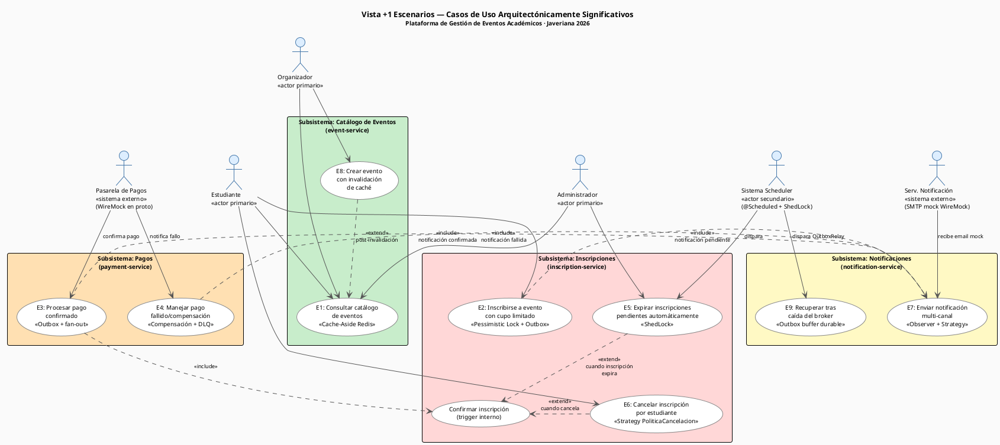
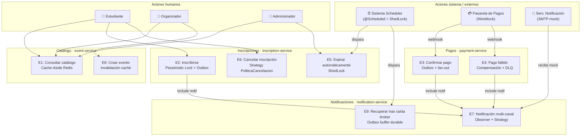
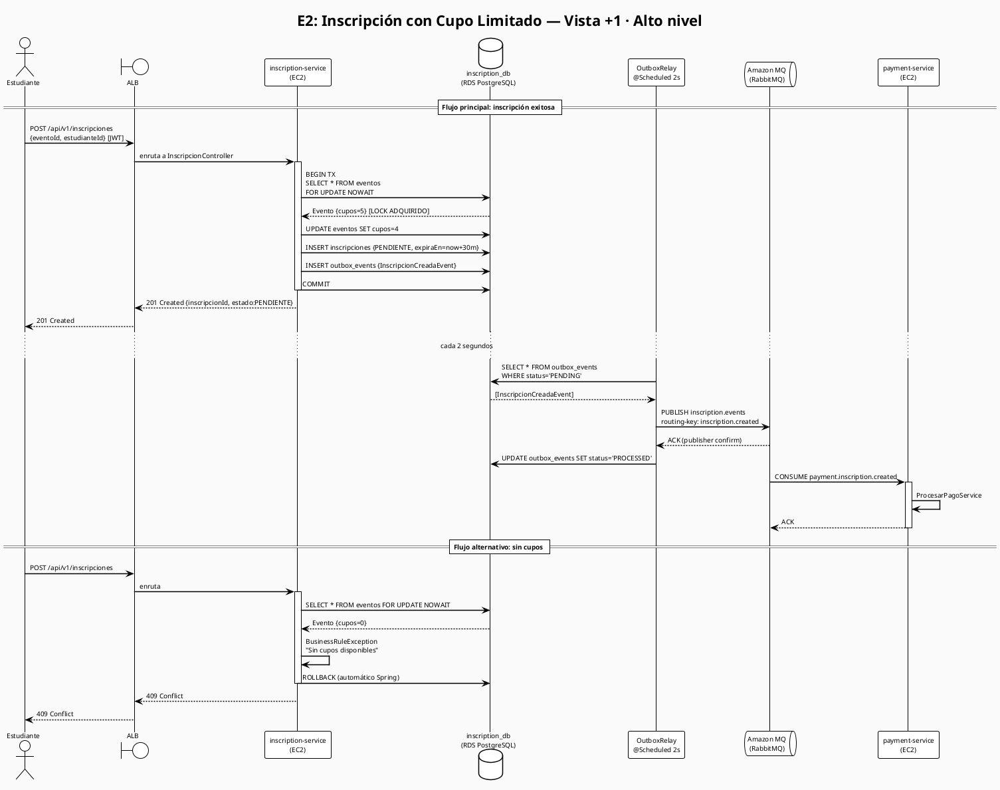
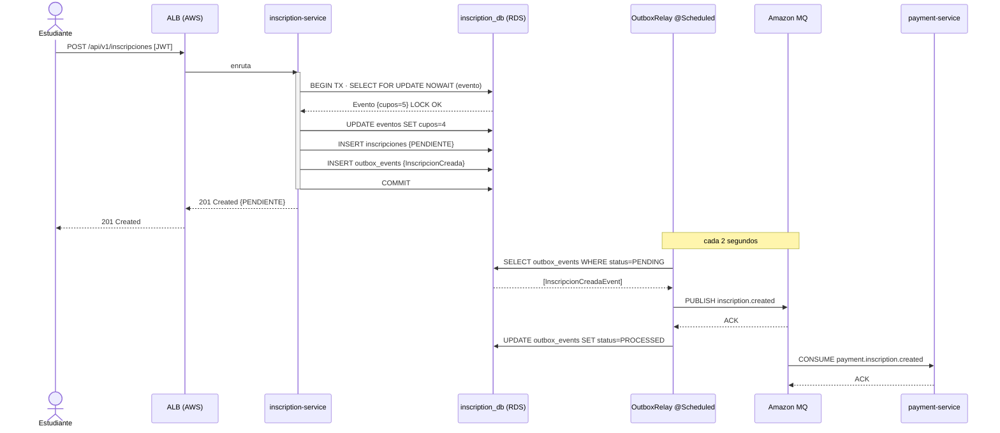
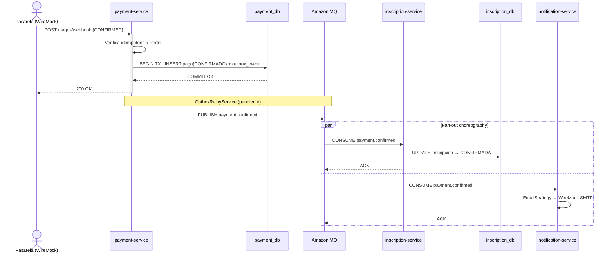
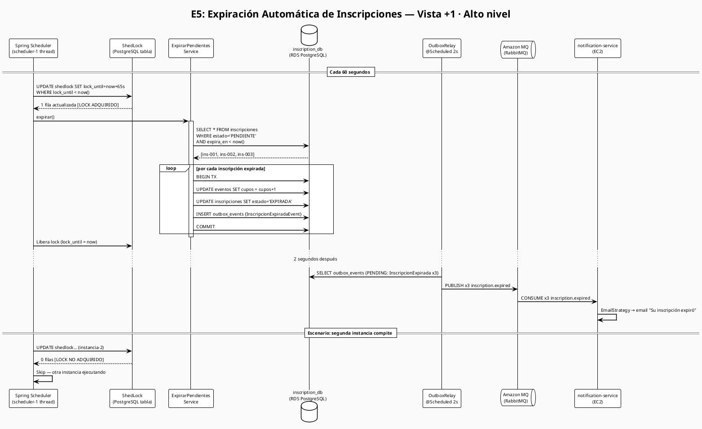
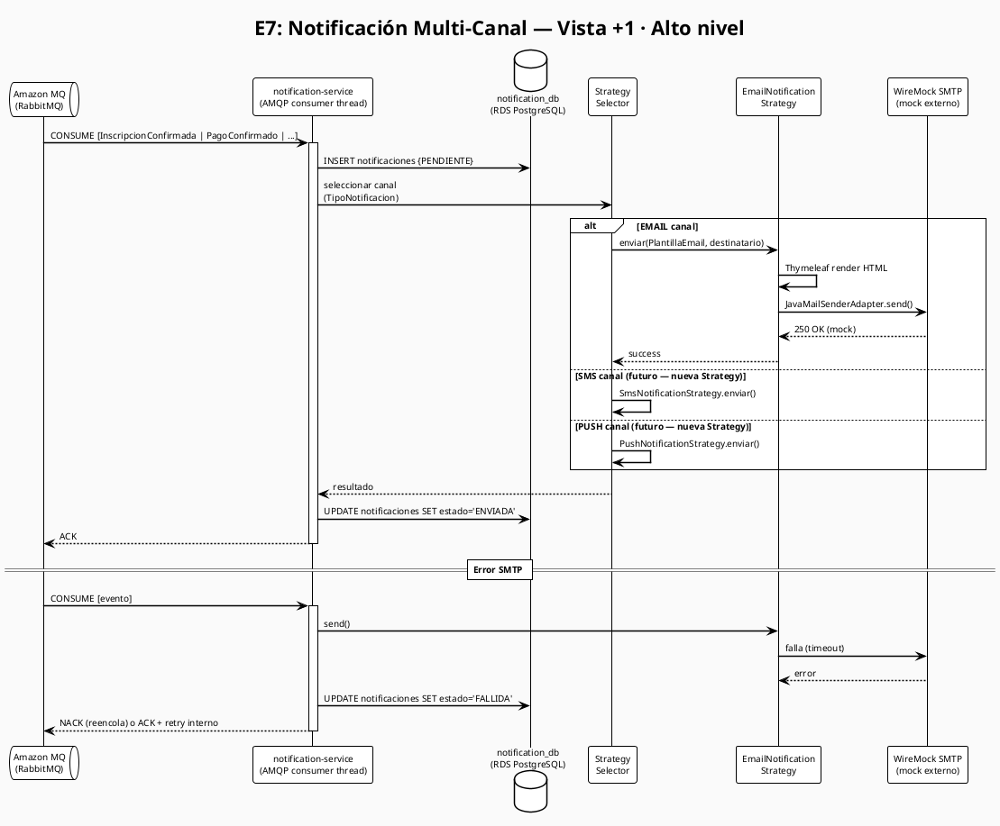

# Vista +1 Escenarios — Kruchten 4+1

**Plataforma de Gestión de Eventos Académicos — Javeriana 2026**  
Maestría en Ingeniería de Software · Diseño de Software Basado en Patrones · Entrega 3  
Deadline: 2026-05-23

---

## Índice

1. [Diagrama General de Casos de Uso UML](#1-diagrama-general-de-casos-de-uso-uml)
2. [Fichas Detalladas por Escenario (9)](#2-fichas-detalladas-por-escenario)
3. [Matriz de Trazabilidad Vistas ↔ Escenarios](#3-matriz-de-trazabilidad-vistas--escenarios)
4. [Matriz de Trazabilidad Escenarios ↔ Patrones GoF](#4-matriz-de-trazabilidad-escenarios--patrones-gof)
5. [Matriz de Trazabilidad Escenarios ↔ ADRs](#5-matriz-de-trazabilidad-escenarios--adrs)
6. [Matriz de Trazabilidad Escenarios ↔ RNFs](#6-matriz-de-trazabilidad-escenarios--rnfs)
7. [Diagramas de Secuencia de Alto Nivel (4 críticos)](#7-diagramas-de-secuencia-de-alto-nivel)
8. [Escenarios de Calidad ATAM](#8-escenarios-de-calidad-atam)
9. [Escenario Integrador End-to-End](#9-escenario-integrador-end-to-end)
10. [Referencia Cruzada con Otras Vistas](#10-referencia-cruzada-con-otras-vistas)

---

## Propósito de la Vista +1

La Vista +1 **valida** que las cuatro vistas estructurales (Lógica, Procesos, Desarrollo, Física) actúan correctamente en conjunto. Los escenarios no son todos los casos de uso funcionales sino los **arquitectónicamente significativos**: aquellos que ejercitan decisiones de diseño críticas, patrones de concurrencia, integración asíncrona y resiliencia.

| # | Escenario | Decisión arquitectónica ejercitada |
|---|---|---|
| E1 | Consulta del catálogo de eventos | Cache-Aside, Redis, invalidación |
| E2 | Inscripción con cupo limitado | Pessimistic Lock, Transactional Outbox |
| E3 | Confirmación de pago | Outbox relay, choreography, fan-out |
| E4 | Pago fallido / compensación | Rollback asíncrono, DLQ |
| E5 | Expiración automática de inscripción | ShedLock, @Scheduled distribuido |
| E6 | Cancelación por estudiante | Strategy PoliticaCancelacion, cupo liberado |
| E7 | Notificación multi-canal | Observer, Strategy de canal |
| E8 | Creación de evento por organizador | Invalidación de caché Redis |
| E9 | Recuperación tras caída del broker | Outbox como buffer durable, at-least-once |

---

## 1. Diagrama General de Casos de Uso UML

### 1.1 PlantUML



### 1.2 Mermaid



---

## 2. Fichas Detalladas por Escenario

---

### ESCENARIO N°1: Consulta del Catálogo de Eventos

---

- **Actor principal:** Estudiante / Organizador / Administrador
- **Actores secundarios:** Redis (ElastiCache), event-service, PostgreSQL (RDS `event_db`)
- **Precondiciones:** Sistema en línea. Redis disponible. Al menos un evento publicado en `event_db`.
- **Postcondiciones (éxito):** Lista de eventos retornada en < 200 ms (cache hit) o < 800 ms (cache miss). Sin sobrecarga en RDS.
- **Postcondiciones (fallo):** Si Redis no está disponible, se degrada a consulta directa a PostgreSQL con tiempo > 200 ms.

**Flujo principal:**

1. El actor envía `GET /api/v1/eventos` al ALB (HTTPS).
2. ALB enruta a `event-service` en EC2.
3. `EventoController` → `ConsultarEventosService`.
4. `ConsultarEventosService` consulta Redis (`EventoRedisAdapter`): clave `eventos:lista:pagina:N`.
5. **Cache hit:** Redis retorna JSON serializado. Tiempo total < 200 ms.
6. Respuesta `200 OK` con lista de eventos al actor.

**Flujo alternativo A — Cache miss:**

A1. Redis retorna `null` (TTL expirado o primera consulta).  
A2. `ConsultarEventosService` consulta `EventoJpaAdapter` → `event_db` (PostgreSQL RDS).  
A3. Resultado almacenado en Redis con TTL = 5 min.  
A4. Respuesta `200 OK` al actor. Tiempo < 800 ms.

**Flujo alternativo B — Redis no disponible:**

B1. `EventoRedisAdapter` lanza `RedisConnectionException`.  
B2. `ConsultarEventosService` captura excepción y ejecuta consulta directa a PostgreSQL (degradación elegante).  
B3. Respuesta `200 OK` sin caché. Se registra métrica de degradación en CloudWatch.

**Excepciones:**

| Condición | Manejo |
|---|---|
| `event_db` no disponible | `503 Service Unavailable`, log en CloudWatch, alerta Alarm |
| Parámetros de paginación inválidos | `400 Bad Request`, validado en `EventoController` |

- **Requisitos funcionales:** RF-001 (consultar catálogo), RF-002 (filtrar por fecha/categoría)
- **Requisitos no funcionales:** RNF-PER-01 (p95 < 800 ms), RNF-DIS-01 (disponibilidad 99%)
- **Patrones aplicados:** Cache-Aside (patrón de integración), Adapter (`EventoRedisAdapter`), Facade (`ConsultarEventosService`), Repository (`EventoJpaAdapter`)
- **ADRs relacionados:** ADR-008 (Cache-Aside Redis), ADR-012 (Hexagonal)
- **Microservicios:** event-service
- **Componentes (Vista Lógica):** `EventoController`, `ConsultarEventosService`, `EventoRedisAdapter`, `EventoJpaAdapter`, `EventoRepository «Port»`
- **Mecanismos runtime (Vista Procesos):** Tomcat HTTP worker, Lettuce async event-loop, HikariCP JDBC pool
- **Módulos de código (Vista Desarrollo):** `event-service/infrastructure/rest`, `event-service/infrastructure/persistence`, `event-service/application/service`
- **Recursos AWS (Vista Física):** ALB → EC2 (event-service) → ElastiCache Redis → RDS PostgreSQL (event_db)
- **Diagrama de secuencia:** ver [escenario-a-inscripcion-outbox.puml](diagramas/escenario-a-inscripcion-outbox.puml) (referencia a Vista Procesos)

---

### ESCENARIO N°2: Inscripción con Cupo Limitado

---

- **Actor principal:** Estudiante
- **Actores secundarios:** inscription-service, event-service (BD local), payment-service (downstream), RabbitMQ (Amazon MQ)
- **Precondiciones:** Estudiante autenticado (JWT válido). Evento en estado `PUBLICADO` con cupo > 0.
- **Postcondiciones (éxito):** `Inscripcion` en estado `PENDIENTE` persistida. `OutboxEvent` `InscripcionCreada` registrado en misma transacción. Cupo decrementado atómicamente. `payment-service` recibe el evento (eventual).
- **Postcondiciones (fallo):** Sin cupo: `409 Conflict`. Sin token: `401 Unauthorized`. Error de concurrencia: rollback completo, cupo intacto.

**Flujo principal:**

1. Estudiante envía `POST /api/v1/inscripciones` con `{ eventoId, estudianteId }`.
2. ALB → EC2 → `InscripcionController` (Driving Adapter REST).
3. `InscripcionController` → `CrearInscripcionService`.
4. `CrearInscripcionService` inicia `@Transactional`:
   - `EventoJpaAdapter.findByIdWithLock(eventoId)` → `SELECT ... FOR UPDATE NOWAIT` sobre `eventos` en `inscription_db`.
   - Valida `cuposDisponibles > 0` → lanza `BusinessRuleException` si no.
   - `evento.decrementarCupo()`.
   - `Inscripcion.crear(...)` → estado `PENDIENTE`, `expiraEn = now + 30 min`.
   - `InscripcionJpaAdapter.save(inscripcion)`.
   - `OutboxJpaAdapter.save(OutboxEvent.of(InscripcionCreadaEvent{...}))`.
5. COMMIT de la transacción (atomicidad garantizada).
6. `OutboxRelayService` (@Scheduled cada 2 s) lee `outbox_events` y publica a RabbitMQ exchange `inscription.events` con routing key `inscription.created`.
7. `payment-service` consume de la cola `payment.inscription.created`.
8. Respuesta `201 Created` con `{ inscripcionId, estado: PENDIENTE, expiraEn }`.

**Flujo alternativo A — Sin cupos:**

A1. `SELECT FOR UPDATE` adquiere lock.  
A2. `cuposDisponibles == 0` → `BusinessRuleException("Sin cupos disponibles")`.  
A3. Spring rollback automático. Lock liberado.  
A4. `InscripcionController` responde `409 Conflict`.

**Flujo alternativo B — Concurrencia: dos estudiantes simultáneos, 1 cupo:**

B1. Transacción A adquiere `SELECT FOR UPDATE NOWAIT`.  
B2. Transacción B intenta adquirir → `LockAcquisitionException` (NOWAIT).  
B3. Transacción B rollback → `409 Conflict` al segundo estudiante.  
B4. Transacción A completa exitosamente.

**Excepciones:**

| Condición | Manejo |
|---|---|
| JWT inválido/expirado | Spring Security → `401 Unauthorized` |
| `EventoId` no existe | `NotFoundException` → `404 Not Found` |
| PostgreSQL timeout | `500 Internal Server Error`, log CloudWatch |
| RabbitMQ caído (Outbox) | Evento queda en tabla `outbox_events`, relay reintenta en 2 s — sin pérdida |

- **Requisitos funcionales:** RF-010 (inscribirse), RF-011 (control de cupos)
- **Requisitos no funcionales:** RNF-CON-01 (cero sobrecupo), RNF-PER-01 (p95 < 1.5 s bajo concurrencia)
- **Patrones aplicados:** Pessimistic Lock (ADR-003), Transactional Outbox (ADR-011), Facade (`CrearInscripcionService`), Adapter (`EventoJpaAdapter`), Repository, Command (`CrearInscripcionCommand`), Observer (downstream `payment-service`)
- **ADRs relacionados:** ADR-003 (Pessimistic Lock), ADR-011 (Transactional Outbox), ADR-006 (RabbitMQ), ADR-012 (Hexagonal)
- **Microservicios:** inscription-service (primario), payment-service (downstream)
- **Componentes (Vista Lógica):** `InscripcionController`, `CrearInscripcionService`, `EventoJpaAdapter`, `InscripcionJpaAdapter`, `OutboxJpaAdapter`, `OutboxRelayService`, `EventPublisher «Port»`
- **Mecanismos runtime (Vista Procesos):** Tomcat HTTP worker, HikariCP JDBC, PostgreSQL WAL + lock manager, `scheduler-1` thread (OutboxRelay), AMQP connection pool
- **Módulos de código (Vista Desarrollo):** `inscription-service/domain/model`, `inscription-service/application/service`, `inscription-service/infrastructure/persistence`, `inscription-service/infrastructure/messaging`
- **Recursos AWS (Vista Física):** ALB → EC2 (inscription-service) → RDS PostgreSQL (inscription_db) → Amazon MQ (RabbitMQ) → EC2 (payment-service)
- **Diagrama de secuencia:** ver §7.1 y [escenario-a-inscripcion-outbox.puml](diagramas/escenario-a-inscripcion-outbox.puml)

---

### ESCENARIO N°3: Confirmación de Pago

---

- **Actor principal:** Pasarela de Pagos (webhook externo)
- **Actores secundarios:** payment-service, inscription-service, notification-service, RabbitMQ
- **Precondiciones:** Inscripción en estado `PENDIENTE`. `InscripcionCreadaEvent` consumido por `payment-service`. Pago procesado exitosamente por la pasarela.
- **Postcondiciones (éxito):** `Inscripcion` en estado `CONFIRMADA`. `PagoConfirmadoEvent` publicado a RabbitMQ. `notification-service` y `inscription-service` reciben el evento. Email de confirmación enviado al estudiante.
- **Postcondiciones (fallo):** Webhook duplicado → idempotencia garantizada (no procesado dos veces).

**Flujo principal:**

1. Pasarela de Pagos envía `POST /api/v1/pagos/webhook` con `{ pagoId, status: "CONFIRMED", inscriptionId }`.
2. `PagoController` → `ConfirmarPagoWebhookService`.
3. Verifica idempotencia: consulta `idempotency_keys` en Redis (`payment-service` usa Redis para deduplicar webhooks).
4. Si no procesado: persiste `Pago` en estado `CONFIRMADO` + `OutboxEvent(PaymentConfirmedEvent)` en misma transacción (`payment_db`).
5. `OutboxRelayService` de `payment-service` (**pendiente** en rama `feat/payment-outbox-e2e`) publica a RabbitMQ.
6. RabbitMQ hace fan-out (choreography):
   - `inscription-service` (`EventoConsumerListener`) consume → `ConfirmarInscripcionService` → estado `CONFIRMADA`.
   - `notification-service` (`PagoConfirmadoListener`) consume → `EnviarNotificacionService` → email al estudiante.
7. `ConfirmarInscripcionService` registra `InscripcionConfirmadaEvent` en su propio Outbox.
8. `notification-service` envía email vía WireMock SMTP.

**Flujo alternativo — Webhook duplicado:**

A1. `ConfirmarPagoWebhookService` consulta Redis → clave `idem:webhook:{pagoId}` presente.  
A2. Retorna `200 OK` inmediato sin re-procesar. Idempotencia garantizada.

**Excepciones:**

| Condición | Manejo |
|---|---|
| `OutboxRelayService` aún pendiente | Evento queda en `outbox_events` de `payment_db` hasta que el relay esté implementado |
| `inscription-service` no disponible | Mensaje en cola RabbitMQ persiste hasta que el servicio restaure |
| Error en `notification-service` | DLQ captura el mensaje; alerta CloudWatch; reintento manual |

- **Requisitos funcionales:** RF-020 (confirmar pago), RF-021 (notificar confirmación)
- **Requisitos no funcionales:** RNF-CON-02 (consistencia eventual), RNF-RES-01 (resiliencia broker), RNF-EXT-01 (extensibilidad canales notificación)
- **Patrones aplicados:** Transactional Outbox, Observer (fan-out choreography), Adapter (`MercadoPagoAdapter`), Strategy (selección canal), Idempotent Consumer
- **ADRs relacionados:** ADR-011 (Outbox), ADR-006 (RabbitMQ), ADR-019 (DLQ), ADR-012 (Hexagonal)
- **Microservicios:** payment-service, inscription-service, notification-service
- **Componentes (Vista Lógica):** `PagoController`, `ConfirmarPagoWebhookService`, `OutboxRelayService`, `EventoConsumerListener`, `ConfirmarInscripcionService`, `PagoConfirmadoListener`, `EnviarNotificacionService`
- **Mecanismos runtime (Vista Procesos):** `scheduler-1` OutboxRelay (payment), AMQP consumer threads, múltiples colas RabbitMQ, DLX exchanges
- **Módulos de código (Vista Desarrollo):** `payment-service/infrastructure/rest`, `payment-service/application/service`, `payment-service/infrastructure/messaging`, `inscription-service/infrastructure/messaging`, `notification-service/infrastructure/messaging`
- **Recursos AWS (Vista Física):** Pasarela → ALB → EC2 (payment-service) → RDS (payment_db) → Amazon MQ → EC2 (inscription-service + notification-service)
- **Diagrama de secuencia:** ver §7.2 y [escenario-b-confirmacion-pago.puml](diagramas/escenario-b-confirmacion-pago.puml)

---

### ESCENARIO N°4: Pago Fallido / Compensación

---

- **Actor principal:** Pasarela de Pagos (webhook fallo)
- **Actores secundarios:** payment-service, inscription-service, notification-service, RabbitMQ
- **Precondiciones:** Inscripción en estado `PENDIENTE`. Pago rechazado por la pasarela (fondos insuficientes, tarjeta inválida, etc.).
- **Postcondiciones (éxito):** `Inscripcion` en estado `CANCELADA`. Cupo liberado (`evento.incrementarCupo()`). Email de rechazo enviado al estudiante. Sin movimiento económico real.
- **Postcondiciones (fallo):** Mensaje en DLQ si `inscription-service` no puede procesar la compensación.

**Flujo principal:**

1. Pasarela envía `POST /api/v1/pagos/webhook` con `{ status: "FAILED", reason: "INSUFFICIENT_FUNDS" }`.
2. `PagoController` → `ConfirmarPagoWebhookService` → registra `Pago{RECHAZADO}` + `OutboxEvent(PaymentFailedEvent)`.
3. `OutboxRelayService` publica `PaymentFailedEvent` a RabbitMQ `payment.events` → routing key `payment.failed`.
4. `inscription-service` `EventoConsumerListener` consume → `CancelarInscripcionService.cancelar(motivo: PAGO_FALLIDO)`:
   - `PoliticaCancelacion.evaluarReembolso()` → `false` (pago no fue exitoso).
   - `evento.incrementarCupo()`.
   - `inscripcion.cancelar()` → estado `CANCELADA`.
   - Persiste `OutboxEvent(InscripcionCancelladaEvent)`.
5. `notification-service` consume `PaymentFailedEvent` → email de rechazo al estudiante.

**Flujo alternativo — DLQ por error en inscription-service:**

A1. `CancelarInscripcionService` lanza excepción → Spring rollback.  
A2. RabbitMQ detecta NACK → reintenta 3 veces (configurado en `RabbitMqTopologyConfig`).  
A3. Tras 3 reintentos → mensaje enruta a `payment.failed.dlq`.  
A4. CloudWatch Alarm detecta mensajes en DLQ → alerta operacional.

**Excepciones:**

| Condición | Manejo |
|---|---|
| DLQ acumula mensajes | Alerta CloudWatch → intervención manual → reintentar o descartar |
| Cupo no se libera | Inconsistencia temporal → resuelta por `ExpirarPendientesService` (@Scheduled 60 s) |

- **Requisitos funcionales:** RF-022 (manejar pago fallido), RF-023 (liberar cupo)
- **Requisitos no funcionales:** RNF-CON-01 (cupo liberado), RNF-RES-01 (DLQ sin pérdida), RNF-OBS-01 (observabilidad)
- **Patrones aplicados:** Compensating Transaction, Transactional Outbox, Observer (downstream), Strategy (PoliticaCancelacion), DLQ (Dead Letter Queue)
- **ADRs relacionados:** ADR-011 (Outbox), ADR-019 (DLQ), ADR-006 (RabbitMQ), ADR-003 (Pessimistic Lock para liberación)
- **Microservicios:** payment-service, inscription-service, notification-service
- **Recursos AWS:** Amazon MQ (DLQ configurado), CloudWatch Alarms

---

### ESCENARIO N°5: Expiración Automática de Inscripción

---

- **Actor principal:** Sistema Scheduler (actor secundario)
- **Actores secundarios:** inscription-service (2 instancias hipotéticas), PostgreSQL (shedlock table), RabbitMQ
- **Precondiciones:** `ExpirarInscripcionesPendientesService` configurado con `@SchedulerLock`. Inscripción en estado `PENDIENTE` con `expiraEn < now()`. El sistema tiene al menos una instancia activa.
- **Postcondiciones (éxito):** Inscripción en estado `EXPIRADA`. Cupo devuelto. `InscripcionExpiradaEvent` publicado vía Outbox. Notificación de expiración enviada.
- **Postcondiciones (fallo):** Si ShedLock no puede adquirir el lock (otra instancia lo tiene), el job se omite sin error — idempotente por diseño.

**Flujo principal:**

1. Spring `@Scheduled(fixedDelay = 60000)` dispara `ExpirarInscripcionesPendientesService.expirar()`.
2. ShedLock intenta adquirir lock: `UPDATE shedlock SET lock_until=now()+65s, locked_by='ins-1' WHERE name='expirar-pendientes' AND lock_until < now()`.
3. Lock adquirido → ejecuta lógica:
4. `InscripcionJpaAdapter.findPendientesExpiradas()` → `SELECT * FROM inscripciones WHERE estado='PENDIENTE' AND expira_en < now()`.
5. Por cada inscripción: delega a `CancelarInscripcionService.cancelar(motivo: EXPIRACION)`:
   - `evento.incrementarCupo()`.
   - `inscripcion.expirar()` → estado `EXPIRADA`.
   - `OutboxJpaAdapter.save(InscripcionExpiradaEvent)`.
6. COMMIT por cada inscripción (lote individual para minimizar tiempo de lock).
7. ShedLock libera lock al finalizar.
8. `OutboxRelayService` publica los eventos expirados a RabbitMQ.
9. `notification-service` notifica a estudiantes.

**Flujo alternativo — Dos instancias compiten:**

A1. Instancia `ins-1` adquiere lock ShedLock.  
A2. Instancia `ins-2` intenta adquirir → falla → log DEBUG → skip silencioso.  
A3. Ninguna inscripción se procesa dos veces. Idempotencia garantizada.

**Excepciones:**

| Condición | Manejo |
|---|---|
| PostgreSQL no disponible | `@Scheduled` retries según spring config; lock no adquirido = skip |
| Inscripción ya cancelada | `estado != PENDIENTE` → skip en la query (`WHERE estado='PENDIENTE'`) |

- **Requisitos funcionales:** RF-030 (expiración automática), RF-031 (liberar cupo)
- **Requisitos no funcionales:** RNF-DIS-02 (jobs distribuidos sin doble ejecución), RNF-CON-01 (cupo correcto)
- **Patrones aplicados:** ShedLock (distributed lock), Template Method (`ExpirarPendientesService` esqueleto), Transactional Outbox, Observer
- **ADRs relacionados:** ADR-018 (ShedLock), ADR-011 (Outbox), ADR-003 (Pessimistic Lock en liberación)
- **Microservicios:** inscription-service
- **Componentes (Vista Lógica):** `ExpirarPendientesService`, `CancelarInscripcionService`, `PoliticaCancelacion`, `InscripcionJpaAdapter`, `OutboxJpaAdapter`
- **Mecanismos runtime (Vista Procesos):** `scheduler-1` thread, ShedLock heartbeat, HikariCP, OutboxRelay
- **Módulos de código (Vista Desarrollo):** `inscription-service/application/service`, `inscription-service/infrastructure/persistence`, `inscription-service/infrastructure/config` (ShedLockConfig)
- **Recursos AWS (Vista Física):** EC2 (inscription-service) → RDS (shedlock table + inscription_db) → Amazon MQ
- **Diagrama de secuencia:** ver §7.3 y [escenario-c-expiracion-job.puml](diagramas/escenario-c-expiracion-job.puml)

---

### ESCENARIO N°6: Cancelación de Inscripción por Estudiante

---

- **Actor principal:** Estudiante
- **Actores secundarios:** inscription-service, RabbitMQ, notification-service
- **Precondiciones:** Estudiante autenticado. Inscripción en estado `PENDIENTE` o `CONFIRMADA`. Pertenece al estudiante autenticado.
- **Postcondiciones (éxito):** Inscripción en estado `CANCELADA`. Cupo liberado si correspondía. `PoliticaCancelacion` evaluó reembolso. `InscripcionCancelladaEvent` publicado.
- **Postcondiciones (fallo):** Inscripción no cancelable (ya `EXPIRADA` o `CANCELADA`) → `409 Conflict`.

**Flujo principal:**

1. Estudiante envía `DELETE /api/v1/inscripciones/{id}`.
2. `InscripcionController` verifica que `inscripcion.estudianteId == tokenStudentId` (autorización).
3. `CancelarInscripcionService.cancelar(inscripcionId, motivo: VOLUNTARIA)`.
4. `PoliticaCancelacion.puedeCancelarse(inscripcion)` → `true`.
5. `PoliticaCancelacion.aplicaReembolso(inscripcion)` → `true` si `CONFIRMADA` y dentro de plazo.
6. `evento.incrementarCupo()`. `inscripcion.cancelar()` → `CANCELADA`.
7. Persiste `OutboxEvent(InscripcionCancelladaEvent{refundApplicable})`.
8. `notification-service` notifica cancelación (y reembolso si aplica).
9. Respuesta `204 No Content`.

**Flujo alternativo — Cancelación fuera de plazo:**

A1. `PoliticaCancelacion.aplicaReembolso()` → `false` (pasó el plazo de 24 h).  
A2. Cancelación procede pero sin reembolso. Evento publicado con `refundApplicable: false`.

**Excepciones:**

| Condición | Manejo |
|---|---|
| Inscripción ya `CANCELADA`/`EXPIRADA` | `409 Conflict`: no se puede cancelar nuevamente |
| Inscripción de otro estudiante | `403 Forbidden` (Spring Security) |
| Estado `CONFIRMADA` sin política clara | `PoliticaCancelacion` define reglas de negocio |

- **Requisitos funcionales:** RF-040 (cancelar inscripción), RF-041 (política de reembolso)
- **Requisitos no funcionales:** RNF-SEC-01 (autorización por ownership), RNF-CON-01 (cupo liberado)
- **Patrones aplicados:** Strategy (`PoliticaCancelacion`), Transactional Outbox, Facade (`CancelarInscripcionService`), Observer (downstream notification)
- **ADRs relacionados:** ADR-011 (Outbox), ADR-012 (Hexagonal), ADR-007 (JWT ownership check)
- **Microservicios:** inscription-service, notification-service

---

### ESCENARIO N°7: Notificación Multi-Canal

---

- **Actor principal:** notification-service (dispara automáticamente al recibir eventos AMQP)
- **Actores secundarios:** RabbitMQ, WireMock SMTP, Thymeleaf, `inscription-service`/`payment-service` (publicadores)
- **Precondiciones:** Al menos un evento AMQP llegó a la cola de `notification-service`. Canal EMAIL activo (WireMock SMTP en prototipo).
- **Postcondiciones (éxito):** Notificación persistida en `notification_db`. Email enviado (o logueado si falla el mock SMTP). `Notificacion` en estado `ENVIADA`.
- **Postcondiciones (fallo):** `Notificacion` en estado `FALLIDA`. `ReintentarEnvioService` reintenta en el próximo ciclo.

**Flujo principal:**

1. `InscripcionConfirmadaListener` (o `PagoConfirmadoListener`) recibe evento de RabbitMQ.
2. `EnviarNotificacionService.enviar(evento)`:
   - `RegistrarNotificacionService.registrar(...)` → persiste `Notificacion{PENDIENTE}` en `notification_db`.
   - **Strategy:** selecciona canal según `TipoNotificacion`:
     - `EmailNotificationStrategy` → `JavaMailSenderAdapter.send(PlantillaEmail)` → Thymeleaf genera HTML.
     - (futuro: `SmsNotificationStrategy`, `PushNotificationStrategy`).
   - WireMock SMTP recibe y simula envío exitoso.
   - `Notificacion{ENVIADA}` persiste.
3. ACK a RabbitMQ.

**Flujo alternativo — SMTP no disponible:**

A1. `JavaMailSenderAdapter` lanza `MailException`.  
A2. `EnviarNotificacionService` captura → `Notificacion{FALLIDA}` persistida.  
A3. NACK a RabbitMQ (o ACK + marca para reintento).  
A4. `ReintentarEnvioService` (@Scheduled) detecta en próximo ciclo y reintenta.

**Excepciones:**

| Condición | Manejo |
|---|---|
| Canal no soportado | `TipoNotificacion` desconocido → log + skip (extensible por Strategy) |
| Thymeleaf no encuentra plantilla | `TemplateInputException` → `Notificacion{FALLIDA}` |

- **Requisitos funcionales:** RF-050 (notificar al estudiante), RF-051 (multi-canal)
- **Requisitos no funcionales:** RNF-EXT-01 (agregar canal sin tocar código existente), RNF-OBS-01
- **Patrones aplicados:** Observer (`*Listener` reacciona a eventos), Strategy (`EmailNotificationStrategy`), Adapter (`JavaMailSenderAdapter`), Template Method (Thymeleaf), Factory Method (selección de `NotificationStrategy`)
- **ADRs relacionados:** ADR-006 (RabbitMQ), ADR-012 (Hexagonal), ADR-019 (DLQ para fallos SMTP)
- **Microservicios:** notification-service
- **Recursos AWS:** Amazon MQ → EC2 (notification-service) → RDS (notification_db)
- **Diagrama de secuencia:** ver §7.4

---

### ESCENARIO N°8: Creación de Evento por Organizador

---

- **Actor principal:** Organizador
- **Actores secundarios:** event-service, PostgreSQL (event_db), Redis (invalidación)
- **Precondiciones:** Organizador autenticado (JWT con rol `COORDINADOR`). Datos del evento válidos.
- **Postcondiciones (éxito):** Evento en estado `PUBLICADO` persistido en `event_db`. Caché Redis invalidada para clave `eventos:lista:*`. Próxima consulta será cache miss y cargará el nuevo evento.
- **Postcondiciones (fallo):** Datos inválidos → `400 Bad Request`. Sin rol → `403 Forbidden`.

**Flujo principal:**

1. Organizador envía `POST /api/v1/eventos` con datos del evento.
2. `EventoController` (deuda técnica: validación mixta) → `CrearEventoService`.
3. `EventoFactory.crear(...)` → `Evento{BORRADOR}`.
4. Flujo de aprobación (simplificado): `PublicarEventoService.publicar(evento)` → `Evento{PUBLICADO}`.
5. `EventoJpaAdapter.save(evento)` → persiste en `event_db`.
6. **Invalidación de caché:** `EventoRedisAdapter.evict("eventos:lista:*")` → Redis `DEL` o `SCAN+DEL` por patrón.
7. Respuesta `201 Created` con `{ eventoId, estado: PUBLICADO }`.
8. Próxima consulta de catálogo → cache miss → carga fresco desde `event_db`.

**Excepciones:**

| Condición | Manejo |
|---|---|
| Caché no disponible | Invalidación fallida → se ignora (próximo TTL expiración natural) |
| Datos inválidos | `400 Bad Request` con errores de validación (Bean Validation) |

- **Patrones aplicados:** Cache-Aside (invalidación), Factory Method (`EventoFactory`), Adapter (`EventoRedisAdapter`), Repository
- **ADRs relacionados:** ADR-008 (Cache-Aside), ADR-012 (Hexagonal), ADR-007 (JWT roles)

---

### ESCENARIO N°9: Recuperación tras Caída del Broker

---

- **Actor principal:** Sistema Scheduler (OutboxRelayService)
- **Actores secundarios:** RabbitMQ (Amazon MQ), inscription-service, payment-service, tabla `outbox_events`
- **Precondiciones:** Amazon MQ caído por 5 minutos. Inscripciones y pagos continúan creándose (PostgreSQL disponible). Eventos acumulados en tabla `outbox_events` (Outbox como buffer durable).
- **Postcondiciones (éxito):** Al restaurarse Amazon MQ, `OutboxRelayService` publica todos los eventos acumulados. Sin pérdida de datos. Consistencia eventual restaurada.
- **Postcondiciones (fallo):** Si `outbox_events` supera umbral → alerta CloudWatch.

**Flujo principal (durante caída):**

1. `OutboxRelayService` (@Scheduled 2 s) intenta publicar a RabbitMQ.
2. `RabbitMQ Publisher` lanza `AmqpException` → evento queda en `outbox_events` con `status=PENDING`, `attempts++`.
3. Inscripciones y pagos continúan creándose normalmente (solo afecta la propagación asíncrona).
4. Reintentos cada 2 s → `attempts` incrementa.

**Flujo principal (recuperación):**

5. Amazon MQ restaurado.
6. `OutboxRelayService` siguiente ciclo → conexión exitosa.
7. Procesa todos los eventos `PENDING` en lote (100 por ciclo, configurable).
8. Publica y marca `PROCESSED`. Consistencia eventual restaurada.
9. CloudWatch detecta reducción de `outbox_events.status=PENDING` → alerta normalizada.

**Excepciones:**

| Condición | Manejo |
|---|---|
| Evento envenenado en Outbox | `maxAttempts` alcanzado → `status=DEAD_LETTER` → log + alerta |
| PostgreSQL cae también | Transacciones nuevas fallan con `500`; Outbox no aplica (sin BD no hay estado) |

- **Patrones aplicados:** Transactional Outbox (at-least-once delivery), Template Method (relay loop), Idempotent Consumer (downstream)
- **ADRs relacionados:** ADR-011 (Outbox), ADR-006 (RabbitMQ), ADR-019 (DLQ/retry)
- **Microservicios:** inscription-service, payment-service
- **Recursos AWS:** EC2 → RDS (outbox_events) → Amazon MQ

---

## 3. Matriz de Trazabilidad Vistas ↔ Escenarios

| Escenario | Vista Lógica (componentes) | Vista Procesos (mecanismos runtime) | Vista Desarrollo (módulos) | Vista Física (recursos AWS) |
|---|---|---|---|---|
| **E1** Consulta catálogo | `ConsultarEventosService`, `EventoRedisAdapter`, `EventoJpaAdapter` | Tomcat HTTP worker, Lettuce async, HikariCP | `event-service/application`, `event-service/infrastructure/persistence` | ALB → EC2 → ElastiCache Redis → RDS event_db |
| **E2** Inscripción cupo | `CrearInscripcionService`, `EventoJpaAdapter (PL)`, `OutboxJpaAdapter`, `OutboxRelayService` | Tomcat HTTP, PostgreSQL WAL+lock, scheduler-1 AMQP | `inscription-service/domain/model`, `application/service`, `infrastructure/persistence` | ALB → EC2 (inscription) → RDS inscription_db → Amazon MQ |
| **E3** Confirmación pago | `ConfirmarPagoWebhookService`, `OutboxRelayService` (payment), `EventoConsumerListener`, `ConfirmarInscripcionService`, `PagoConfirmadoListener` | scheduler-1 (payment Outbox), AMQP consumer threads, múltiples queues | `payment-service/application`, `inscription-service/infrastructure/messaging`, `notification-service/infrastructure/messaging` | ALB → EC2 (payment) → RDS payment_db → Amazon MQ → EC2 (inscription + notification) |
| **E4** Pago fallido | `CancelarInscripcionService`, `PoliticaCancelacion`, `OutboxJpaAdapter` | AMQP consumer, DLX routing, DLQ | `inscription-service/domain/service`, `application/service` | Amazon MQ (DLQ) → EC2 (inscription) → RDS |
| **E5** Expiración auto | `ExpirarPendientesService`, `CancelarInscripcionService`, ShedLock tabla | scheduler-1, ShedLock heartbeat, HikariCP | `inscription-service/application/service`, `infrastructure/config` | EC2 (inscription) → RDS (shedlock + inscription_db) → Amazon MQ |
| **E6** Cancelación manual | `CancelarInscripcionService`, `PoliticaCancelacion`, `InscripcionController` | Tomcat HTTP worker, HikariCP, AMQP publish | `inscription-service/domain/service`, `application/service`, `infrastructure/rest` | ALB → EC2 (inscription) → RDS → Amazon MQ |
| **E7** Notificación multi-canal | `EnviarNotificacionService`, `EmailNotificationStrategy`, `JavaMailSenderAdapter`, Thymeleaf | AMQP consumer, SMTP (WireMock), HikariCP | `notification-service/infrastructure/email`, `infrastructure/messaging` | Amazon MQ → EC2 (notification) → RDS notification_db → WireMock (SMTP) |
| **E8** Crear evento | `CrearEventoService`, `EventoFactory`, `EventoRedisAdapter` (evict), `EventoJpaAdapter` | Tomcat HTTP, Redis evict, HikariCP | `event-service/domain/model`, `application/service`, `infrastructure/persistence` | ALB → EC2 (event) → ElastiCache (evict) → RDS event_db |
| **E9** Recuperación broker | `OutboxRelayService` (inscription + payment), `OutboxJpaAdapter` | scheduler-1, AMQP reconnect, HikariCP | `inscription-service/application/service`, `payment-service/application/service` | EC2 → RDS (outbox_events) → Amazon MQ (at-least-once) |

---

## 4. Matriz de Trazabilidad Escenarios ↔ Patrones GoF

| Escenario | Strategy | Factory Method | Adapter | Repository | Observer | Template Method | Command | Singleton (Spring) | Facade | DTO+Mapper |
|---|---|---|---|---|---|---|---|---|---|---|
| **E1** Consulta catálogo | — | — | ✓ `EventoRedisAdapter` adapta Lettuce | ✓ `EventoJpaAdapter` | — | — | — | ✓ Spring beans únicos | ✓ `ConsultarEventosService` | ✓ `EventoResponse` + mapper |
| **E2** Inscripción cupo | — | — | ✓ `EventoJpaAdapter` (PESSIMISTIC_WRITE) | ✓ `InscripcionJpaAdapter`, `OutboxJpaAdapter` | ✓ `payment-service` reacciona | — | ✓ `CrearInscripcionCommand` | ✓ `@Bean` Spring | ✓ `CrearInscripcionService` | ✓ `InscripcionResponse` |
| **E3** Confirmación pago | — | — | ✓ `MercadoPagoAdapter` | ✓ `PagoJpaAdapter` | ✓ Fan-out: inscription + notification consumen | — | — | ✓ `@Bean` Spring | ✓ `ConfirmarPagoWebhookService` | ✓ Webhook DTO |
| **E4** Pago fallido | ✓ `PoliticaCancelacion` evalúa compensación | — | ✓ Adapters JPA | ✓ `InscripcionJpaAdapter` | ✓ Downstream consumers | — | — | ✓ Spring | ✓ `CancelarInscripcionService` | ✓ DTOs evento AMQP |
| **E5** Expiración auto | ✓ `PoliticaCancelacion` motivo=EXPIRACION | — | ✓ `InscripcionJpaAdapter` | ✓ `OutboxJpaAdapter` | ✓ notification-service consume | ✓ `ExpirarPendientesService` (esqueleto @Scheduled) | — | ✓ ShedLock bean | ✓ `CancelarInscripcionService` | — |
| **E6** Cancelación manual | ✓ `PoliticaCancelacion` reembolso | — | ✓ `EventoJpaAdapter` | ✓ `InscripcionJpaAdapter` | ✓ notification-service | — | — | ✓ Spring | ✓ `CancelarInscripcionService` | ✓ `InscripcionRequest` |
| **E7** Notificación multi-canal | ✓ `EmailNotificationStrategy` (extensible) | ✓ Selección de `NotificationStrategy` | ✓ `JavaMailSenderAdapter` | ✓ `NotificacionJpaAdapter` | ✓ `*Listener` observa eventos | ✓ Thymeleaf Template Method | — | ✓ Spring beans | ✓ `EnviarNotificacionService` | ✓ DTO eventos AMQP |
| **E8** Crear evento | — | ✓ `EventoFactory.crear()` | ✓ `EventoRedisAdapter` (evict) | ✓ `EventoJpaAdapter` | — | — | — | ✓ Spring | ✓ `CrearEventoService` | ✓ `EventoRequest` |
| **E9** Recuperación broker | — | — | ✓ AMQP Publisher Adapter | ✓ `OutboxJpaAdapter` | — | ✓ `OutboxRelayService` loop | — | ✓ Spring scheduler | ✓ `OutboxRelayService` | ✓ DTOs Outbox → AMQP |

---

## 5. Matriz de Trazabilidad Escenarios ↔ ADRs

| Escenario | ADR-003 Pessimistic Lock | ADR-004 AWS ≤100 USD | ADR-006 RabbitMQ | ADR-007 JWT mock | ADR-008 Cache-Aside | ADR-011 Outbox | ADR-012 Hexagonal | ADR-018 ShedLock | ADR-019 DLQ |
|---|---|---|---|---|---|---|---|---|---|
| **E1** Consulta catálogo | — | ✓ ElastiCache t4g.micro | — | ✓ JWT valida rol | ✓ Cache-Aside primario | — | ✓ Hexagonal en event-service | — | — |
| **E2** Inscripción cupo | ✓ SELECT FOR UPDATE NOWAIT | ✓ RDS t4g.micro | ✓ InscripcionCreada → queue | ✓ JWT estudiante | — | ✓ Outbox en misma TX | ✓ Puertos e inversión | — | — |
| **E3** Confirmación pago | — | ✓ EC2 t3.small (todos los svc) | ✓ PaymentConfirmed fan-out | ✓ JWT webhook (básico) | — | ✓ Outbox payment-service | ✓ Hexagonal payment | — | ✓ DLQ si consumer falla |
| **E4** Pago fallido | — | — | ✓ PaymentFailed routing | — | — | ✓ Outbox buffer | ✓ Hexagonal | — | ✓ DLQ activo |
| **E5** Expiración auto | ✓ Liberación cupo @Tx | — | ✓ InscripcionExpirada publish | — | — | ✓ Outbox expiración | ✓ Hexagonal | ✓ ShedLock primario | — |
| **E6** Cancelación manual | ✓ Incremento cupo @Tx | — | ✓ InscripcionCancellada publish | ✓ JWT ownership | — | ✓ Outbox cancelación | ✓ Hexagonal | — | — |
| **E7** Notificación multi-canal | — | ✓ EC2 único para notif | ✓ Consume múltiples queues | — | — | — | ✓ Hexagonal notification | — | ✓ DLQ si SMTP falla |
| **E8** Crear evento | — | ✓ ElastiCache evict cheap | — | ✓ JWT rol COORDINADOR | ✓ Invalidación caché | — | ✓ Hexagonal event-svc | — | — |
| **E9** Recuperación broker | — | ✓ Amazon MQ mq.t3.micro | ✓ Reconexión automática | — | — | ✓ Outbox como buffer durable | ✓ Hexagonal | ✓ ShedLock durante recovery | ✓ DLQ acumula durante caída |

---

## 6. Matriz de Trazabilidad Escenarios ↔ RNFs

| Escenario | Consistencia eventual | Cero sobrecupo | Resiliencia broker | Disponibilidad | Rendimiento (p95 < 1.5s) | Escalabilidad H. | Extensibilidad | Seguridad (TLS/JWT) | Observabilidad |
|---|---|---|---|---|---|---|---|---|---|
| **E1** Consulta catálogo | — | — | — | ✓ Degradación a PostgreSQL si Redis cae | ✓ <200 ms cache hit, <800 ms miss | ✓ Redis desacopla carga de RDS | — | ✓ TLS ALB→EC2, JWT leído | ✓ CloudWatch latencia Redis |
| **E2** Inscripción cupo | ✓ Outbox garantiza eventual delivery | ✓ SELECT FOR UPDATE NOWAIT | ✓ Outbox buffer si broker cae | ✓ ALB health check | ✓ < 1.5 s (PL overhead ~50ms) | ✓ Sin estado compartido entre instancias | — | ✓ JWT estudiante, TLS | ✓ CloudWatch métricas TX, outbox backlog |
| **E3** Confirmación pago | ✓ Fan-out choreography | — | ✓ Outbox + DLQ | ✓ Múltiples consumers | ✓ Async: webhook responde < 200 ms | ✓ Consumers escalables independientemente | ✓ Agregar consumidor sin tocar payment-svc | ✓ AMQPS TLS, JWT webhook | ✓ CloudWatch consumer lag |
| **E4** Pago fallido | ✓ Compensación eventual | ✓ Cupo liberado en cancelación | ✓ DLQ retiene sin pérdida | ✓ DLQ mantiene mensajes | — | — | — | — | ✓ CloudWatch Alarm en DLQ |
| **E5** Expiración auto | ✓ Cupo liberado eventualmente | ✓ Cupo corregido por job | ✓ Job reintenta si broker no disponible | ✓ ShedLock previene doble ejecución | — | ✓ ShedLock escala a N instancias | — | — | ✓ CloudWatch métricas job duración |
| **E6** Cancelación manual | ✓ Notificación eventual | ✓ Cupo incrementado @Tx | ✓ Outbox buffer | ✓ — | ✓ < 1 s (solo DB + publish) | — | — | ✓ JWT ownership check | ✓ Log auditoría cancelación |
| **E7** Notificación multi-canal | ✓ Eventual (reintento async) | — | ✓ DLQ para SMTP fallido | ✓ Retry automático | — | ✓ Múltiples instancias notification | ✓ Agregar Strategy canal sin tocar listeners | — | ✓ CloudWatch emails enviados/fallidos |
| **E8** Crear evento | ✓ Cache invalidada → consistencia eventual con próxima carga | — | — | — | ✓ Cache evict < 10 ms | — | — | ✓ JWT rol COORDINADOR | ✓ Log invalidación caché |
| **E9** Recuperación broker | ✓ At-least-once con Outbox | — | ✓ Cero pérdidas — buffer durable en RDS | ✓ Sin intervención manual | — | — | — | — | ✓ CloudWatch Alarm outbox_backlog > umbral |

---

## 7. Diagramas de Secuencia de Alto Nivel

### 7.1 E2 — Inscripción con Cupo Limitado





---

### 7.2 E3 — Confirmación de Pago

```plantuml
@startuml seq-e3-confirmacion-pago
title <b>E3: Confirmación de Pago</b> — Vista +1 · Alto nivel
!theme plain
skinparam backgroundColor #FAFAFA
skinparam defaultFontSize 10
skinparam sequenceArrowThickness 1.5
skinparam shadowing false

actor "Pasarela\n(WireMock)" as PASARELA
boundary "ALB" as ALB
participant "payment-service\n(EC2)" as PAY
database "payment_db\n(RDS)" as PAYDB
participant "OutboxRelay\n[payment — pendiente]" as PRELAY
queue "Amazon MQ\n(RabbitMQ)" as MQ
participant "inscription-service\n(EC2)" as INS
database "inscription_db\n(RDS)" as INSDB
participant "notification-service\n(EC2)" as NOTIF

== Confirmación de pago (fan-out choreography) ==

PASARELA -> ALB : POST /api/v1/pagos/webhook\n{pagoId, status:CONFIRMED}
ALB -> PAY : enruta a PagoController

activate PAY
PAY -> PAY : Verifica idempotencia Redis
PAY -> PAYDB : BEGIN TX\nINSERT pagos {CONFIRMADO}\nINSERT outbox_events {PaymentConfirmedEvent}
PAYDB --> PAY : COMMIT OK
PAY --> ALB : 200 OK
ALB --> PASARELA : 200 OK
deactivate PAY

Note over PRELAY: OutboxRelayService\n⚠ pendiente feat/payment-outbox-e2e
PRELAY -> PAYDB : SELECT outbox_events {PENDING}
PRELAY -> MQ : PUBLISH payment.events\nrouting-key: payment.confirmed
MQ --> PRELAY : ACK

== Fan-out: dos consumers en paralelo ==

par inscription-service consume
  MQ -> INS : CONSUME inscription.payment.confirmed
  activate INS
  INS -> INSDB : UPDATE inscripciones SET estado=CONFIRMADA
  INS -> INSDB : INSERT outbox_events {InscripcionConfirmada}
  INS --> MQ : ACK
  deactivate INS
and notification-service consume
  MQ -> NOTIF : CONSUME notification.payment.confirmed
  activate NOTIF
  NOTIF -> NOTIF : EnviarNotificacionService\nEmailStrategy → WireMock SMTP
  NOTIF --> MQ : ACK
  deactivate NOTIF
end

@enduml
```



---

### 7.3 E5 — Expiración Automática



---

### 7.4 E7 — Notificación Multi-Canal



---

## 8. Escenarios de Calidad ATAM

### a) Rendimiento bajo concurrencia

| Campo ATAM | Descripción |
|---|---|
| **Source** | 500 estudiantes concurrentes |
| **Stimulus** | Intentan inscribirse al mismo evento en < 10 s (1 cupo disponible) |
| **Artifact** | `inscription-service`, `EventoJpaAdapter`, PostgreSQL `inscription_db` |
| **Environment** | Producción: EC2 t3.small, RDS db.t4g.micro, carga pico |
| **Response** | Solo 1 inscripción exitosa (`PENDIENTE`). Las 499 restantes reciben `409 Conflict`. Cero sobrecupo. |
| **Response Measure** | p95 latencia < 1.5 s. Cero inconsistencias de cupo. Lock wait timeout configurable (NOWAIT = inmediato). |
| **Mecanismo arquitectónico** | `SELECT FOR UPDATE NOWAIT` (ADR-003) + `@Transactional` + Spring Connection Pool (HikariCP max 10). Bajo alta concurrencia, la mayoría de requests falla rápido por NOWAIT. |
| **Riesgo identificado** | EC2 t3.small con HikariCP de 10 conexiones: bajo 500 requests simultáneos, las conexiones pueden agotarse. Mitigación: pool de conexiones configurado + Tomcat max threads 200. |

---

### b) Resiliencia ante caída del broker

| Campo ATAM | Descripción |
|---|---|
| **Source** | Amazon MQ (RabbitMQ) — servicio gestionado AWS |
| **Stimulus** | Cae durante 5 minutos (mantenimiento, red failure) |
| **Artifact** | `OutboxRelayService` (inscription-service, payment-service), tabla `outbox_events` |
| **Environment** | Producción: Amazon MQ mq.t3.micro, inscripciones y pagos continúan |
| **Response** | Cero eventos perdidos. PostgreSQL actúa como buffer durable (Outbox). Al restaurarse MQ, `OutboxRelayService` procesa el backlog automáticamente. |
| **Response Measure** | 0 mensajes perdidos. Backlog procesado en < 5 min tras restauración (relay cada 2 s, lote de 100). CloudWatch Alarm: `outbox_pending_count > 50`. |
| **Mecanismo arquitectónico** | Transactional Outbox (ADR-011): evento + estado de dominio en misma TX. `OutboxRelayService` reintentos automáticos. At-least-once delivery + Idempotent Consumer en downstream. |
| **Riesgo identificado** | `OutboxRelayService` de `payment-service` aún no implementado (rama `feat/payment-outbox-e2e`). Sin él, `PaymentConfirmedEvent` no sale de `payment_db`. |

---

### c) Disponibilidad ante reinicio de EC2

| Campo ATAM | Descripción |
|---|---|
| **Source** | AWS (mantenimiento) o fallo de instancia |
| **Stimulus** | EC2 `eventos-app-server` reinicia |
| **Artifact** | Todos los microservicios en Docker Compose en EC2 |
| **Environment** | Producción: ALB con health checks configurados |
| **Response** | ALB deja de enrutar tráfico en < 30 s (health check interval). Al restaurarse EC2, Docker Compose levanta contenedores automáticamente (`restart: always`). ALB detecta health check verde y restaura tráfico. |
| **Response Measure** | Downtime < 2 min (boot + health check). 0 solicitudes enrutadas a instancia caída. Outbox en RDS preserva eventos pendientes durante el downtime. |
| **Mecanismo arquitectónico** | ALB health checks + `restart: always` en Docker Compose. RDS y Amazon MQ externos al EC2 → no afectados por reinicio. |
| **Riesgo identificado** | Single EC2 = SPOF. ADR-004 acepta este riesgo por presupuesto. No hay Auto Scaling Group configurado. |

---

### d) Modificabilidad — Agregar canal Telegram

| Campo ATAM | Descripción |
|---|---|
| **Source** | Requerimiento de negocio |
| **Stimulus** | Agregar canal Telegram a `notification-service` |
| **Artifact** | `notification-service`, `infrastructure/email`, Strategy pattern |
| **Environment** | Desarrollo, sprint de implementación |
| **Response** | Implementar `TelegramNotificationStrategy implements NotificationStrategy`. Registrar en `StrategySelector`. Sin tocar `EnviarNotificacionService`, listeners existentes, ni `payment-service`/`inscription-service`. |
| **Response Measure** | Cambios confinados a 2 archivos nuevos + 1 modificación en selector. 0 cambios en otros microservicios. 0 cambios en contratos AMQP (shared-kernel). Tests existentes pasan sin modificación. |
| **Mecanismo arquitectónico** | Strategy Pattern (ADR-012 Hexagonal): `EmailSenderPort` puede extenderse a `NotificationChannelPort`. Principle of OCP (Open/Closed). |

---

### e) Seguridad — Acceso sin token JWT

| Campo ATAM | Descripción |
|---|---|
| **Source** | Usuario no autenticado / actor malicioso |
| **Stimulus** | Request HTTP sin header `Authorization: Bearer <jwt>` a cualquier endpoint protegido |
| **Artifact** | Spring Security Filter Chain en todos los microservicios |
| **Environment** | Producción, HTTPS obligatorio (TLS terminado en ALB) |
| **Response** | Spring Security intercepta en `SecurityFilterChain` antes de llegar a cualquier Controller. Retorna `401 Unauthorized`. Log de intento en CloudWatch. Sin acceso a datos de dominio. |
| **Response Measure** | 100% de requests sin JWT rechazados con `401`. Tiempo de respuesta < 10 ms (sin consulta a BD). Log con IP origen en CloudWatch Logs. |
| **Mecanismo arquitectónico** | Spring Security (ADR-007 JWT mock en prototipo). TLS en ALB. Secreto JWT en AWS Secrets Manager. `SecurityConfig` en `infrastructure.config` de cada microservicio. |

---

## 9. Escenario Integrador End-to-End

**Narrativa:** María (estudiante) consulta el catálogo, se inscribe al "Simposio de IA", recibe confirmación de inscripción pendiente, paga exitosamente y su inscripción queda activa.

```plantuml
@startuml seq-e2e-integrador
title <b>Escenario Integrador E2E</b> — "María se inscribe y paga al Simposio de IA"\nVista +1 Escenarios · Plataforma de Gestión de Eventos Académicos

!theme plain
skinparam backgroundColor #FAFAFA
skinparam defaultFontSize 9
skinparam sequenceArrowThickness 1.5
skinparam sequenceGroupBorderColor #AAAAAA
skinparam shadowing false
skinparam sequenceBoxBackgroundColor #F5F5F5

actor "María\n(Estudiante)" as MARIA
participant "CloudFront\n+ S3 (SPA)" as CDN
boundary "ALB\n(HTTPS)" as ALB
participant "event-service\n:8081 (EC2)" as EVTSVC
participant "inscription-service\n:8082 (EC2)" as INSSVC
participant "payment-service\n:8083 (EC2)" as PAYSVC
participant "notification-service\n:8084 (EC2)" as NOTIFSVC
database "event_db\n(RDS)" as EVTDB
database "inscription_db\n(RDS)" as INSDB
database "payment_db\n(RDS)" as PAYDB
database "notification_db\n(RDS)" as NOTIFDB
participant "Redis\n(ElastiCache)" as REDIS
queue "Amazon MQ\n(RabbitMQ)" as MQ
participant "WireMock\nPassarela + SMTP" as WIREMOCK
participant "AWS Secrets\nManager" as SECRETS

== PASO 1: María carga la SPA ==

MARIA -> CDN : GET https://eventos.javeriana.edu.co
CDN --> MARIA : React SPA (HTML/JS/CSS desde S3)

== PASO 2: Consultar catálogo (Cache-Aside) ==

MARIA -> ALB : GET /api/v1/eventos (JWT)
ALB -> EVTSVC : enruta (path /api/v1/eventos → :8081)
EVTSVC -> REDIS : GET eventos:lista:pagina:1
alt Cache HIT
  REDIS --> EVTSVC : JSON lista eventos
  EVTSVC --> ALB : 200 OK [{Simposio de IA, cupos:1, precio:50000}]
else Cache MISS
  REDIS --> EVTSVC : null
  EVTSVC -> EVTDB : SELECT * FROM eventos WHERE estado='PUBLICADO'
  EVTDB --> EVTSVC : [Simposio de IA, ...]
  EVTSVC -> REDIS : SET eventos:lista:pagina:1 TTL=5min
  EVTSVC --> ALB : 200 OK
end
ALB --> MARIA : 200 OK — María ve el Simposio de IA con 1 cupo

== PASO 3: María se inscribe (Pessimistic Lock + Outbox) ==

MARIA -> ALB : POST /api/v1/inscripciones\n{eventoId:"simposio-ia", estudianteId:"maria-uuid"} [JWT]
ALB -> INSSVC : enruta → InscripcionController

activate INSSVC #LightBlue
INSSVC -> INSDB : BEGIN TX\nSELECT FROM eventos FOR UPDATE NOWAIT (simposio-ia)
INSDB --> INSSVC : Evento {cupos:1} [LOCK OK]
INSSVC -> INSDB : UPDATE eventos SET cupos=0 WHERE id='simposio-ia'
INSSVC -> INSDB : INSERT inscripciones\n{id:ins-001, estado:PENDIENTE, expiraEn:now+30m}
INSSVC -> INSDB : INSERT outbox_events\n{payload:InscripcionCreadaEvent{ins-001, simposio-ia, monto:50000}}
INSSVC -> INSDB : COMMIT
deactivate INSSVC

INSSVC --> ALB : 201 Created {ins-001, estado:PENDIENTE, expiraEn}
ALB --> MARIA : 201 Created — "Inscripción pendiente, tiene 30 min para pagar"

== PASO 4: OutboxRelay publica InscripcionCreadaEvent (2s después) ==

INSSVC -> INSDB : SELECT outbox_events WHERE status=PENDING
INSDB --> INSSVC : [InscripcionCreadaEvent{ins-001}]
INSSVC -> MQ : PUBLISH inscription.events\nRK: inscription.created\n{ins-001, simposio-ia, monto:50000}
MQ --> INSSVC : publisher CONFIRM
INSSVC -> INSDB : UPDATE outbox_events SET status=PROCESSED

== PASO 5: payment-service consume y procesa ==

MQ -> PAYSVC : CONSUME payment.inscription.created
activate PAYSVC #LightYellow
PAYSVC -> SECRETS : GetSecretValue(payment-api-key)
PAYSVC -> WIREMOCK : POST /v1/payment_intents\n{amount:50000, inscriptionId:ins-001}
WIREMOCK --> PAYSVC : {paymentId:pay-001, status:PENDING, checkoutUrl}
PAYSVC -> PAYDB : INSERT pagos {pay-001, INICIADO, ins-001}
PAYSVC --> MQ : ACK
deactivate PAYSVC

== PASO 6: María paga (Pasarela WireMock) ==

MARIA -> ALB : Redirect a checkout (URL WireMock simulado)
MARIA -> WIREMOCK : Completa pago en formulario mock
WIREMOCK -> ALB : POST /api/v1/pagos/webhook\n{pagoId:pay-001, status:CONFIRMED, inscriptionId:ins-001}
ALB -> PAYSVC : enruta → PagoController

activate PAYSVC #LightYellow
PAYSVC -> REDIS : GET idem:webhook:pay-001 [no existe → procede]
PAYSVC -> PAYDB : BEGIN TX\nUPDATE pagos SET estado=CONFIRMADO\nINSERT outbox_events {PaymentConfirmedEvent{pay-001, ins-001}}
PAYDB --> PAYSVC : COMMIT
PAYSVC -> REDIS : SET idem:webhook:pay-001 TTL=24h [marca idempotencia]
PAYSVC --> ALB : 200 OK
deactivate PAYSVC

== PASO 7: OutboxRelay payment publica PaymentConfirmedEvent ==

note over PAYSVC: OutboxRelayService ⚠ pendiente feat/payment-outbox-e2e
PAYSVC -> PAYDB : SELECT outbox_events {PENDING}
PAYSVC -> MQ : PUBLISH payment.events RK: payment.confirmed\n{pay-001, ins-001}
MQ --> PAYSVC : CONFIRM

== PASO 8: Fan-out choreography (dos consumers en paralelo) ==

par inscription-service confirma
  MQ -> INSSVC : CONSUME inscription.payment.confirmed
  activate INSSVC #LightBlue
  INSSVC -> INSDB : BEGIN TX\nUPDATE inscripciones SET estado=CONFIRMADA WHERE id=ins-001
  INSSVC -> INSDB : INSERT outbox_events {InscripcionConfirmadaEvent}
  INSSVC -> INSDB : COMMIT
  INSSVC --> MQ : ACK
  deactivate INSSVC
and notification-service notifica pago
  MQ -> NOTIFSVC : CONSUME notification.payment.confirmed
  activate NOTIFSVC #LightGreen
  NOTIFSVC -> NOTIFDB : INSERT notificaciones {PENDIENTE}
  NOTIFSVC -> WIREMOCK : JavaMailSender.send()\n"¡Tu pago fue confirmado, María!"
  WIREMOCK --> NOTIFSVC : 250 OK (SMTP mock)
  NOTIFSVC -> NOTIFDB : UPDATE notificaciones SET estado=ENVIADA
  NOTIFSVC --> MQ : ACK
  deactivate NOTIFSVC
end

== RESULTADO FINAL ==

MARIA -> ALB : GET /api/v1/inscripciones/ins-001
ALB -> INSSVC : enruta
INSSVC -> INSDB : SELECT inscripciones WHERE id=ins-001
INSDB --> INSSVC : {id:ins-001, estado:CONFIRMADA}
INSSVC --> ALB : 200 OK {estado:CONFIRMADA}
ALB --> MARIA : ✅ Inscripción CONFIRMADA al Simposio de IA

note over MARIA, WIREMOCK
  <b>Estado final del sistema:</b>
  · event_db: evento Simposio-IA {cupos:0}
  · inscription_db: ins-001 {CONFIRMADA}
  · payment_db: pay-001 {CONFIRMADO}
  · notification_db: notif-001 {ENVIADA}
  · Redis: idem:webhook:pay-001 {TTL 24h}
  · Amazon MQ: todas las colas vacías (procesado)
  · outbox_events: todos PROCESSED
end note

@enduml
```

---

## 10. Referencia Cruzada con Otras Vistas

| Escenario | Vista Lógica | Vista de Procesos | Vista de Desarrollo | Vista Física |
|---|---|---|---|---|
| **E1** Consulta catálogo | `docs/vista-logica-kruchten.puml` §Event Catalog BC — `EventoRedisAdapter`, `ConsultarEventosService` | `docs/vista-procesos-kruchten.md` §2 Lettuce async event-loop, Cache-Aside | `docs/vista-desarrollo-kruchten.md` §3.1 event-service / infrastructure/persistence | `docs/diagramas/deployment-aws.dsl` §ElastiCache cache.t4g.micro, RDS event_db |
| **E2** Inscripción cupo | `docs/vista-logica-kruchten.puml` §Inscription Management BC — `Inscripcion«AR»`, `OutboxEvent`, Ports | `docs/vista-procesos-kruchten.md` §1 Tabla threads: `scheduler-1 OutboxRelay`, `@Scheduled ShedLock` | `docs/vista-desarrollo-kruchten.md` §3.2 inscription-service — domain/model, application/service | `docs/diagramas/deployment-aws.dsl` §EC2 inscription → RDS inscription_db → Amazon MQ |
| **E3** Confirmación pago | `docs/vista-logica-kruchten.puml` §Payment Processing BC — `ConfirmarPagoWebhookService`, Outbox | `docs/vista-procesos-kruchten.md` §5 Escenario B confirmación pago, fan-out RabbitMQ | `docs/vista-desarrollo-kruchten.md` §3.3 payment-service — infrastructure/messaging, gateway | `docs/diagramas/deployment-aws.dsl` §Amazon MQ → inscription-service + notification-service |
| **E4** Pago fallido | `docs/vista-logica-kruchten.puml` §Payment + Inscription BC — compensación, DLQ | `docs/vista-procesos-kruchten.md` §DLX exchanges, NACK + DLQ routing | `docs/vista-desarrollo-kruchten.md` §3.2 inscription-service/domain/service PoliticaCancelacion | `docs/diagramas/deployment-aws.dsl` §Amazon MQ (DLX configurado), CloudWatch Alarms |
| **E5** Expiración auto | `docs/vista-logica-kruchten.puml` §Inscription Management — `ExpirarPendientesService`, ShedLock | `docs/vista-procesos-kruchten.md` §1 `ExpirarInscripciones @Scheduled 60s`, ShedLock heartbeat | `docs/vista-desarrollo-kruchten.md` §3.2 inscription-service/infrastructure/config ShedLockConfig | `docs/diagramas/deployment-aws.dsl` §RDS shedlock table, EC2 scheduler thread |
| **E6** Cancelación manual | `docs/vista-logica-kruchten.puml` §Inscription Management — `PoliticaCancelacion «Strategy»` | `docs/vista-procesos-kruchten.md` §Tomcat HTTP worker, @Transactional cupo | `docs/vista-desarrollo-kruchten.md` §3.2 inscription-service/domain/service | `docs/diagramas/deployment-aws.dsl` §ALB → EC2 → RDS inscription_db |
| **E7** Notificación multi-canal | `docs/vista-logica-kruchten.puml` §Notification BC — `EmailNotificationStrategy`, Thymeleaf | `docs/vista-procesos-kruchten.md` §1 `notification-service` AMQP listener, Strategy + Template | `docs/vista-desarrollo-kruchten.md` §3.4 notification-service/infrastructure/email | `docs/diagramas/deployment-aws.dsl` §Amazon MQ → notification-service → WireMock SMTP |
| **E8** Crear evento | `docs/vista-logica-kruchten.puml` §Event Catalog BC — `CrearEventoService`, `EventoFactory` | `docs/vista-procesos-kruchten.md` §Lettuce Redis evict, Tomcat worker | `docs/vista-desarrollo-kruchten.md` §3.1 event-service/domain/model, application/service | `docs/diagramas/deployment-aws.dsl` §ElastiCache (evict), RDS event_db |
| **E9** Recuperación broker | `docs/vista-logica-kruchten.puml` §Shared Infrastructure Outbox | `docs/vista-procesos-kruchten.md` §OutboxRelayService reintentos, AMQP reconnect | `docs/vista-desarrollo-kruchten.md` §5 Dependency Rule — `OutboxRelayService` en application | `docs/diagramas/deployment-aws.dsl` §Amazon MQ mq.t3.micro, outbox_events en RDS |

---

*Documento generado con MCP Structurizr + PlantUML + Mermaid · Vista +1 validada contra DSL inscription-service.dsl y deployment-aws.dsl*  
*Versión: Entrega 3 · Fecha: 2026-05-22 · Autor: Tannia Hernández*
