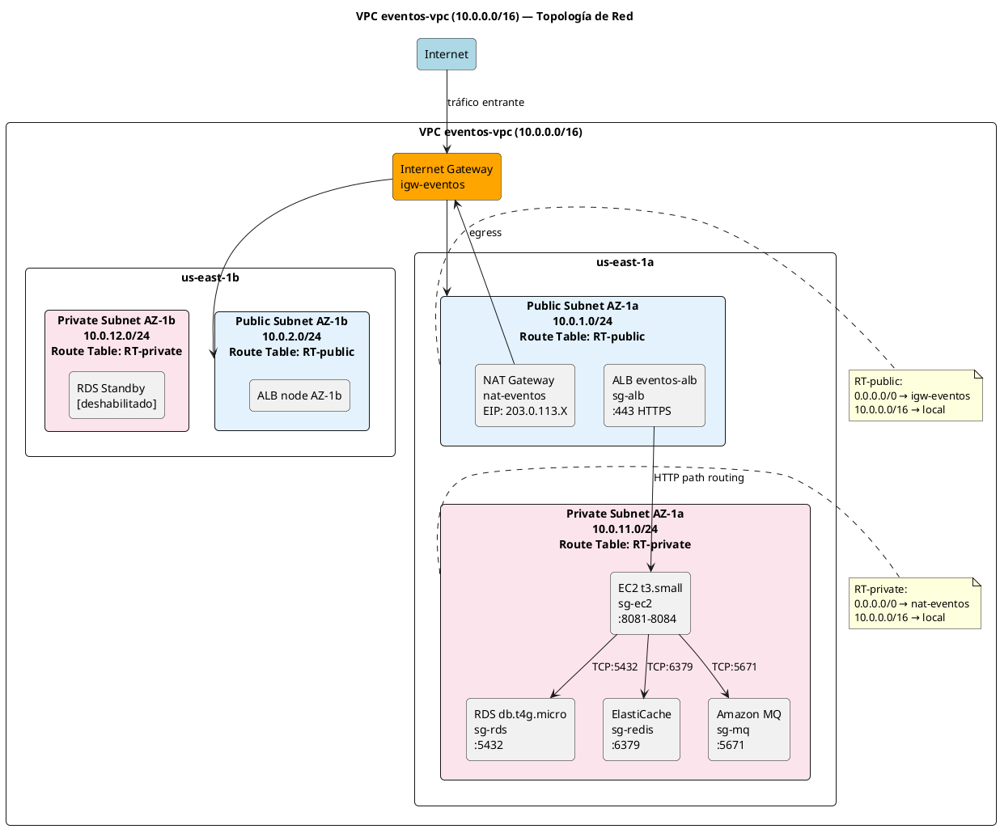
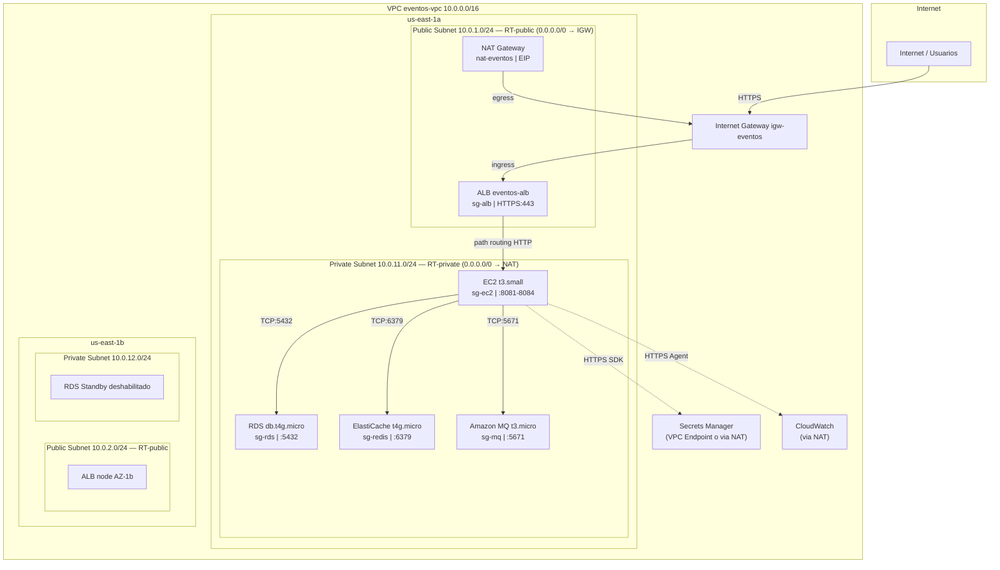
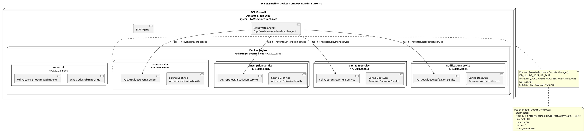
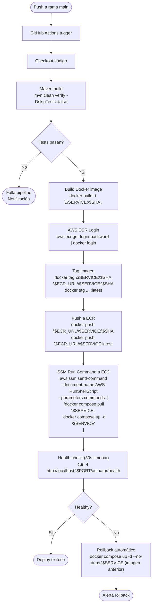
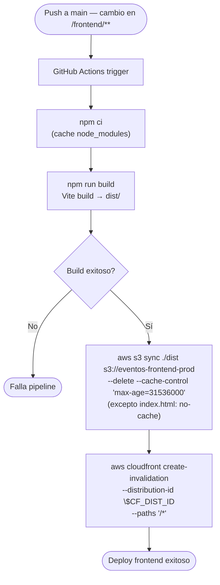
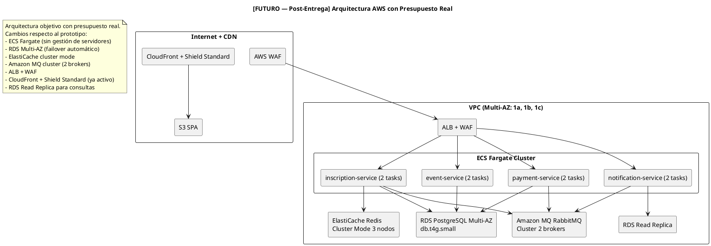

# Vista Física (Deployment) — Kruchten 4+1 / C4 Nivel 4

**Proyecto:** Plataforma de Gestión de Eventos Académicos — Pontificia Universidad Javeriana  
**Curso:** Diseño de Software Basado en Patrones — Maestría en Ingeniería de Software  
**Entrega:** 3  
**Fecha:** 2026-05-22  
**Entorno:** AWS us-east-1 (Producción) — Presupuesto académico 100 USD

---

## Leyenda de Notación

| Símbolo / Elemento | Significado |
|---|---|
| `Deployment_Node` (C4) | Infraestructura que aloja software (EC2, RDS, VPC, etc.) |
| `Container` (C4) | Unidad de software ejecutable desplegada (microservicio, SPA) |
| `infrastructureNode` | Componente de infraestructura sin software de aplicación (ALB, NAT GW, etc.) |
| Línea sólida | Flujo de datos en tiempo de ejecución |
| Línea punteada | Flujo CI/CD o relación de configuración |
| `[sg-X]` | Security Group asociado al recurso |
| `[ADR-XXX]` | Decisión arquitectónica que justifica la elección |

---

## 1. Diagrama de Despliegue AWS (Principal)

> **Generado con Structurizr DSL** — fuente en [deployment-aws.dsl](diagramas/deployment-aws.dsl).  
> Renderizar con: `Alt+D` en VS Code (extensión PlantUML) o [https://www.plantuml.com/plantuml](https://www.plantuml.com/plantuml)

### 1.1 C4-PlantUML (exportado desde Structurizr MCP)

```plantuml
@startuml
title <size:20>Vista Física C4 Nivel 4 — AWS Deployment\nPlataforma de Gestión de Eventos Académicos (us-east-1)</size>

set separator none
top to bottom direction

<style>
  root {
    BackgroundColor: #ffffff
    FontColor: #444444
  }
</style>

!include <C4/C4>
!include <C4/C4_Context>
!include <C4/C4_Container>
!include <C4/C4_Deployment>

' ── Actores ─────────────────────────────────────────────────────────
Person(estudiante, "Estudiante", "Inscribe y gestiona participaciones")
Person(coordinador, "Coordinador Académico", "Publica y administra eventos")

' ── AWS Global Edge (fuera de VPC) ──────────────────────────────────
Deployment_Node(globalEdge, "AWS Global Services", "AWS Global", "Servicios de borde: Route53, CloudFront, S3, ECR") {
  Deployment_Node(route53, "Amazon Route53", "AWS Route53", "Hosted zone eventos.javeriana.edu.co")
  Deployment_Node(cloudFront, "Amazon CloudFront", "AWS CloudFront", "CDN + TLS termination para SPA")
  Deployment_Node(s3, "Amazon S3 eventos-frontend-prod", "AWS S3", "Bucket privado SPA estática") {
    Container(reactSpa, "React SPA", "React 18 + Vite", "Interfaz web de usuario")
  }
  Deployment_Node(ecr, "Amazon ECR eventos-registry", "AWS ECR", "Repos Docker: 4 microservicios")
}

' ── VPC ─────────────────────────────────────────────────────────────
Deployment_Node(vpc, "VPC eventos-vpc (10.0.0.0/16)", "AWS VPC", "") {

  Deployment_Node(igw, "Internet Gateway igw-eventos", "AWS IGW", "")

  ' Subnets públicas
  Deployment_Node(pubAz1, "Public Subnet AZ-1a (10.0.1.0/24)", "AWS Subnet", "") {
    Deployment_Node(alb, "ALB eventos-alb", "AWS ALB", "HTTPS:443 | ACM cert | sg-alb")
    Deployment_Node(natGw, "NAT Gateway nat-eventos", "AWS NAT GW", "EIP fija — egress subnet privada")
  }
  Deployment_Node(pubAz2, "Public Subnet AZ-1b (10.0.2.0/24)", "AWS Subnet", "") {
    Deployment_Node(albAz2, "ALB node AZ-1b", "AWS ALB", "Nodo HA del balanceador")
  }

  ' Subnet privada AZ-1a (carga de trabajo principal)
  Deployment_Node(privAz1, "Private Subnet AZ-1a (10.0.11.0/24)", "AWS Subnet", "") {

    Deployment_Node(ec2, "EC2 t3.small eventos-app-server", "AWS EC2", "Amazon Linux 2023 | 2 vCPU / 2 GB | sg-ec2 | IAM: eventos-ec2-role") {
      Deployment_Node(docker, "Docker Engine — eventos-net (bridge)", "Docker Compose v2", "/opt/eventos/docker-compose.yml") {
        Container(eventSvc,  "event-service:8081",       "Spring Boot 3 / Java 17", "Gestión catálogo eventos [100%]")
        Container(inscSvc,   "inscription-service:8082",  "Spring Boot 3 / Java 17", "Inscripciones + Outbox + ShedLock [100%]")
        Container(paySvc,    "payment-service:8083",      "Spring Boot 3 / Java 17", "Procesamiento de pagos [70%]")
        Container(notifSvc,  "notification-service:8084", "Spring Boot 3 / Java 17", "Notificaciones [en impl.]")
        Container(wireMock,  "wiremock:8089",             "WireMock 3.x",            "Mock pasarela de pagos externos")
      }
    }

    Deployment_Node(rds, "RDS db.t4g.micro eventos-rds", "AWS RDS", "PostgreSQL 15 | Multi-AZ OFF | 20GB gp3 | sg-rds") {
      ContainerDb(pg, "PostgreSQL 15", "PostgreSQL 15", "event_db | inscription_db | payment_db | notification_db")
    }

    Deployment_Node(cache, "ElastiCache cache.t4g.micro eventos-cache", "AWS ElastiCache", "Redis 7 | single-node | sg-redis | :6379") {
      Container(redis, "Redis 7", "Redis 7", "Idempotency keys + rate limiting + session cache")
    }

    Deployment_Node(mq, "Amazon MQ mq.t3.micro eventos-broker", "AWS Amazon MQ", "RabbitMQ 3.x | single-instance | sg-mq | AMQPS:5671") {
      Container(rabbit, "RabbitMQ 3.x", "RabbitMQ 3.x", "Exchanges: eventos.direct / eventos.dlq")
    }

    Deployment_Node(sm,  "AWS Secrets Manager", "AWS SecretsManager", "rds/master | rabbitmq/creds | jwt-secret | payment-api-key")
    Deployment_Node(cwl, "CloudWatch Logs",     "AWS CloudWatch",     "Log groups por servicio | retención 14 días")
    Deployment_Node(cwa, "CloudWatch Metrics y Alarms", "AWS CloudWatch", "EMF metrics | alarmas CPU, 5xx, RDS, MQ | dashboard eventos-prod")
  }

  Deployment_Node(privAz2, "Private Subnet AZ-1b (10.0.12.0/24)", "AWS Subnet", "") {
    Deployment_Node(rdsStandby, "RDS Standby [deshabilitado]", "AWS RDS", "Multi-AZ OFF por presupuesto — ADR-004")
  }
}

' ── Relaciones en tiempo de ejecución ────────────────────────────────
Rel(estudiante,  reactSpa, "Navega", "HTTPS")
Rel(coordinador, alb,      "API REST", "HTTPS")

Rel(route53,    cloudFront, "alias", "eventos.javeriana.edu.co")
Rel(route53,    alb,        "alias", "api.eventos.javeriana.edu.co")
Rel(cloudFront, s3,         "origin", "HTTPS OAC")
Rel(alb,        ec2,        "path routing", "HTTP /events/*→8081 /inscriptions/*→8082 /payments/*→8083 /notifications/*→8084")

Rel(eventSvc,  pg,     "JDBC", ":5432 → event_db")
Rel(inscSvc,   pg,     "JDBC", ":5432 → inscription_db")
Rel(paySvc,    pg,     "JDBC", ":5432 → payment_db")
Rel(notifSvc,  pg,     "JDBC", ":5432 → notification_db")

Rel(inscSvc,   redis,  "Idempotency + rate limit", "TCP:6379")
Rel(paySvc,    redis,  "Session cache",             "TCP:6379")

Rel(inscSvc,   rabbit, "Publica InscripcionCreadaEvent [ADR-008]", "AMQPS:5671")
Rel(paySvc,    rabbit, "Publica PagoConfirmadoEvent / Expirado",   "AMQPS:5671")
Rel(notifSvc,  rabbit, "Consume eventos notificacion",             "AMQPS:5671")
Rel(paySvc,    wireMock, "Mock pasarela pagos",                    "HTTP:8089")

Rel(ec2, sm,  "GetSecretValue en startup", "HTTPS SDK")
Rel(ec2, cwl, "Logs por servicio",         "CloudWatch Agent")
Rel(ec2, cwa, "Custom metrics EMF",        "CloudWatch Agent")
Rel(natGw, igw, "Egress internet",         "NAT → IGW")

' ── CI/CD (punteado) ─────────────────────────────────────────────────
Rel_D(ecr, docker, "docker pull", "GitHub Actions → ECR → EC2 SSM")

SHOW_LEGEND(true)
hide stereotypes
@enduml
```



### 1.2 Mermaid (exportado desde Structurizr MCP — render en GitHub/GitLab)

```mermaid
graph TB
  linkStyle default fill:#ffffff

  subgraph globalEdge ["AWS Global Services (Route53 / CloudFront / S3 / ECR)"]
    style globalEdge fill:#f0f8ff,stroke:#0073BB,color:#444
    R53["<b>Amazon Route53</b><br/>[DNS] eventos.javeriana.edu.co"]
    CF["<b>Amazon CloudFront</b><br/>[CDN] TLS termination SPA"]
    subgraph S3bucket ["S3 eventos-frontend-prod"]
      style S3bucket fill:#e8f5e9,stroke:#1B9632
      SPA["<b>React SPA</b><br/>[React 18 + Vite + TypeScript]<br/>Interfaz web"]
    end
    ECR["<b>Amazon ECR</b><br/>eventos-registry<br/>4 repos Docker"]
  end

  subgraph VPC ["VPC eventos-vpc (10.0.0.0/16)"]
    style VPC fill:#fff9e6,stroke:#F4A460,color:#444

    IGW["<b>Internet Gateway</b><br/>igw-eventos"]

    subgraph pubAz1 ["Public Subnet AZ-1a (10.0.1.0/24)"]
      style pubAz1 fill:#e3f2fd,stroke:#1565C0
      ALB["<b>ALB eventos-alb</b><br/>HTTPS:443 | ACM cert<br/>Path-based routing | sg-alb"]
      NAT["<b>NAT Gateway</b><br/>nat-eventos | EIP fija"]
    end

    subgraph pubAz2 ["Public Subnet AZ-1b (10.0.2.0/24)"]
      style pubAz2 fill:#e3f2fd,stroke:#1565C0
      ALB2["<b>ALB node AZ-1b</b><br/>Nodo HA balanceador"]
    end

    subgraph privAz1 ["Private Subnet AZ-1a (10.0.11.0/24)"]
      style privAz1 fill:#fce4ec,stroke:#C62828

      subgraph EC2 ["EC2 t3.small eventos-app-server — Amazon Linux 2023 | sg-ec2"]
        style EC2 fill:#fff3e0,stroke:#E65100
        subgraph Docker ["Docker Engine — eventos-net bridge — Docker Compose v2"]
          style Docker fill:#e8eaf6,stroke:#3949AB
          AUTH["auth-service-stub<br/>:8081<br/>JWT RS256 + JWKS<br/>5 usuarios demo"]
          ES["event-service<br/>:8082 [100%]"]
          IS["inscription-service<br/>:8083 [100%]"]
          PS["payment-service<br/>:8084 [100%]"]
          NS["notification-service<br/>Fase 2 conceptual"]
          WM["wiremock<br/>:8089 mock"]
        end
      end

      subgraph RDS ["RDS db.t4g.micro eventos-rds | PostgreSQL 15 | sg-rds"]
        style RDS fill:#f3e5f5,stroke:#6A1B9A
        PG["<b>PostgreSQL 15</b><br/>event_db | inscription_db<br/>payment_db | notification_db"]
      end

      subgraph Cache ["ElastiCache cache.t4g.micro eventos-cache | Redis 7 | sg-redis"]
        style Cache fill:#e0f2f1,stroke:#00695C
        REDIS["<b>Redis 7</b><br/>:6379 — idempotency + sessions"]
      end

      subgraph MQ ["Amazon MQ mq.t3.micro eventos-broker | RabbitMQ 3.x | sg-mq"]
        style MQ fill:#fff8e1,stroke:#F57F17
        RABBIT["<b>RabbitMQ 3.x</b><br/>AMQPS:5671<br/>eventos.direct / eventos.dlq"]
      end

      SM["<b>AWS Secrets Manager</b><br/>rds/master | rabbitmq/creds<br/>jwt-secret | payment-api-key"]
      CWL["<b>CloudWatch Logs</b><br/>Log groups por servicio<br/>Retención: 14 días"]
      CWA["<b>CloudWatch Alarms</b><br/>CPU | 5xx | RDS | MQ depth<br/>Dashboard: eventos-prod"]
    end

    subgraph privAz2 ["Private Subnet AZ-1b (10.0.12.0/24)"]
      style privAz2 fill:#fce4ec,stroke:#C62828
      RDSSB["<b>RDS Standby</b><br/>[deshabilitado por costo]<br/>ADR-004"]
    end
  end

  GHA["<b>GitHub Actions</b><br/>Pipeline CI/CD"]

  %% Flujo usuarios
  R53 -->|"alias"| CF
  R53 -->|"alias"| ALB
  CF  -->|"HTTPS OAC"| SPA

  %% Routing
  ALB -->|"/auth/*→8081\n/events/*→8082\n/inscriptions/*→8083\n/payments/*→8084"| EC2

  %% Datos
  ES  -->|"JDBC:5432 event_db"| PG
  IS  -->|"JDBC:5432 inscription_db"| PG
  PS  -->|"JDBC:5432 payment_db"| PG
  NS  -->|"JDBC:5432 notification_db"| PG

  IS  -->|"TCP:6379 idempotency"| REDIS
  PS  -->|"TCP:6379 session cache"| REDIS

  IS  -->|"AMQPS:5671 InscripcionCreadaEvent"| RABBIT
  PS  -->|"AMQPS:5671 PagoConfirmado/Expirado"| RABBIT
  NS  -->|"AMQPS:5671 consume notif."| RABBIT
  PS  -->|"HTTP:8089 mock"| WM

  EC2 -->|"GetSecretValue startup"| SM
  EC2 -->|"CloudWatch Agent logs"| CWL
  EC2 -->|"CloudWatch Agent metrics"| CWA
  NAT -->|"Egress internet"| IGW

  %% CI/CD
  GHA -.->|"docker push"| ECR
  GHA -.->|"SSM Run Command\ndocker compose up"| EC2
  GHA -.->|"aws s3 sync"| SPA
  GHA -.->|"cf invalidation"| CF
```



### 1.3 ASCII Art (respaldo)

```
Internet
   │
   ├─[HTTPS]──► Route53 ─── A-alias ──────────────────────┐
   │             └─ A-alias ──► CloudFront ──► S3 (SPA)   │
   │                                                        │
   │                                        ┌──────────────▼──────────────┐
   │                                        │  VPC 10.0.0.0/16            │
   │                                        │  ┌─ Public Subnet AZ-1a ──┐ │
   └────────────────────────────────────────►  │  ALB (sg-alb) :443     │ │
                                            │  │  NAT Gateway (EIP)     │ │
                                            │  └───────────┬────────────┘ │
                                            │              │               │
                                            │  ┌─ Private Subnet AZ-1a ─┐ │
                                            │  │  EC2 t3.small (sg-ec2) │ │
                                            │  │  ┌── Docker Compose ──┐ │ │
                                            │  │  │ event-svc  :8081   │ │ │
                                            │  │  │ inscr-svc  :8082   │ │ │
                                            │  │  │ pay-svc    :8083   │ │ │
                                            │  │  │ notif-svc  :8084   │ │ │
                                            │  │  │ wiremock   :8089   │ │ │
                                            │  │  └──────┬─────────────┘ │ │
                                            │  │         │               │ │
                                            │  │  ┌──────▼──────────┐   │ │
                                            │  │  │ RDS PostgreSQL  │   │ │
                                            │  │  │ db.t4g.micro    │   │ │
                                            │  │  │ (sg-rds) :5432  │   │ │
                                            │  │  └─────────────────┘   │ │
                                            │  │  ┌─────────────────┐   │ │
                                            │  │  │ ElastiCache     │   │ │
                                            │  │  │ Redis 7 :6379   │   │ │
                                            │  │  │ (sg-redis)      │   │ │
                                            │  │  └─────────────────┘   │ │
                                            │  │  ┌─────────────────┐   │ │
                                            │  │  │ Amazon MQ       │   │ │
                                            │  │  │ RabbitMQ :5671  │   │ │
                                            │  │  │ (sg-mq)         │   │ │
                                            │  │  └─────────────────┘   │ │
                                            │  │  Secrets Manager       │ │
                                            │  │  CloudWatch Logs+Alarms│ │
                                            │  └────────────────────────┘ │
                                            └─────────────────────────────┘

GitHub Actions ──(docker push)──► ECR
GitHub Actions ──(SSM Run Cmd)──► EC2
GitHub Actions ──(s3 sync)──────► S3
```

---

## 2. Inventario de Nodos de Despliegue

| Nodo | Tipo AWS | Instance type / SKU | Cant. | Subnet | Propósito | Software / Imagen |
|---|---|---|---|---|---|---|
| eventos-app-server | EC2 | t3.small | 1 | Private AZ-1a (10.0.11.0/24) | Runtime Docker Compose — 4 microservicios + WireMock | Amazon Linux 2023 AMI |
| event-service | Docker container | — | 1 | (dentro de EC2) | Gestión catálogo de eventos [100%] | `ecr/.../event-service:latest` |
| inscription-service | Docker container | — | 1 | (dentro de EC2) | Inscripciones + Outbox + ShedLock [100%] | `ecr/.../inscription-service:latest` |
| payment-service | Docker container | — | 1 | (dentro de EC2) | Procesamiento de pagos [70%] | `ecr/.../payment-service:latest` |
| notification-service | Docker container | — | 1 | (dentro de EC2) | Notificaciones [en impl.] | `ecr/.../notification-service:latest` |
| wiremock | Docker container | — | 1 | (dentro de EC2) | Mock pasarela de pagos externos | `wiremock/wiremock:3` |
| eventos-rds | RDS | db.t4g.micro | 1 | Private AZ-1a | PostgreSQL 15 — 4 bases de datos | PostgreSQL 15 |
| eventos-cache | ElastiCache | cache.t4g.micro | 1 | Private AZ-1a | Redis 7 single-node | Redis 7.x |
| eventos-broker | Amazon MQ | mq.t3.micro | 1 | Private AZ-1a | RabbitMQ single-instance | RabbitMQ 3.x |
| eventos-alb | ALB | — | 1 | Public AZ-1a + AZ-1b | Balanceador HTTPS + path routing | AWS ALB |
| nat-eventos | NAT Gateway | — | 1 | Public AZ-1a | Egress Internet desde subnet privada | AWS NAT GW |
| igw-eventos | Internet Gateway | — | 1 | VPC | Entrada/salida Internet subnets públicas | AWS IGW |
| eventos-frontend-prod | S3 Bucket | — | 1 | Global (AWS S3) | Hosting estático React SPA | AWS S3 |
| CloudFront Distribution | CloudFront | — | 1 | Global (edge) | CDN + TLS + OAC hacia S3 | AWS CloudFront |
| eventos.javeriana.edu.co | Route53 | Hosted zone | 1 | Global | DNS público del sistema | AWS Route53 |
| eventos-registry | ECR | — | 1 | Global | Registro privado Docker | Amazon ECR |
| AWS Secrets Manager | Secrets Manager | — | 1 | Regional | Credenciales RDS, MQ, JWT, API keys | AWS Secrets Manager |
| CloudWatch Logs | CloudWatch | — | 1 | Regional | Log groups 4 servicios + retención | AWS CloudWatch |
| CloudWatch Alarms | CloudWatch | — | 1 | Regional | Métricas + alarmas + dashboard | AWS CloudWatch |
| ACM Certificate | ACM | — | 1 | Regional | Certificado TLS wildcard `*.eventos.javeriana.edu.co` | AWS ACM |
| IAM Role eventos-ec2-role | IAM | — | 1 | Global | Permisos EC2 → Secrets Manager, ECR, CloudWatch | AWS IAM |

---

## 3. Estimación de Costos (FinOps — dentro de 100 USD)

> Precios us-east-1 — estimación Abril 2026. Free Tier AWS aplica durante 12 meses desde creación de cuenta.

### 3.1 Arquitectura Principal (Amazon MQ + ElastiCache gestionados)

| Servicio | SKU | Costo/mes USD | Aplica free tier | Costo neto/mes | Notas |
|---|---|---|---|---|---|
| EC2 t3.small | t3.small On-Demand | $16.79 | No (750h es t3.micro) | **$16.79** | 24/7, 730h/mes |
| RDS PostgreSQL db.t4g.micro | db.t4g.micro | $12.41 | Sí (750h/mes 12 meses) | **$0.00** (12 meses) → $12.41 | Multi-AZ OFF. Storage 20GB ~$2.30/mes incluido en free tier |
| ElastiCache cache.t4g.micro | cache.t4g.micro | $11.52 | Sí (750h/mes 12 meses) | **$0.00** (12 meses) → $11.52 | Single-node, Redis 7 |
| Amazon MQ mq.t3.micro | mq.t3.micro single | $18.15 | No | **$18.15** | Single-instance. Sin free tier. El ítem más costoso. |
| ALB | ALB LCU | ~$16.20 | No (750h free tier solo para CLB) | **$16.20** | $0.008/LCU-hora + $0.0008/hora = ~$16.20/mes estimado low traffic |
| NAT Gateway | NAT GW + data | ~$32.40 | No | **$32.40** | $0.045/hora ($32.85) + data $0.045/GB. ÍTEM MÁS CARO. |
| S3 (SPA estática) | S3 Standard | ~$0.50 | Sí (5GB gratis) | **$0.00** | SPA <100 MB. CloudFront egress reduce costos S3 |
| CloudFront | CloudFront data out | ~$0.00 | Sí (1TB/mes gratis 12 meses) | **$0.00** | Tráfico académico mínimo |
| Route53 Hosted Zone | $0.50/zona/mes | $0.50 | No | **$0.50** | 1 zona + queries mínimas |
| ECR | $0.10/GB/mes | ~$1.00 | Sí (500MB gratis) | **$0.50** | 4 imágenes ~500MB total |
| CloudWatch Logs | $0.50/GB ingestado | ~$1.00 | Sí (5GB gratis) | **$0.00** | Logs académicos <5GB/mes |
| CloudWatch Metrics | $0.30/métrica/mes | ~$0.90 | Sí (10 métricas) | **$0.00** | Primeras 10 custom metrics gratis |
| Secrets Manager | $0.40/secreto/mes | ~$1.60 | No | **$1.60** | 4 secretos |
| ACM | $0 (gratis con ALB) | $0.00 | Sí | **$0.00** | Certificados públicos ACM son gratuitos |
| Data transfer EC2→Internet | $0.09/GB | ~$1.00 | Sí (1GB gratis) | **$0.50** | Tráfico mínimo académico |
| **TOTAL MENSUAL** | | | | **~$86.14/mes** | Meses 1-12 con free tier |

**Duración cubierta por 100 USD:** ~1.16 meses. **RIESGO: excede presupuesto en ~2 semanas.**

> El NAT Gateway ($32.40) + ALB ($16.20) + Amazon MQ ($18.15) = $66.75 = 77% del total.

### 3.2 Alternativa Ultra-Económica (RabbitMQ + Redis self-hosted en EC2)

Reemplazar Amazon MQ + ElastiCache con contenedores adicionales dentro de la misma EC2:

| Cambio | Ahorro mensual |
|---|---|
| Eliminar Amazon MQ mq.t3.micro | **-$18.15** |
| Eliminar ElastiCache cache.t4g.micro | **-$0.00** (free tier año 1) → **-$11.52** año 2 |
| Agregar RabbitMQ como contenedor en EC2 | $0 (ya en EC2) |
| Agregar Redis como contenedor en EC2 | $0 (ya en EC2) |
| Requerir EC2 t3.medium (más RAM) | **+$5.00/mes** |
| **Ahorro neto año 1** | **~$13.15/mes** |
| **Ahorro neto año 2+** | **~$24.67/mes** |

**Total ultra-económico:** ~$68.00/mes  
**Duración cubierta:** ~1.47 meses. **Sigue siendo ajustado.**

### 3.3 Solución para cubrir 2 meses con 100 USD

Reemplazar NAT Gateway con NAT Instance (EC2 t3.nano):

| Componente | Costo NAT GW | Costo NAT Instance t3.nano | Ahorro |
|---|---|---|---|
| NAT Gateway | $32.40/mes | — | — |
| EC2 t3.nano (NAT) | — | $3.50/mes | **$28.90/mes** |

**Arquitectura recomendada para presupuesto:** Mantener Amazon MQ + ElastiCache gestionados (confiabilidad) + reemplazar NAT Gateway con NAT Instance:

| Variante | Costo mensual | Duración 100 USD |
|---|---|---|
| Arquitectura principal + NAT GW | ~$86.14 | ~1.2 meses |
| Arquitectura principal + NAT Instance | **~$57.24** | **~1.7 meses** |
| Ultra-económica (sin Amazon MQ/ElastiCache) + NAT Instance | **~$44.09** | **~2.3 meses ✓** |

**Recomendación para Entrega 3:** Usar NAT Instance t3.nano + RabbitMQ/Redis auto-gestionados en EC2 → cubre 2+ meses dentro de 100 USD.  
**ADR relacionado:** Ver ADR sugerido "NAT Instance vs NAT Gateway" (Sección 13).

### 3.4 Plan de contingencia si se excede presupuesto

1. **Stop/Start EC2 en horarios nocturnos** (22h-7h) → ahorro ~38% en EC2
2. **RDS stop/start manual** cuando no hay demos activos → $0 mientras esté parada
3. **Eliminar NAT Gateway** y usar SSM Session Manager para acceso (sin NAT) → $32.40 de ahorro
4. **Activar AWS Budget Alert** a $80 USD (alerta) y $95 USD (acción: stop instancias no críticas)

---

## 4. Diagrama de Topología de Red (VPC)

### 4.1 PlantUML



### 4.2 Mermaid



---

## 5. Matriz de Security Groups

| SG Origen | SG / CIDR Destino | Puerto | Protocolo | Dirección | Justificación |
|---|---|---|---|---|---|
| `0.0.0.0/0` (Internet) | `sg-alb` | 443 | TCP HTTPS | **Inbound** | Tráfico HTTPS público hacia ALB |
| `0.0.0.0/0` (Internet) | `sg-alb` | 80 | TCP HTTP | **Inbound** | Redirect 80→443 en ALB |
| `sg-alb` | `sg-ec2` | 8081 | TCP | **Inbound** | ALB → event-service |
| `sg-alb` | `sg-ec2` | 8082 | TCP | **Inbound** | ALB → inscription-service |
| `sg-alb` | `sg-ec2` | 8083 | TCP | **Inbound** | ALB → payment-service |
| `sg-alb` | `sg-ec2` | 8084 | TCP | **Inbound** | ALB → notification-service |
| `sg-ec2` | `sg-rds` | 5432 | TCP PostgreSQL | **Inbound en sg-rds** | Los 4 microservicios → PostgreSQL |
| `sg-ec2` | `sg-redis` | 6379 | TCP Redis | **Inbound en sg-redis** | inscription-svc + payment-svc → Redis |
| `sg-ec2` | `sg-mq` | 5671 | TCP AMQPS | **Inbound en sg-mq** | Microservicios → RabbitMQ (TLS) |
| `sg-ec2` | `sg-mq` | 443 | TCP HTTPS | **Inbound en sg-mq** | Acceso consola Amazon MQ desde EC2 |
| `sg-ec2` | `0.0.0.0/0` | 443 | TCP HTTPS | **Outbound** | EC2 → Secrets Manager / ECR / CloudWatch vía NAT |
| `sg-alb` | Ninguno | Todos | — | **Outbound** | Solo retorno de respuestas (stateful) |
| `sg-rds` | Ninguno | — | — | **Outbound** | Solo respuestas SQL (stateful) |
| `sg-redis` | Ninguno | — | — | **Outbound** | Solo respuestas Redis (stateful) |
| `sg-mq` | Ninguno | — | — | **Outbound** | Solo respuestas AMQP (stateful) |

> **Regla de oro:** todo lo no listado está denegado por defecto (Security Group = deny-all implícito).  
> **Acceso operativo a EC2:** Via SSM Session Manager (no requiere puerto 22 abierto) — IAM Role `eventos-ec2-role` incluye política `AmazonSSMManagedInstanceCore`.

---

## 6. Diagrama de Despliegue Interno de la EC2 (Docker)



**Extracto docker-compose.yml (referencia):**

```yaml
version: "3.9"

networks:
  eventos-net:
    driver: bridge
    ipam:
      config:
        - subnet: 172.20.0.0/16

x-common-env: &common-env
  SPRING_PROFILES_ACTIVE: prod
  # Los secretos se inyectan via entrypoint script que llama a AWS SDK
  # Ver: /opt/eventos/scripts/inject-secrets.sh

services:
  event-service:
    image: ${ECR_REGISTRY}/event-service:${IMAGE_TAG}
    ports: ["8081:8081"]
    networks: [eventos-net]
    environment:
      <<: *common-env
    volumes:
      - /opt/logs/event-service:/app/logs
    healthcheck:
      test: ["CMD", "curl", "-f", "http://localhost:8081/actuator/health"]
      interval: 30s
      timeout: 5s
      retries: 3
      start_period: 60s
    restart: unless-stopped

  inscription-service:
    image: ${ECR_REGISTRY}/inscription-service:${IMAGE_TAG}
    ports: ["8082:8082"]
    networks: [eventos-net]
    environment:
      <<: *common-env
    volumes:
      - /opt/logs/inscription-service:/app/logs
    healthcheck:
      test: ["CMD", "curl", "-f", "http://localhost:8082/actuator/health"]
      interval: 30s
      timeout: 5s
      retries: 3
      start_period: 60s
    restart: unless-stopped
    depends_on:
      event-service:
        condition: service_healthy

  payment-service:
    image: ${ECR_REGISTRY}/payment-service:${IMAGE_TAG}
    ports: ["8083:8083"]
    networks: [eventos-net]
    environment:
      <<: *common-env
    volumes:
      - /opt/logs/payment-service:/app/logs
    healthcheck:
      test: ["CMD", "curl", "-f", "http://localhost:8083/actuator/health"]
      interval: 30s
      timeout: 5s
      retries: 3
      start_period: 60s
    restart: unless-stopped

  notification-service:
    image: ${ECR_REGISTRY}/notification-service:${IMAGE_TAG}
    ports: ["8084:8084"]
    networks: [eventos-net]
    environment:
      <<: *common-env
    volumes:
      - /opt/logs/notification-service:/app/logs
    healthcheck:
      test: ["CMD", "curl", "-f", "http://localhost:8084/actuator/health"]
      interval: 30s
      timeout: 5s
      retries: 3
      start_period: 60s
    restart: unless-stopped

  wiremock:
    image: wiremock/wiremock:3
    ports: ["8089:8080"]
    networks: [eventos-net]
    volumes:
      - /opt/wiremock/mappings:/home/wiremock/mappings:ro
    restart: unless-stopped
```

---

## 7. Flujo de CI/CD

### 7.1 Pipeline Backend (por microservicio)



### 7.2 Pipeline Frontend



### 7.3 Secretos en GitHub Actions

```
GitHub Repository Secrets (Settings → Secrets):
  AWS_ACCESS_KEY_ID          → IAM user con permisos ECR + SSM + S3 + CloudFront
  AWS_SECRET_ACCESS_KEY
  AWS_REGION                 → us-east-1
  ECR_REGISTRY               → <account-id>.dkr.ecr.us-east-1.amazonaws.com
  EC2_INSTANCE_ID            → i-0abc123def456789
  CLOUDFRONT_DISTRIBUTION_ID → E1XXXXXXXXXXXXX
```

---

## 8. Estrategia de Observabilidad

### 8.1 Logs

| Log Group | Fuente | Retención | Pattern de búsqueda ejemplo |
|---|---|---|---|
| `/eventos/event-service` | Docker logs → CloudWatch Agent | 14 días | `ERROR` `WARN` `traceId` |
| `/eventos/inscription-service` | Docker logs → CloudWatch Agent | 14 días | `OutboxRelay` `ShedLock` `InscripcionCreada` |
| `/eventos/payment-service` | Docker logs → CloudWatch Agent | 14 días | `PagoConfirmado` `PagoExpirado` `WireMock` |
| `/eventos/notification-service` | Docker logs → CloudWatch Agent | 14 días | `NotificationSent` `NotificationFailed` |
| `/aws/rds/eventos-rds` | RDS Enhanced Monitoring | 7 días | Slow queries, conexiones |

**Configuración CloudWatch Agent** (`/opt/aws/amazon-cloudwatch-agent/bin/config.json`):
```json
{
  "logs": {
    "logs_collected": {
      "files": {
        "collect_list": [
          {"file_path": "/opt/logs/event-service/*.log", "log_group_name": "/eventos/event-service"},
          {"file_path": "/opt/logs/inscription-service/*.log", "log_group_name": "/eventos/inscription-service"},
          {"file_path": "/opt/logs/payment-service/*.log", "log_group_name": "/eventos/payment-service"},
          {"file_path": "/opt/logs/notification-service/*.log", "log_group_name": "/eventos/notification-service"}
        ]
      }
    }
  }
}
```

### 8.2 Métricas y Health Checks

| Métrica | Fuente | Umbral alarma | Acción |
|---|---|---|---|
| `CPUUtilization` EC2 | CloudWatch built-in | >80% durante 5 min | SNS → email equipo |
| `DatabaseConnections` RDS | CloudWatch built-in | >80% max connections | SNS → email equipo |
| `HTTPCode_ELB_5XX_Count` ALB | CloudWatch built-in | >1% de requests en 5 min | SNS → email equipo |
| `QueueDepth` Amazon MQ | CloudWatch built-in | >1000 mensajes | SNS → email equipo |
| `HealthyHostCount` ALB target group | CloudWatch built-in | <1 (target EC2 unhealthy) | SNS → email equipo |
| Spring Actuator `/actuator/health` | ALB Health Check | HTTP 200 cada 30s | ALB detiene routing si falla |

### 8.3 Dashboard CloudWatch `eventos-prod`

Widgets recomendados:
- EC2 CPU (1h window, 1-min resolution)
- RDS Connections + IOPS
- ALB Request Count + 5xx rate
- Amazon MQ Queue Depth
- Logs Insights: últimos 50 errores (query: `fields @timestamp, @message | filter @message like /ERROR/ | sort @timestamp desc | limit 50`)

---

## 9. Estrategia de Respaldo y Recuperación

### 9.1 RDS — Backups automáticos

| Parámetro | Configuración |
|---|---|
| Automated backups | Habilitado, 7 días retención |
| Backup window | 04:00–05:00 UTC (mínimo tráfico académico) |
| Maintenance window | Domingo 05:00–06:00 UTC |
| Point-in-time recovery | Disponible hasta 7 días atrás (5 min granularidad) |
| Snapshots manuales | Antes de cada release (manual desde consola o CLI) |

**Comando snapshot manual:**
```bash
aws rds create-db-snapshot \
  --db-instance-identifier eventos-rds \
  --db-snapshot-identifier eventos-rds-pre-release-$(date +%Y%m%d)
```

### 9.2 EC2 — AMI Base

```bash
# Crear AMI antes de cambios de infraestructura
aws ec2 create-image \
  --instance-id i-XXXXXXXXXXXX \
  --name "eventos-app-server-$(date +%Y%m%d)" \
  --description "AMI base eventos con Docker + CloudWatch Agent"
```

### 9.3 RTO / RPO Objetivo (Prototipo Académico)

| Escenario | RPO (pérdida datos) | RTO (tiempo recuperación) | Método |
|---|---|---|---|
| Fallo EC2 | 0 (stateless) | ~10 min | Launch nueva EC2 desde AMI + docker compose up |
| Fallo RDS | ≤5 min (PITR) | ~20–30 min | Restore desde snapshot + update endpoint en Secrets Manager |
| Fallo Amazon MQ | Mensajes en vuelo perdidos (~10) | ~15 min | Recrear broker + aplicaciones re-conectan automáticamente |
| Corrupción datos | ≤24h (backup diario) | ~30 min | Restore snapshot + PITR al punto exacto |

### 9.4 Procedimiento de Restore RDS

```bash
# 1. Restaurar desde snapshot
aws rds restore-db-instance-from-db-snapshot \
  --db-instance-identifier eventos-rds-restored \
  --db-snapshot-identifier eventos-rds-pre-release-20260520 \
  --db-instance-class db.t4g.micro \
  --no-multi-az \
  --availability-zone us-east-1a

# 2. Actualizar endpoint en Secrets Manager
aws secretsmanager update-secret \
  --secret-id rds/eventos/master \
  --secret-string '{"host":"nuevo-endpoint.rds.amazonaws.com","port":"5432","username":"admin","password":"..."}'

# 3. Reiniciar microservicios para que lean nuevo secreto
aws ssm send-command \
  --instance-ids i-XXXXXXXXXXXX \
  --document-name AWS-RunShellScript \
  --parameters 'commands=["cd /opt/eventos && docker compose restart"]'
```

---

## 10. Escenarios de Fallo y Mitigación

| Componente que falla | Impacto | Mitigación actual (prototipo) | Mitigación ideal (post-entrega) |
|---|---|---|---|
| **EC2 t3.small** | Sistema completamente down. Todos los microservicios inaccesibles. | Launch manual nueva EC2 desde AMI. Docker Compose up en ~10 min. ALB detecta unhealthy y retorna 502 hasta recuperación. | Auto Scaling Group (min=1, desired=2). ECS Fargate con 2 tasks. |
| **RDS PostgreSQL** | Todas las operaciones que requieren persistencia fallan. 500 en todos los endpoints. | RDS restart automático (AWS). PITR para corrupción. Snapshot pre-release. | RDS Multi-AZ (failover ~60s). Read replica para consultas. |
| **Amazon MQ RabbitMQ** | Mensajes de pago/notificación no se entregan. Outbox Relay falla silenciosamente (reintenta). Inscripciones siguen funcionando (sincrón.). | Outbox pattern garantiza at-least-once: cuando MQ vuelve, Relay reintenta los OutboxEvents pendientes (ADR-008). | Amazon MQ cluster mode (2 brokers). |
| **ElastiCache Redis** | Rate limiting desactivado (fail-open). Idempotency keys perdidos → posibles duplicados en reintentos. | inscription-service tiene fallback: si Redis no responde, continúa sin idempotency key (circuit breaker). | ElastiCache cluster mode con 2 nodos. |
| **ALB** | Todo el tráfico externo bloqueado. | ALB es un servicio gestionado AWS con SLA 99.99%. Multi-AZ por diseño (2 subnets). | Sin cambios necesarios. |
| **Exceso de presupuesto** | AWS suspende cuenta / instancias. | AWS Budget alert a $80 + acción stop a $95. Stop manual de instancias no críticas. | Migración a Spot Instances (EC2 savings ~70%). |
| **Ataque DDoS básico** | Saturación ALB / EC2. | AWS Shield Standard (gratuito, protección L3/L4). CloudFront absorbe ataques HTTP flood hacia SPA. | AWS WAF (Web ACL en ALB). AWS Shield Advanced. |
| **Certificado TLS vencido** | HTTPS falla en ALB y CloudFront. Browsers bloquean acceso. | ACM renueva automáticamente certificados públicos asociados a ALB/CloudFront (100% automático). | Sin acción requerida si se usa ACM. Alarma manual si se usa cert externo. |

---

## 11. Mapeo a RNFs y Restricciones

| RNF / Restricción | Cómo se cumple en esta topología |
|---|---|
| **Disponibilidad SPA** (alta) | CloudFront SLA 99.99% + S3 SLA 99.99%. No hay single point of failure en capa de presentación. |
| **Disponibilidad API** (media-alta, prototipo) | ALB multi-AZ (SLA 99.99%) → EC2 single instance (SPOF). Documentado: recuperación ~10 min vía AMI. Aceptado para entrega académica. |
| **Seguridad - TLS** | HTTPS obligatorio en ALB (redirect 80→443) + ACM wildcard. CloudFront HTTPS. Certificados renuevan automáticamente. |
| **Seguridad - Secrets** | Credenciales nunca en código ni en variables de entorno planas. AWS Secrets Manager + IAM Role sin acceso a consola. |
| **Seguridad - Red** | Microservicios en subnet privada sin IP pública. Solo ALB expuesto a Internet. Security Groups con principio de mínimo privilegio. |
| **Seguridad - IAM** | IAM Role con políticas específicas (no AdministratorAccess). Principio de mínimo privilegio. Sin llaves de acceso de larga duración en EC2. |
| **Escalabilidad** (limitada en prototipo) | EC2 single instance escala verticalmente cambiando instance type. Evolución: Auto Scaling + ECS Fargate (Sección 12). |
| **Presupuesto ≤ 100 USD** | Ver Sección 3. Con NAT Instance + RabbitMQ/Redis self-hosted: ~$44/mes → cubre 2+ meses dentro del presupuesto. |
| **Observabilidad** | CloudWatch Logs + Metrics + Alarms. Spring Actuator para health checks ALB. Dashboard consolidado. |
| **Backup/Recovery** | RDS automated backups 7 días + PITR. Snapshots manuales pre-release. EC2 AMI base. RTO ~10-30 min. |
| **Separación de bases de datos** | Un RDS con 4 bases separadas por microservicio (event_db, inscription_db, payment_db, notification_db). Alineado con principio de autonomía de microservicios. |
| **Mensajería asíncrona** | Amazon MQ gestionado → sin operación manual del broker. Outbox Pattern (ADR-008) garantiza at-least-once delivery. |

---

## 12. Evolución Propuesta (Post-Entrega)

> **NOTA: Este diagrama describe arquitectura FUTURA con presupuesto real (~$500-2000/mes). NO es la arquitectura de la Entrega 3.**



**Comparativa Prototipo vs Producción Real:**

| Componente | Prototipo (Entrega 3) | Producción Real |
|---|---|---|
| Cómputo | EC2 t3.small + Docker Compose | ECS Fargate (serverless containers) |
| HA microservicios | Single instance (SPOF) | 2+ tasks por servicio |
| Base de datos | RDS single-AZ | RDS Multi-AZ + Read Replica |
| Cache | ElastiCache single-node | ElastiCache cluster (3 nodos) |
| Message broker | Amazon MQ single-instance | Amazon MQ cluster (2 brokers) |
| Seguridad web | Shield Standard (gratis) | WAF + Shield Advanced |
| Costo estimado | ~$44-86/mes | ~$500-1500/mes |

---

## 13. Referencia a ADRs

### ADRs existentes relacionados

| ADR | Título | Relación con esta vista |
|---|---|---|
| ADR-004 (reescrito) | Despliegue productivo AWS dentro de 100 USD | Justifica la topología EC2+RDS+AmazonMQ completa. Single-AZ por presupuesto. |
| ADR-008 | Transactional Outbox Pattern | Garantiza at-least-once delivery cuando Amazon MQ falla. Visible en inscription-service. |
| ADR-012 | Pessimistic Locking con SELECT FOR UPDATE | Implementado en inscription-service → RDS. Requiere conexión directa JDBC sin pooling externo. |
| ADR-018 | ShedLock para scheduling distribuido | Visible en inscription-service (OutboxRelay + Expiracion schedulers). Persiste en inscription_db. |
| ADR-019 | Dead Letter Queue (DLQ) strategy | Exchanges `eventos.dlq` en Amazon MQ para mensajes no procesables. |

### ADRs Sugeridos (a crear)

**ADR-024 — Single EC2 con Docker Compose como runtime de prototipo**
- **Contexto:** Necesidad de ejecutar 4+ microservicios Java con presupuesto ≤100 USD.
- **Decisión:** EC2 t3.small orquestado con Docker Compose como runtime de producción del prototipo (no como herramienta de desarrollo local).
- **Consecuencias:** Simplicidad operativa, bajo costo, pero single point of failure en capa de cómputo. Aceptable para prototipo académico.

**ADR-025 — NAT Instance vs NAT Gateway**
- **Contexto:** NAT Gateway cuesta ~$32.40/mes (33% del presupuesto total). Subnets privadas necesitan acceso a internet para ECR, Secrets Manager, CloudWatch.
- **Decisión:** Usar EC2 t3.nano ($3.50/mes) como NAT Instance con `ip-masquerade` + `net.ipv4.ip_forward=1`.
- **Consecuencias:** Ahorro de $28.90/mes pero require gestión manual de la instancia NAT. Single point of failure (igual que NAT GW en esta arquitectura single-AZ). Aceptable para prototipo.

**ADR-026 — Amazon MQ vs RabbitMQ self-hosted en EC2**
- **Contexto:** Amazon MQ mq.t3.micro cuesta $18.15/mes. RabbitMQ como contenedor en EC2 cuesta $0 adicional.
- **Decisión:** Para la entrega 3 con presupuesto limitado, usar RabbitMQ auto-gestionado en Docker Compose en la misma EC2. Amazon MQ se documenta como arquitectura objetivo.
- **Consecuencias:** Sin SLA gestionado del broker. Backup y actualización manual. Comparte recursos CPU/RAM con microservicios.

**ADR-027 — CloudFront + S3 para SPA React**
- **Contexto:** React SPA es aplicación estática. Requiere HTTPS, caché y distribución global eficiente.
- **Decisión:** S3 bucket privado + CloudFront con OAC (Origin Access Control). ACM para TLS. Route53 para DNS.
- **Consecuencias:** Free tier generoso (1TB/mes datos, 10M requests) cubre completamente el tráfico académico. Sin costo adicional. TLS automático. Separación total frontend/backend.

---

*Documento generado con asistencia de Structurizr MCP — DSL fuente: [deployment-aws.dsl](diagramas/deployment-aws.dsl)*  
*Diagramas validados y exportados mediante `mcp__structurizr__validate` + `mcp__structurizr__export-c4plantuml` + `mcp__structurizr__export-mermaid`*
