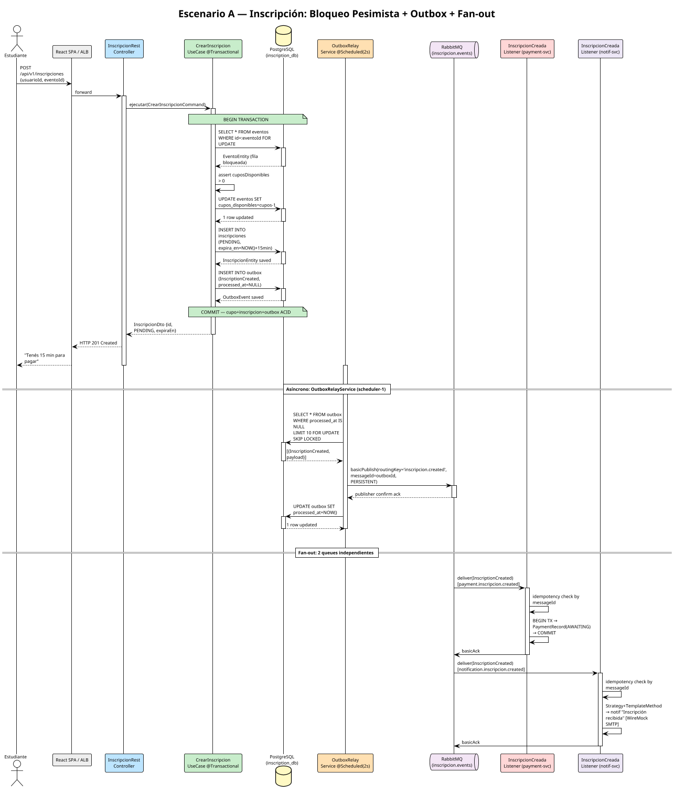
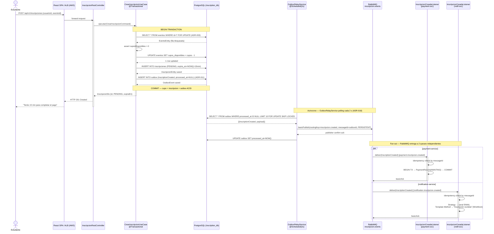
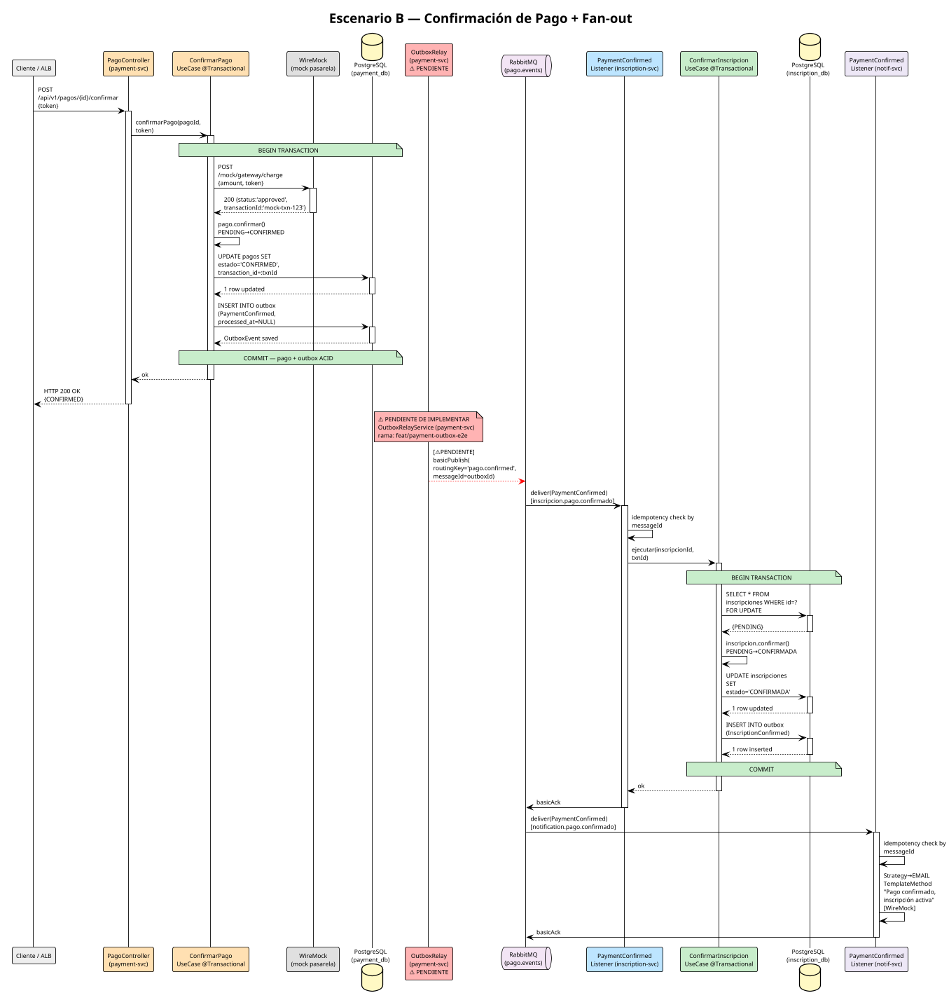
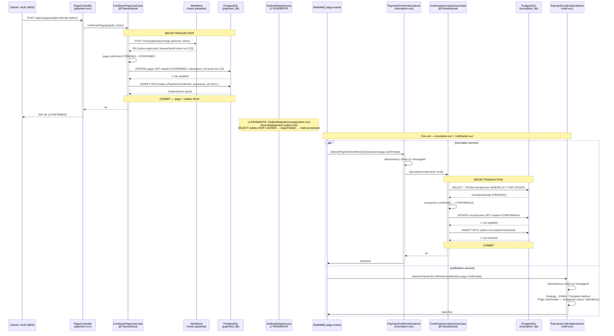
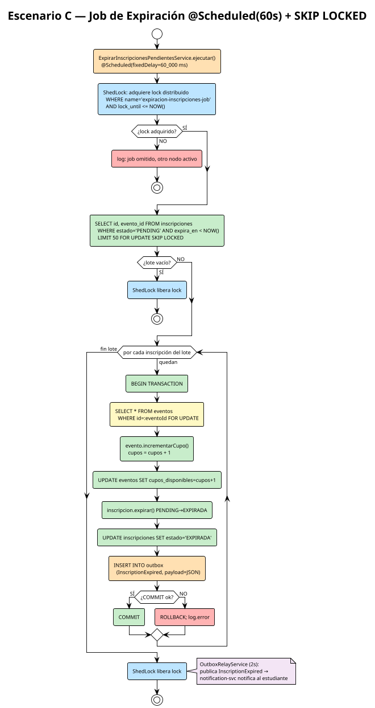
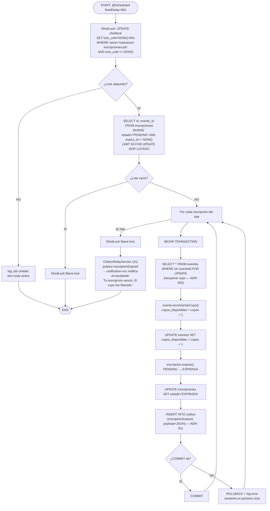

# Vista de Procesos (Kruchten 4+1)
## Plataforma de Gestión de Eventos Académicos — Pontificia Universidad Javeriana

> **Propósito:** Muestra cómo el sistema se comporta en tiempo de ejecución: procesos, threads,
> comunicación entre servicios, concurrencia y manejo de fallos.
> **Responde:** *¿Qué procesos existen, cómo interactúan y cómo se garantiza la consistencia bajo concurrencia?*
> **Audiencia:** arquitectos de software, evaluador académico.

**Stack:** Java 17 · Spring Boot 3.x · PostgreSQL 15 (RDS) · Redis 7 (ElastiCache) · RabbitMQ 3.x (Amazon MQ) · React 18/Vite (S3+CloudFront) · WireMock (mock pasarela)

---

## 1. Inventario de Procesos y Threads en Runtime

| Servicio / Componente | Tipo de proceso | Thread(s) relevantes | Responsabilidad |
|---|---|---|---|
| **inscription-service** | Tomcat HTTP worker pool | hasta 200 (NIO default) | Atender `POST/GET/DELETE /api/v1/inscripciones` |
| **inscription-service** | `OutboxRelayService` | `scheduler-1` (fixedDelay=2 s) | Poll tabla `outbox`, publicar a RabbitMQ, marcar procesado |
| **inscription-service** | `ExpirarInscripcionesPendientesService` | `scheduler-1` (fixedDelay=60 s) | Detectar inscripciones `PENDING` vencidas, expirar y devolver cupo |
| **inscription-service** | RabbitMQ AMQP listener | 1–5 (SimpleMessageListenerContainer) | Consumir `PaymentConfirmed`, `PaymentFailed` |
| **inscription-service** | ShedLock heartbeat | background | Renovar locks en tabla `shedlock` de PostgreSQL |
| **inscription-service** | HikariCP connection pool | 10 conexiones (default) | Pool JDBC hacia `inscription_db` |
| **payment-service** | Tomcat HTTP worker pool | hasta 200 | Atender `POST /api/v1/pagos/{id}/confirmar` |
| **payment-service** | RabbitMQ AMQP listener | 1–5 | Consumir `InscriptionCreated` |
| **payment-service** | `OutboxRelayService` ⚠️ | `scheduler-1` (fixedDelay=2 s) — **PENDIENTE** | Publicar `PaymentConfirmed` / `PaymentFailed` a RabbitMQ |
| **payment-service** | WireMock HTTP client | HTTP worker (sync) | Llamada síncrona a mock de pasarela de pago |
| **payment-service** | HikariCP connection pool | 10 conexiones | Pool JDBC hacia `payment_db` |
| **event-service** | Tomcat HTTP worker pool | hasta 200 | Atender consultas de catálogo público |
| **event-service** | Lettuce (Redis client) | event-loop (async) | Cache-Aside GET/SET contra Redis 7 (ElastiCache) |
| **event-service** | HikariCP connection pool | 10 conexiones | Pool JDBC hacia `event_db` |
| **notification-service** | RabbitMQ AMQP listener | 1–5 (concurrent consumers) | Consumir `InscriptionCreated`, `PaymentConfirmed`, `PaymentFailed`, `InscriptionExpired` |
| **notification-service** | Strategy + Template Method | worker thread (sync dentro de listener) | Seleccionar canal (EMAIL/SMS/PUSH) y construir notificación |
| **notification-service** | WireMock SMTP client | HTTP worker (sync) | Envío mock de email (WireMock SMTP) |
| **RabbitMQ** (Amazon MQ) | Broker externo gestionado | N/A — managed service | Routing de mensajes, persistencia de colas, DLQ, publisher confirms |
| **PostgreSQL** (RDS) | Motor de base de datos | WAL writer, autovacuum, lock manager | Persistencia ACID, gestión de `SELECT FOR UPDATE`, tabla `shedlock` |
| **Redis** (ElastiCache) | Cache en memoria | Event loop single-thread (Redis) | Caché de catálogo de eventos para event-service |

> **Estado de madurez:**
> - `inscription-service` 100% · `event-service` 100% (deuda hexagonal en EventoController)
> - `payment-service` 70% — `OutboxRelayService` en rama `feat/payment-outbox-e2e` ⚠️
> - `notification-service` en implementación

---

## 2. Escenario A: Inscripción con Bloqueo Pesimista + Outbox + Fan-out

### Descripción

1. El estudiante envía `POST /api/v1/inscripciones` a través del ALB.
2. `CrearInscripcionUseCase` abre una transacción y ejecuta `SELECT ... FOR UPDATE` sobre la fila del evento (**ADR-003**), bloqueándola hasta el commit.
3. En la **misma transacción ACID**: decrementa cupo, crea la inscripción `PENDING` con `expira_en = NOW() + 15 min`, e inserta un `OutboxEvent{InscriptionCreated}` (**ADR-011**).
4. El `OutboxRelayService` (hilo `scheduler-1`, cada 2 s) hace poll con `SKIP LOCKED` (**ADR-018**), publica al exchange `inscripcion.events` y marca el evento como procesado.
5. **Fan-out:** RabbitMQ entrega el evento a dos colas independientes. `payment-service` crea el registro de cobro; `notification-service` envía la confirmación al estudiante.

### PlantUML — Escenario A
> Render local: `java -jar ~/plantuml.jar docs/diagramas/vp-escenario-a-fanout.puml`



### Mermaid — Escenario A



---

## 3. Escenario B: Confirmación de Pago

### Descripción

1. El cliente confirma el pago vía REST. `ConfirmarPagoUseCase` llama a **WireMock** (mock de la pasarela), actualiza el estado a `CONFIRMED` e inserta `OutboxEvent{PaymentConfirmed}` en la misma transacción.
2. **⚠️ PENDIENTE:** El `OutboxRelayService` de `payment-service` debe publicar el evento a RabbitMQ (rama `feat/payment-outbox-e2e`).
3. **Fan-out:** `inscription-service` confirma la inscripción (`PENDING → CONFIRMADA`); `notification-service` envía el recibo de pago al estudiante.

### PlantUML — Escenario B
> Render local: `java -jar ~/plantuml.jar docs/diagramas/vp-escenario-b-pago.puml`



### Mermaid — Escenario B



---

## 4. Escenario C: Job de Expiración de Inscripciones

### Descripción

Cada 60 s, `ExpirarInscripcionesPendientesService` se activa bajo un **lock ShedLock distribuido** en la tabla `shedlock` de PostgreSQL (**ADR-018**). Usa `SKIP LOCKED` para evitar contención entre nodos. Por cada inscripción vencida: devuelve el cupo con `SELECT FOR UPDATE` sobre el evento (**ADR-003**), marca la inscripción como `EXPIRADA` y registra un `OutboxEvent{InscriptionExpired}` (**ADR-011**) en la misma transacción.

### PlantUML — Escenario C (Activity)
> Render local: `java -jar ~/plantuml.jar docs/diagramas/vp-escenario-c-expiracion.puml`



### Mermaid — Escenario C (Flowchart)



---

## 5. Tabla de Comunicación entre Procesos (IPC)

| Origen | Destino | Sincronía | Canal | Garantía de entrega | Idempotencia |
|---|---|---|---|---|---|
| React SPA (browser) | ALB → inscription-service | **Síncrona** | HTTPS/REST | At-most-once | N/A (idempotente por diseño REST) |
| React SPA (browser) | ALB → event-service | **Síncrona** | HTTPS/REST | At-most-once | N/A |
| React SPA (browser) | ALB → payment-service | **Síncrona** | HTTPS/REST | At-most-once | N/A |
| event-service | Redis 7 (ElastiCache) | **Síncrona** | RESP (Lettuce) | Best-effort (cache) | N/A — lectura |
| inscription-service | PostgreSQL (inscription_db) | **Síncrona** | JDBC/pgwire | ACID | `@Transactional` Spring |
| payment-service | PostgreSQL (payment_db) | **Síncrona** | JDBC/pgwire | ACID | `@Transactional` Spring |
| notification-service | PostgreSQL (inscription_db) | **Síncrona** | JDBC/pgwire | ACID | Check `processed_messages` por `message_id` |
| inscription-service | RabbitMQ (Amazon MQ) | **Asíncrona** | AMQP 0-9-1 | **At-least-once** (Outbox+publisher confirms) | Outbox garantiza exactamente-una-vez en publicación |
| payment-service | RabbitMQ (Amazon MQ) | **Asíncrona** | AMQP 0-9-1 | **At-least-once** ⚠️ PENDIENTE | ⚠️ Outbox pendiente |
| RabbitMQ | payment-service (consumer) | **Asíncrona** | AMQP 0-9-1 | At-least-once con ack manual | `SELECT 1 FROM processed_messages WHERE message_id=?` |
| RabbitMQ | inscription-service (consumer) | **Asíncrona** | AMQP 0-9-1 | At-least-once con ack manual | `SELECT 1 FROM processed_messages WHERE message_id=?` |
| RabbitMQ | notification-service (consumer) | **Asíncrona** | AMQP 0-9-1 | At-least-once con ack manual | `INSERT INTO processed_messages ... ON CONFLICT DO NOTHING` |
| payment-service | WireMock (mock pasarela) | **Síncrona** | HTTP | At-most-once (mock local) | `x-idempotency-key` en header |
| notification-service | WireMock SMTP (mock email) | **Síncrona** | HTTP | At-most-once (mock local) | messageId check antes de llamar |
| ShedLock heartbeat | PostgreSQL (`shedlock` table) | **Síncrona** | JDBC | ACID | `UPDATE ... WHERE lock_until <= NOW()` atómica |

---

## 6. Modelo de Concurrencia por Microservicio

### 6.1 inscription-service

| Mecanismo | Implementación | Propósito |
|---|---|---|
| **Pessimistic Row Lock** | `SELECT * FROM eventos WHERE id=? FOR UPDATE` en `EventoJpaRepository.buscarPorIdConBloqueoPesimista()` | Serializar el acceso a `cupos_disponibles`; impide sobrecupo bajo concurrencia alta |
| **SKIP LOCKED** | En poll de `outbox` y en `SELECT` del job de expiración | Permite múltiples instancias sin contención: cada nodo procesa filas no bloqueadas |
| **ShedLock** | `@SchedulerLock(name="expiracion-inscripciones-job", lockAtMostFor="90s")` | Garantiza que el job de expiración se ejecute en exactamente un nodo a la vez |
| **Transactional Outbox** | `OutboxRelayService` + tabla `outbox` | Atomicidad entre persistencia del dominio y publicación al broker |
| **Idempotencia AMQP** | Check `message_id` en tabla `processed_messages` antes de procesar | Tolerar re-delivery de RabbitMQ sin efectos secundarios |
| **Pool Tomcat** | 200 workers (default Spring Boot) | Paralelismo en requests HTTP sin estado compartido |
| **HikariCP** | 10 conexiones por instancia (default) | Límite de conexiones simultáneas a PostgreSQL |

### 6.2 payment-service

| Mecanismo | Implementación | Propósito |
|---|---|---|
| **Idempotencia webhook** | `x-idempotency-key` + check en tabla `pagos` | Tolerar reintentos del cliente sin procesar el pago dos veces |
| **@Transactional** | Spring `@Transactional(rollbackFor=Exception.class)` | Atomicidad entre actualización del pago y registro en `outbox` |
| **WireMock timeout** | `RestTemplate`/`WebClient` con `connectTimeout=3s`, `readTimeout=5s` | Evitar threads colgados ante demora del mock |
| **Idempotencia AMQP** | Check `message_id` al consumir `InscriptionCreated` | Tolerar re-delivery |
| **OutboxRelayService** ⚠️ | **PENDIENTE** — rama `feat/payment-outbox-e2e` | Garantizar publicación de `PaymentConfirmed` incluso si el servicio cae tras COMMIT |

### 6.3 event-service

| Mecanismo | Implementación | Propósito |
|---|---|---|
| **Cache-Aside** | `@Cacheable(value="eventos")` + Redis 7 (ElastiCache) | Reducir latencia y carga en PostgreSQL para catálogo público (read-heavy) |
| **@CacheEvict** | Ante modificación de evento | Mantener consistencia caché-BD |
| **Lettuce async** | Cliente Redis no bloqueante (Lettuce) | Cache GET/SET no bloquea el thread HTTP worker |
| **Lecturas optimistas** | Sin locking en consultas de catálogo | El catálogo es read-heavy; actualizaciones son infrecuentes y coordinadas |

### 6.4 notification-service

| Mecanismo | Implementación | Propósito |
|---|---|---|
| **Concurrent consumers** | `concurrency="1-5"` en `@RabbitListener` container | Paralelismo de procesamiento de notificaciones por tipo de evento |
| **Idempotencia** | `INSERT INTO processed_messages ... ON CONFLICT DO NOTHING` | Tolerar re-delivery de cualquier evento |
| **Strategy Pattern** | `NotificationStrategy` por canal: `EmailStrategy`, `SmsStrategy`, `PushStrategy` | Seleccionar canal en runtime sin condicionales |
| **Template Method** | `AbstractNotificationHandler.handle()` | Estructura común: validar → construir → enviar → registrar |
| **Circuit Breaker (futuro)** | Resilience4j sobre llamada a WireMock SMTP | Tolerar indisponibilidad del canal externo |

---

## 7. Tabla de Manejo de Fallos en Runtime

| Fallo | Detección | Mitigación |
|---|---|---|
| **Caída de RabbitMQ** | `AmqpException` / `ConnectException` en `OutboxRelayService.publish()` | El `OutboxEvent` permanece en PostgreSQL (`processed_at=NULL`). El relay reintenta en próximo poll (2 s). Sin pérdida de mensajes mientras la BD esté disponible. |
| **Caída de un microservicio** | HTTP 503 desde ALB / falla de health check | Mensajes AMQP se acumulan en la cola (persistente). Al reiniciar, el consumer retoma desde el primer mensaje no `ack`-eado. Idempotencia evita duplicados. |
| **Mensaje envenenado → DLQ** | `x-death` count supera `maxRetries` (configurable, default 3) | RabbitMQ mueve el mensaje a `<queue>.dlq`. Requiere revisión manual o proceso de remediation automatizado. |
| **Deadlock en PostgreSQL** | `PSQLException` código `40001` (serialization failure) | Spring `@Transactional` hace rollback automático. El cliente recibe HTTP 409 o reintenta. `SELECT FOR UPDATE` serializa el acceso y reduce la probabilidad de deadlock entre inscripciones. |
| **Mensaje AMQP duplicado (reentrega)** | Mismo `messageId` recibido dos veces | Check `SELECT 1 FROM processed_messages WHERE message_id=?` antes de procesar. Si existe: `basicAck` sin reprocesar. |
| **Lock ShedLock no liberado (nodo muerto)** | `lock_until` en el pasado detectado por el siguiente nodo activo | `lock_until` expira automáticamente en 90 s. El siguiente poll de cualquier nodo adquiere el lock y reanuda el job. |
| **Timeout de WireMock (pasarela mock)** | `ConnectTimeoutException` / `ReadTimeoutException` en `ConfirmarPagoUseCase` | `@Transactional` hace rollback. El cliente recibe HTTP 502 Bad Gateway. La BD permanece consistente (sin cambios). El cliente puede reintentar (con `x-idempotency-key`). |
| **OutboxRelayService caído (eventos acumulados)** | Tabla `outbox` crece con registros `processed_at=NULL` | Al reiniciar, el relay procesa el backlog ordenado por `created_at ASC`. Publisher confirms garantizan que cada publicación sea exitosa antes de marcar procesado. No hay pérdida de eventos. |

---

## 8. Mapeo a Requerimientos No Funcionales (RNF)

| RNF | Cómo lo soporta esta Vista de Procesos |
|---|---|
| **Consistencia eventual entre servicios** | Transactional Outbox (ADR-011): la BD garantiza la existencia del evento; RabbitMQ garantiza la entrega. La consistencia entre servicios se alcanza en segundos (poll ≤ 2 s). |
| **Cero sobrecupo bajo concurrencia** | `SELECT ... FOR UPDATE` sobre la fila del evento (ADR-003) serializa el acceso. Solo una transacción a la vez puede decrementar `cupos_disponibles`. Validación de cupo > 0 dentro del mismo TX. |
| **Liberación automática de cupos vencidos** | Job `@Scheduled(60s)` con ShedLock (ADR-018) detecta inscripciones `PENDING` con `expira_en < NOW()` y ejecuta el rollback de cupo transaccionalmente (ADR-003). |
| **Resiliencia ante caídas del broker** | Outbox persiste mensajes en PostgreSQL antes de publicar. Si RabbitMQ cae, los mensajes esperan en la BD y se entregan al volver. DLQs capturan mensajes envenenados. |
| **Escalabilidad horizontal stateless** | HTTP workers sin estado compartido. `SKIP LOCKED` evita hot-rows en acceso concurrente al `outbox`. ShedLock garantiza que los jobs no se dupliquen entre instancias. |
| **Extensibilidad (nuevos consumidores sin tocar productores)** | Pub-Sub fan-out en RabbitMQ: agregar un nuevo consumidor implica solo crear una nueva queue y binding en el exchange existente. Los productores (`OutboxRelayService`) no cambian. Ejemplo: `certificate-service` puede suscribirse a `InscriptionConfirmed` sin modificar `inscription-service`. |

---

## 9. Referencia a ADRs

| ADR | Mecanismo runtime | Dónde se materializa |
|---|---|---|
| **ADR-003** — Pessimistic Locking | `SELECT * FROM eventos WHERE id=? FOR UPDATE` | `EventoJpaRepository.buscarPorIdConBloqueoPesimista()` en inscription-service · Job de expiración (devolución de cupo) |
| **ADR-008** — Cache-Aside con Redis | `@Cacheable` + Redis 7 (ElastiCache) | event-service: catálogo de eventos públicos · Fallback automático a PostgreSQL ante fallo de Redis |
| **ADR-011** — Transactional Outbox Pattern | Tabla `outbox` + `OutboxRelayService` + publisher confirms | inscription-service (completo) · payment-service ⚠️ PENDIENTE rama `feat/payment-outbox-e2e` |
| **ADR-012** — Arquitectura Hexagonal | Puertos (`*Repository`, `EventPublisher`) + Adaptadores JPA/AMQP/REST | Los 4 microservicios: domain.port / infrastructure.persistence / infrastructure.messaging / infrastructure.rest |
| **ADR-018** — ShedLock para jobs distribuidos | `@SchedulerLock` + tabla `shedlock` en PostgreSQL | inscription-service: `ExpirarInscripcionesPendientesService` + `OutboxRelayService` |

---

## Apéndice: Archivos generados

| Archivo | Tipo | Herramienta de render |
|---|---|---|
| `docs/diagramas/vp-escenario-a-fanout.puml` | Sequence con fan-out | `java -jar plantuml.jar` |
| `docs/diagramas/vp-escenario-b-pago.puml` | Sequence con ⚠️ pendiente | `java -jar plantuml.jar` |
| `docs/diagramas/vp-escenario-c-expiracion.puml` | Activity con SKIP LOCKED | `java -jar plantuml.jar` |

**Render todos de una vez:**
```bash
java -jar ~/plantuml.jar docs/diagramas/vp-escenario-*.puml
```

**Mermaid:** pegar bloques en [mermaid.live](https://mermaid.live) o preview de GitHub — sin límite de tamaño.
